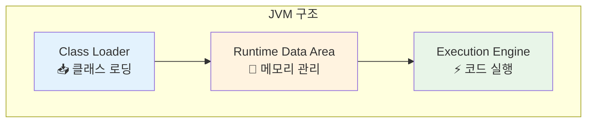
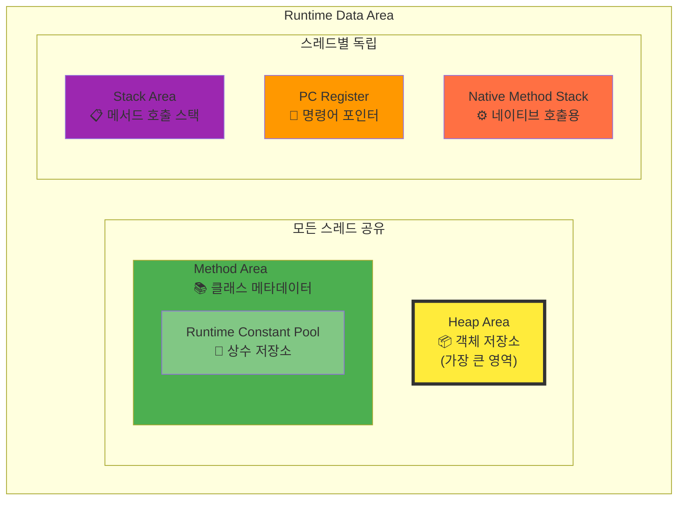
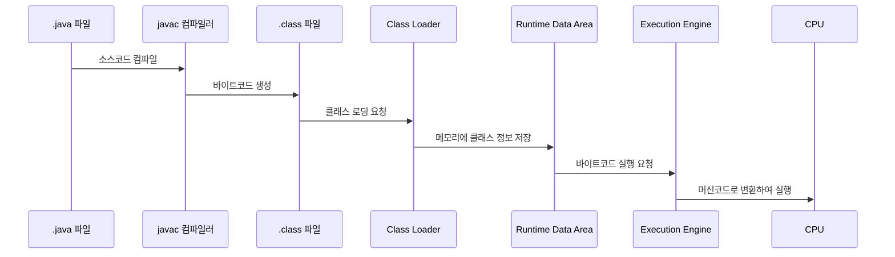

# JVM 내부 구조 & 메모리 영역

## 목차
- [개요](#개요)
- [Java 컴파일 과정](#java-컴파일-과정)
- [JVM 구조](#jvm-구조)
- [핵심 구성 요소 상세 분석](#핵심-구성-요소-상세-분석)

---

## 개요

### 🎯 JVM의 범용성
JVM은 자바 언어 전용이 아닙니다:
- **Java**: 기본 지원 언어
- **Kotlin**: 100% JVM 호환
- **Scala**: 함수형 + 객체지향, JVM 기반
- **Groovy**: 동적 언어, JVM 실행

> 💡 **핵심 포인트**: JVM을 정확히 이해하면 JVM 생태계의 모든 언어를 효율적으로 학습하고 최적화할 수 있습니다.

### 📈 학습 목표
- 내부 동작 원리 이해를 통한 **코드 최적화**
- **메모리 사용 패턴** 분석 능력 향상
- **성능 튜닝** 및 **리팩토링** 전략 수립


> 🔍 **주목**: 빨간 박스 영역이 이 문서에서 다룰 핵심 내용입니다 - 컴파일된 .class 파일이 실행되는 전체 과정

---

## Java 컴파일 과정

### 📝 컴파일(Compile)의 정의
> **컴파일**: 프로그래밍 언어로 작성된 소스 코드를 기계어로 변환하는 과정
> - 어원: '편집하다, 모으다, 엮다'의 의미

### 🔄 변환 과정
```
HelloWorld.java → [javac] → HelloWorld.class (바이트코드)
```

#### 바이트코드(Bytecode)란?

> **정의**: 특정 하드웨어가 아닌 '가상 컴퓨터'에서 실행되는 이진 표현법
> - 소프트웨어에 의해 처리되므로 기계어보다 추상적
> - 하드웨어 독립성 제공
> 
> *출처: Wikipedia*

**특징 비교:**

| 관점 | 소스코드 | 바이트코드 | 기계어 |
|------|----------|------------|--------|
| 가독성 | 높음 (사람 중심) | 중간 | 낮음 (컴퓨터 중심) |
| 추상화 수준 | 높음 | 중간 | 낮음 |
| 플랫폼 의존성 | 없음 | 없음 (JVM 필요) | 있음 | 

---

## JVM 구조


JVM은 크게 **3개의 핵심 영역**으로 구성됩니다:



---

## 핵심 구성 요소 상세 분석

### 1. 📥 Class Loader (클래스 로더)

#### 🎯 주요 역할
- `.class` 파일 형태의 **Java 바이트코드**를 JVM으로 로딩
- 단순 로딩이 아닌 **3단계 처리**:
  1. **Loading**: 클래스 파일을 메모리로 로드
  2. **Linking**: 검증, 준비, 해결 과정
  3. **Initialization**: 클래스 초기화

#### ⚡ 동적 로딩 (Lazy Loading)
```java
// 예시: 동적 로딩 확인
public class LazyLoadingExample {
    public static void main(String[] args) {
        System.out.println("main 시작");
        // 이 시점에서 AnotherClass는 아직 로딩되지 않음
        
        AnotherClass obj = new AnotherClass(); 
        // 👆 이 시점에서 AnotherClass가 로딩됨
    }
}
```

#### 📍 핵심 특징
- **필요할 때만 로딩**: 모든 클래스를 한 번에 로딩하지 않음
- **메서드 영역 저장**: 로딩된 클래스의 메서드는 Method Area에 적재

---

### 2. 🧠 Runtime Data Area (런타임 데이터 영역)

> **가장 중요한 JVM 구성 요소** - 자바 바이트코드 실행에 필요한 모든 데이터 저장

#### 📊 메모리 영역 구조



#### 🏗️ 영역별 상세 분석

##### 📦 Heap Area (힙 영역)
- **저장 대상**: `new` 키워드로 생성하는 **모든 객체 인스턴스**
- **크기**: JVM 내 **가장 큰 메모리 영역** (GB 단위)
- **특징**: 가비지 컬렉터의 주요 관리 대상

```java
// Heap 영역 사용 예시
String str = new String("Hello");    // Heap에 String 객체 생성
List<Integer> list = new ArrayList<>(); // Heap에 ArrayList 객체 생성
```

##### 📚 Method Area (메서드 영역)
- **저장 대상**: 클래스의 **메타데이터 및 메서드 정보**
- **포함 요소**: 
  - 클래스 구조 정보
  - 메서드 바이트코드
  - Runtime Constant Pool

##### 🔗 Runtime Constant Pool (런타임 상수 풀)
- **저장 대상**: **문자열 상수**, **클래스 상수** 등
- **위치**: Method Area 내부에 위치
- **영향**: 문자열 상수 사용량에 따라 메모리 사용량 증가

```java
// 상수 풀 사용 예시
String literal = "Hello World";           // String 리터럴 → 상수 풀에 저장
String object = new String("Hello");      // new String() → Heap에 저장
final int CONSTANT = 100;                 // 컴파일 타임 상수 → 상수 풀에 저장

// 상수 풀 동작 확인
String str1 = "Hello";
String str2 = "Hello";
System.out.println(str1 == str2);         // true - 같은 상수 풀 참조
```

##### 📋 Stack Area & 📍 PC Register (스레드별 영역)
- **특징**: **멀티스레딩 환경**에서 각 스레드마다 독립적으로 생성
- **Stack Area**: 메서드 호출 정보, 지역 변수 저장
- **PC Register**: 현재 실행 중인 명령어 주소 저장

```java
// 스레드별 스택 영역 예시
public void methodA() {
    int localVar = 10;     // Stack에 저장
    methodB(localVar);     // 새로운 Stack Frame 생성
}

public void methodB(int param) {
    String local = "test"; // 새 Stack Frame의 지역변수
} // methodB 종료 시 Stack Frame 제거
```

---

### 3. ⚡ Execution Engine (실행 엔진)

#### 🎯 핵심 기능
런타임 데이터 영역의 **자바 바이트코드**를 **머신 코드(기계어)**로 변환하여 실행

#### 🚀 JIT (Just-In-Time) 컴파일러
- **목적**: 자주 실행되는 코드의 **성능 최적화**
- **동작 원리**:
  1. 바이트코드 실행 횟수 모니터링
  2. 임계값 도달 시 머신 코드로 컴파일
  3. 다음 실행 시 컴파일된 머신 코드 직접 사용

```java
// JIT 컴파일 최적화 예시
public class JITExample {
    // Static 메서드 - JIT 컴파일 대상
    private static int hotStaticMethod(int n) {
        return n * n + 10;
    }
    
    // Instance 메서드 - 자주 호출되면 역시 JIT 컴파일 대상
    private int hotInstanceMethod(int n) {
        return n * n * n + 20;
    }
    
    public static void main(String[] args) {
        JITExample example = new JITExample();
        
        // Static 메서드 반복 호출
        for (int i = 0; i < 20000; i++) {
            hotStaticMethod(i);
        }
        
        // Instance 메서드 반복 호출 - 이것도 JIT 컴파일됨
        for (int i = 0; i < 20000; i++) {
            example.hotInstanceMethod(i);
        }
    }
}
```

#### 🔌 JNI & Native Interface
- **JNI (Java Native Interface)**: 네이티브 코드 연동 인터페이스
- **용도**: 
  - 운영체제 API 호출
  - C/C++ 라이브러리 연동
  - 동적 라이브러리(DLL, SO) 사용

#### 🗑️ Garbage Collector (가비지 컬렉터)
- **관리 대상**: 주로 **Heap 영역**
- **기능**: 사용되지 않는 객체 인스턴스 자동 회수
- **중요성**: **성능에 직접적인 영향**을 미치므로 작동 원리 이해 필수

---

## 📊 JVM 동작 흐름 요약




---

## 🚀 다음 단계 학습 로드맵

1. **메모리 영역 심화** - 각 영역의 세부 구조와 최적화 방법
2. **가비지 컬렉션** - GC 알고리즘별 특성과 튜닝 전략  
3. **JIT 컴파일러** - 최적화 기법과 성능 분석
4. **클래스 로딩** - 커스텀 클래스 로더와 모듈 시스템
5. **모니터링 & 튜닝** - 실무 성능 최적화 기법

> 💡 **Tip**: 각 주제별로 실제 코드 예제와 모니터링 도구를 활용한 실습을 병행하면 더욱 효과적입니다!