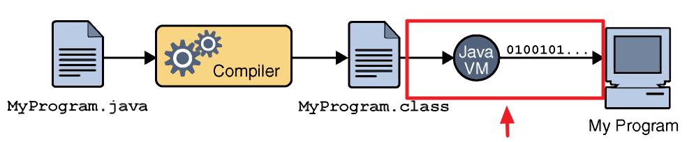
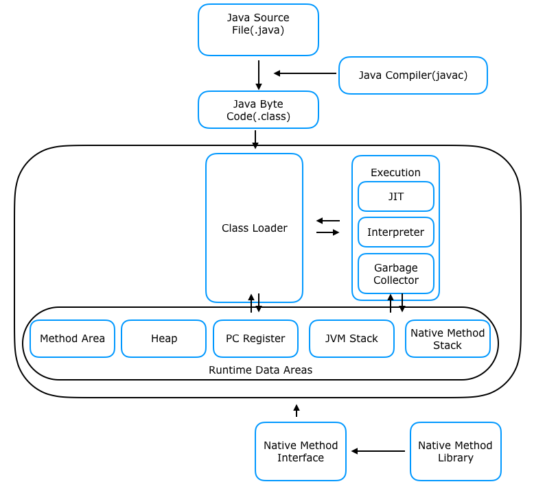
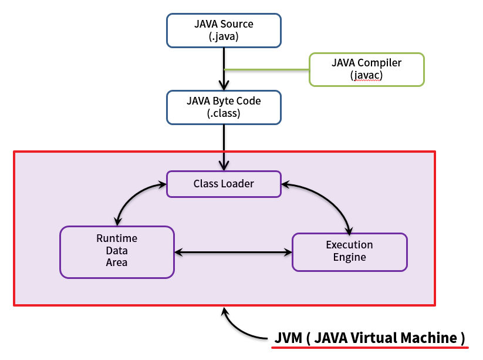

# JVM 내부 구조 & 메모리 영역 

JVM은 자바 언어에서만 사용하는 것이 아니다.  
코틀린, 스칼라 언어에서도 JVM 동작 방식을 그대로 따른다.  
따라서 JVM을 정확히 이해하면 추후에 자바에서 파생된 언어를 이해하는데 있어 수월해진다. 
내부에서 정확히 어떻게 동작하는지 개념을 알면 코드 최적화나 리팩토링을 하는데 매우 도움이 된다.

지금부터 설명할 JVM실행 부분은 빨간 박스를 친 부분인, 컴파일된 .class 파일을 어떠한 처리를 거쳐 프로그램을 실행하는 과정이다.  

# Compile(컴파일)

> 한국어로 번역하면 '컴파일하다, 엮다, 모으다, 편집하다, 편찬하다' 등으로 표현할 수 있습니다.  
> 프로그래밍 언어로 작성된 소스 코드를 기계어로 변환하는 과정을 의미합니다. 

.java 파일이 자바 컴파일러인 javac에 의해 컴파일 되어 .class 파일인 JAVA Byte code를 만들어 낸다.

## 바이트코드?

> 특정 하드웨가 아닌 '가상 컴퓨터'에서 돌아가는 실행 프로그램을 위한 이진 표현법이다.  
> 하드웨어가 아닌 소프트웨어에 의해 처리되기 떄문에, 보통 기계어보다 더 추상적이다.  
> (출처) 위키백과

(사람입장에서) 사람이 읽기 쉽도록 쓰인 소스 코드와 비교하면, 바이트 코드는 덜 추상적이며, 더 간결하고, 더 컴퓨터 중심적이다.
(컴퓨터입장에서) 

# JVM의 구조

Class Loader  
- 자바 프로그램이 `.class` 파일 형태로 컴파일된 **자바 바이트 코드**를 JVM으로 가지고오는 역활을 합니다. 
- 단순히 로딩만 하는 것이 아니라, **링킹(Linking)** 및 **초기화(Initialization)** 과정까지 담당합니다. 
- 모든 클래스를 한 번에 로딩하는 것이 아니라, 프로그램 실행 중 필요할 때마다 동적으로 클래스를 로딩합니다. 이를 `Lazy Loading` 이라고 합니다. 
- 클래스가 로딩되면 해당 클래스의 메서드는 **메서드 영역**에 적재됩니다.  
Runtime Data Area  
- JVM 구성 요소 중 **가장 중요**하며, 자바 바이트 코드를 실행하는 데 필요한 데이터를 저장하는 메모리 영역입니다.
- 주요 하위 영역들은 다음과 같이 상호작용합니다:
- - **힙 영역(Heap Area)**:
- - - **객체 인스턴스** (`new` 키워드로 동적으로 생성하는 인스턴스)가 저장되는 공간입니다.
- - - JVM 내에서 **가장 큰 메모리 영역**을 차지하며, 기가바이트 단위의 용량을 가집니다.
- - **메서드 영역(Method Area)**:
- - - 클래스 로더에 의해 로딩된 **클래스의 메서드(함수)**들의 적재되는 공간입니다.  
- - - `런타임 상숭 풀 (Runtime Constant Pool)`을 포함하여, 문자열 상수 같은 것들이 이곳에 저장됩니다. 문자열 상수들이 많이 사용될수록 이 영역의 메모리 사용량이 증가할 수 있습니다.
- - **스택 영역(Stack Area)** 및 **프로그램 카운터 레지스터(Program Counter Register, PC Register)**:
- - - 이 두 영역은 **스레드(Thread)**와 밀접하게 관련되어 있습니다.
- - - 멀티스레딩 환경에서 각 스레드마다 독립적인 스택과 PC 레지스터를 가집니다. 이는 각 스레드의 실행 흐름과 관련된 정보를 저장하는 역할을 합니다. 
- - - 스택 영역은 메서드 호출 정보, 지역 변수 등을 저장하며, PC 레지스터는 현재 진행 중인 명령어의 주소를 가리킵니다. 
Execution Engine  
- 런타임 데이터 영역에 적재된 **자바 바이트 코드**를 실제 컴퓨터의 CPU가 이해할 수 있는 **머신 코드 (기계어)**로 번역하고 실행하는 역할을 합니다.  
- 주요 구성 요소는 **JIT(Just-In-Time) 컴파일러** 입니다.  
- 자바 바이트 코드는 가상 머신이 인식하는 코드이므로, CPU가 실제 연산을 수행하려면 다시 한번 번역이 필요합니다.  
- **자주 수행되는 코드**는 미리 머신 코드로 번역하여 저장해두었다가 다음 실행 시에 바로 사용할 수 있게 함으로써 **자바의 성능 향상에 결정적인 역할**을 합니다.  

- **JNI (Java Native Interface) 및 네이티브 영역 (Native Area) 인터페이스**:
- - JVM은 자바 언어로만 모든 작업을 수행할 수 없으므로, 운영 체제 수정의 API를 호출해야 할 때가 있습니다. 
- - JNI는 이러한 **네이티브 영역** (주로 C++ 등으로 구현된 영역)과의 인터페이스를 제공하여, 자바 프로그램이 운영체제 API를 호출하거나 동적 라이브러리(DLL, SO 등)와 연동할 수 있도록 합니다. 

- **가비지 컬렉터 (Garbage Collector)**가 주로 힙역역을 관리하며, 사용되지 않는 객체 인스턴스를 회수하여 메모리를 재활용합니다. **가비지 컬렉터의 작동 원리를 아는 것이 중요**합니다.

  
