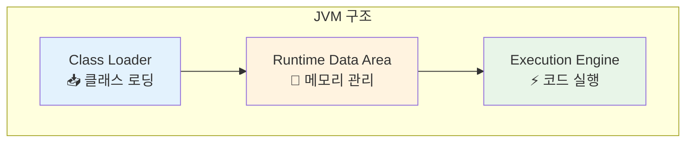
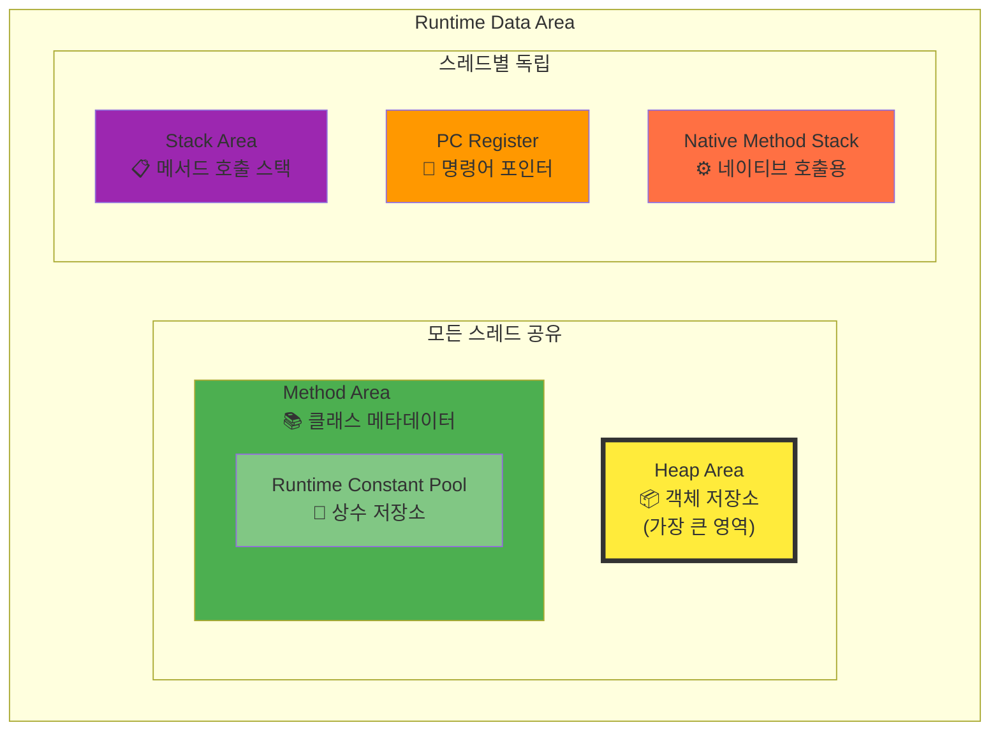
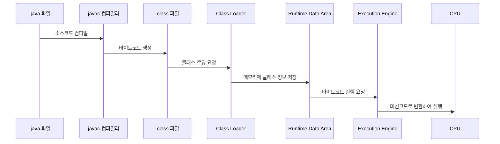

# JVM 내부 구조 & 메모리 영역

## 목차
- [개요](#개요)
- [Java 컴파일 과정](#java-컴파일-과정)
- [JVM 구조](#jvm-구조)
- [핵심 구성 요소 상세 분석](#핵심-구성-요소-상세-분석)

---

## 개요

### 🎯 JVM의 범용성
JVM은 자바 언어 전용이 아닙니다:
- **Java**: 기본 지원 언어
- **Kotlin**: 100% JVM 호환
- **Scala**: 함수형 + 객체지향, JVM 기반
- **Groovy**: 동적 언어, JVM 실행

> 💡 **핵심 포인트**: JVM을 정확히 이해하면 JVM 생태계의 모든 언어를 효율적으로 학습하고 최적화할 수 있습니다.

### 📈 학습 목표
- 내부 동작 원리 이해를 통한 **코드 최적화**
- **메모리 사용 패턴** 분석 능력 향상
- **성능 튜닝** 및 **리팩토링** 전략 수립


> 🔍 **주목**: 빨간 박스 영역이 이 문서에서 다룰 핵심 내용입니다 - 컴파일된 .class 파일이 실행되는 전체 과정

---

## Java 컴파일 과정

### 📝 컴파일(Compile)의 정의
> **컴파일**: 프로그래밍 언어로 작성된 소스 코드를 기계어로 변환하는 과정
> - 어원: '편집하다, 모으다, 엮다'의 의미

### 🔄 변환 과정
```
HelloWorld.java → [javac] → HelloWorld.class (바이트코드)
```

#### 바이트코드(Bytecode)란?

> **정의**: 특정 하드웨어가 아닌 '가상 컴퓨터'에서 실행되는 이진 표현법
> - 소프트웨어에 의해 처리되므로 기계어보다 추상적
> - 하드웨어 독립성 제공
> 
> *출처: Wikipedia*

**특징 비교:**

| 관점 | 소스코드 | 바이트코드 | 기계어 |
|------|----------|------------|--------|
| 가독성 | 높음 (사람 중심) | 중간 | 낮음 (컴퓨터 중심) |
| 추상화 수준 | 높음 | 중간 | 낮음 |
| 플랫폼 의존성 | 없음 | 없음 (JVM 필요) | 있음 | 

---

## JVM 구조


JVM은 크게 **3개의 핵심 영역**으로 구성됩니다:



---

## 핵심 구성 요소 상세 분석

### 1. 📥 Class Loader (클래스 로더)

#### 🎯 주요 역할
- `.class` 파일 형태의 **Java 바이트코드**를 JVM으로 로딩
- 단순 로딩이 아닌 **3단계 처리**:
  1. **Loading**: 클래스 파일을 메모리로 로드
  2. **Linking**: 검증, 준비, 해결 과정
  3. **Initialization**: 클래스 초기화

#### ⚡ 동적 로딩 (Lazy Loading)
```java
// 예시: 동적 로딩 확인
public class LazyLoadingExample {
    public static void main(String[] args) {
        System.out.println("main 시작");
        // 이 시점에서 AnotherClass는 아직 로딩되지 않음
        
        AnotherClass obj = new AnotherClass(); 
        // 👆 이 시점에서 AnotherClass가 로딩됨
    }
}
```

#### 📍 핵심 특징
- **필요할 때만 로딩**: 모든 클래스를 한 번에 로딩하지 않음
- **메서드 영역 저장**: 로딩된 클래스의 메서드는 Method Area에 적재

---

### 2. 🧠 Runtime Data Area (런타임 데이터 영역)

> **가장 중요한 JVM 구성 요소** - 자바 바이트코드 실행에 필요한 모든 데이터 저장

#### 📊 메모리 영역 구조



#### 🏗️ 영역별 상세 분석

##### 📦 Heap Area (힙 영역)
- **저장 대상**: `new` 키워드로 생성하는 **모든 객체 인스턴스**
- **크기**: JVM 내 **가장 큰 메모리 영역** (GB 단위)
- **특징**: 가비지 컬렉터의 주요 관리 대상

```java
// Heap 영역 사용 예시
String str = new String("Hello");    // Heap에 String 객체 생성
List<Integer> list = new ArrayList<>(); // Heap에 ArrayList 객체 생성
```

##### 📚 Method Area (메서드 영역)
- **저장 대상**: 클래스의 **메타데이터 및 메서드 정보**
- **포함 요소**: 
  - 클래스 구조 정보
  - 메서드 바이트코드
  - Runtime Constant Pool

##### 🔗 Runtime Constant Pool (런타임 상수 풀)
- **저장 대상**: **문자열 상수**, **클래스 상수** 등
- **위치**: Method Area 내부에 위치
- **영향**: 문자열 상수 사용량에 따라 메모리 사용량 증가

```java
// 상수 풀 사용 예시
String literal = "Hello World";           // String 리터럴 → 상수 풀에 저장
String object = new String("Hello");      // new String() → Heap에 저장
final int CONSTANT = 100;                 // 컴파일 타임 상수 → 상수 풀에 저장

// 상수 풀 동작 확인
String str1 = "Hello";
String str2 = "Hello";
System.out.println(str1 == str2);         // true - 같은 상수 풀 참조
```

##### 📋 Stack Area & 📍 PC Register (스레드별 영역)
- **특징**: **멀티스레딩 환경**에서 각 스레드마다 독립적으로 생성
- **Stack Area**: 메서드 호출 정보, 지역 변수 저장
- **PC Register**: 현재 실행 중인 명령어 주소 저장

```java
// 스레드별 스택 영역 예시
public void methodA() {
    int localVar = 10;     // Stack에 저장
    methodB(localVar);     // 새로운 Stack Frame 생성
}

public void methodB(int param) {
    String local = "test"; // 새 Stack Frame의 지역변수
} // methodB 종료 시 Stack Frame 제거
```

---

### 3. ⚡ Execution Engine (실행 엔진)

#### 🎯 핵심 기능
런타임 데이터 영역의 **자바 바이트코드**를 **머신 코드(기계어)**로 변환하여 실행

#### 🚀 JIT (Just-In-Time) 컴파일러
- **목적**: 자주 실행되는 코드의 **성능 최적화**
- **동작 원리**:
  1. 바이트코드 실행 횟수 모니터링
  2. 임계값 도달 시 머신 코드로 컴파일
  3. 다음 실행 시 컴파일된 머신 코드 직접 사용

```java
// JIT 컴파일 최적화 예시
public class JITExample {
    // Static 메서드 - JIT 컴파일 대상
    private static int hotStaticMethod(int n) {
        return n * n + 10;
    }
    
    // Instance 메서드 - 자주 호출되면 역시 JIT 컴파일 대상
    private int hotInstanceMethod(int n) {
        return n * n * n + 20;
    }
    
    public static void main(String[] args) {
        JITExample example = new JITExample();
        
        // Static 메서드 반복 호출
        for (int i = 0; i < 20000; i++) {
            hotStaticMethod(i);
        }
        
        // Instance 메서드 반복 호출 - 이것도 JIT 컴파일됨
        for (int i = 0; i < 20000; i++) {
            example.hotInstanceMethod(i);
        }
    }
}
```

### 🔬 JIT 컴파일 실제 확인 방법

순수 Java 코드만으로 JIT 컴파일을 확인할 수 있는 방법들:

#### 1. 확실한 JIT 효과 - 다형성과 메가모피즘 활용
```java
public class JITPolymorphismTest {
    // 추상 클래스로 다형성 구현
    abstract static class Shape {
        abstract double calculateArea();
        abstract double calculatePerimeter();
    }
    
    static class Circle extends Shape {
        private double radius;
        Circle(double radius) { this.radius = radius; }
        
        @Override
        double calculateArea() {
            // 의도적으로 복잡한 계산
            double result = 0;
            for (int i = 0; i < 100; i++) {
                result += Math.PI * radius * radius * Math.sin(i * 0.01);
            }
            return Math.abs(result);
        }
        
        @Override
        double calculatePerimeter() {
            return 2 * Math.PI * radius;
        }
    }
    
    static class Rectangle extends Shape {
        private double width, height;
        Rectangle(double width, double height) { 
            this.width = width; this.height = height; 
        }
        
        @Override
        double calculateArea() {
            // 의도적으로 복잡한 계산
            double result = 0;
            for (int i = 0; i < 100; i++) {
                result += width * height * Math.cos(i * 0.01);
            }
            return Math.abs(result);
        }
        
        @Override
        double calculatePerimeter() {
            return 2 * (width + height);
        }
    }
    
    static class Triangle extends Shape {
        private double a, b, c;
        Triangle(double a, double b, double c) { 
            this.a = a; this.b = b; this.c = c; 
        }
        
        @Override
        double calculateArea() {
            double s = (a + b + c) / 2;
            double result = 0;
            for (int i = 0; i < 100; i++) {
                result += Math.sqrt(s * (s - a) * (s - b) * (s - c)) * Math.tan(i * 0.01);
            }
            return Math.abs(result);
        }
        
        @Override
        double calculatePerimeter() {
            return a + b + c;
        }
    }
    
    public static void main(String[] args) {
        // 다양한 타입의 Shape 객체들 (메가모피즘 유발)
        Shape[] shapes = {
            new Circle(5.0), new Rectangle(4.0, 6.0), new Triangle(3.0, 4.0, 5.0),
            new Circle(3.0), new Rectangle(2.0, 8.0), new Triangle(5.0, 12.0, 13.0),
            new Circle(7.0), new Rectangle(10.0, 2.0), new Triangle(8.0, 6.0, 10.0)
        };
        
        final int MEGA_ITERATIONS = 1000000;
        System.out.println("=== 다형성 JIT 최적화 테스트 ===");
        System.out.println("메가모피즘으로 JIT 최적화 어려움 → 극적 개선 예상\n");
        
        // 15라운드 측정 (더 긴 관찰)
        long[] times = new long[15];
        double totalArea = 0;
        
        for (int round = 0; round < 15; round++) {
            System.out.print("Round " + String.format("%2d", round + 1) + " 진행... ");
            
            long startTime = System.nanoTime();
            double roundArea = 0;
            
            // 다형성 호출로 JIT 최적화 어려움 유발
            for (int i = 0; i < MEGA_ITERATIONS; i++) {
                Shape shape = shapes[i % shapes.length];
                roundArea += shape.calculateArea();  // 가상 함수 호출
                roundArea += shape.calculatePerimeter();
            }
            
            long endTime = System.nanoTime();
            times[round] = (endTime - startTime) / 1_000_000;
            totalArea += roundArea;
            
            System.out.println(times[round] + "ms");
            
            // 초기 라운드에서 더 많은 대기 시간
            if (round < 5) {
                try { Thread.sleep(300); } catch (InterruptedException e) {}
            } else if (round < 10) {
                try { Thread.sleep(100); } catch (InterruptedException e) {}
            }
        }
        
        // 성능 분석
        long firstPhase = (times[0] + times[1] + times[2]) / 3;
        long midPhase = (times[7] + times[8] + times[9]) / 3;
        long lastPhase = (times[12] + times[13] + times[14]) / 3;
        
        System.out.println("\n=== 단계별 성능 분석 ===");
        System.out.println("초기 3라운드 평균: " + firstPhase + "ms (해석 실행)");
        System.out.println("중간 3라운드 평균: " + midPhase + "ms (C1 최적화)");
        System.out.println("마지막 3라운드 평균: " + lastPhase + "ms (C2 최적화)");
        System.out.println();
        System.out.printf("초기 → 최종 성능 향상: %.2f배\n", (double)firstPhase / lastPhase);
        System.out.printf("중간 → 최종 성능 향상: %.2f배\n", (double)midPhase / lastPhase);
        
        // 성능 변화 그래프
        System.out.println("\n=== 성능 변화 추이 ===");
        long maxTime = times[0];
        for (int i = 0; i < 15; i++) {
            int percentage = (int)(100.0 * times[i] / maxTime);
            String bar = "▓".repeat(percentage / 2);
            System.out.printf("Round %2d: %4dms [%3d%%] %s\n", 
                i + 1, times[i], percentage, bar);
        }
        
        System.out.println("\n검증 결과: " + String.format("%.0f", totalArea));
    }
}
```

#### 2. 극단적 JIT 테스트 - 리플렉션과 동적 호출
```java
import java.lang.reflect.Method;
import java.util.Random;

public class JITReflectionTest {
    private static final Random random = new Random(12345);
    
    // 다양한 복잡도의 메서드들
    public static int simpleCalc(int x) {
        return x * x + x + 1;
    }
    
    public static int mediumCalc(int x) {
        int result = 0;
        for (int i = 0; i < x % 50 + 10; i++) {
            result += (i * x) % 997;
        }
        return result;
    }
    
    public static int complexCalc(int x) {
        double result = 0;
        for (int i = 1; i <= x % 30 + 5; i++) {
            result += Math.sin(x * i) * Math.cos(i) / Math.sqrt(i);
            if (i % 3 == 0) {
                result += Math.log(Math.abs(x * i) + 1);
            }
        }
        return (int)(Math.abs(result) * 1000) % 10000;
    }
    
    public static void main(String[] args) throws Exception {
        // 리플렉션으로 메서드 준비
        Method[] methods = {
            JITReflectionTest.class.getMethod("simpleCalc", int.class),
            JITReflectionTest.class.getMethod("mediumCalc", int.class),
            JITReflectionTest.class.getMethod("complexCalc", int.class)
        };
        
        final int REFLECTION_ITERATIONS = 500000;
        System.out.println("=== 리플렉션 JIT 최적화 테스트 ===");
        System.out.println("동적 메서드 호출로 최적화 극도로 어려움 → 큰 성능 차이 예상\n");
        
        long[] executionTimes = new long[12];
        long totalSum = 0;
        
        for (int round = 0; round < 12; round++) {
            System.out.print("Round " + String.format("%2d", round + 1) + " 실행... ");
            
            long startTime = System.nanoTime();
            long sum = 0;
            
            for (int i = 0; i < REFLECTION_ITERATIONS; i++) {
                try {
                    // 랜덤하게 메서드 선택 (분기 예측 어려움)
                    Method method = methods[random.nextInt(3)];
                    int value = random.nextInt(100) + 1;
                    
                    // 리플렉션 호출 (JIT 최적화 매우 어려움)
                    Integer result = (Integer) method.invoke(null, value);
                    sum += result;
                    
                    // 추가 복잡성
                    if (i % 1000 == 0) {
                        sum += complexCalc(value % 20);
                    }
                } catch (Exception e) {
                    // 예외 처리도 최적화 어려움 추가
                    sum += i % 1000;
                }
            }
            
            long endTime = System.nanoTime();
            executionTimes[round] = (endTime - startTime) / 1_000_000;
            totalSum += sum;
            
            System.out.println(executionTimes[round] + "ms");
            
            // GC 유발로 공정한 측정
            if (round % 3 == 0) {
                System.gc();
                try { Thread.sleep(200); } catch (InterruptedException e) {}
            }
        }
        
        // 구간별 분석
        long phase1 = (executionTimes[0] + executionTimes[1]) / 2;
        long phase2 = (executionTimes[4] + executionTimes[5]) / 2;
        long phase3 = (executionTimes[8] + executionTimes[9]) / 2;
        long phase4 = (executionTimes[10] + executionTimes[11]) / 2;
        
        System.out.println("\n=== 4단계 최적화 과정 ===");
        System.out.println("Phase 1 (해석실행):   " + phase1 + "ms");
        System.out.println("Phase 2 (C1-초기):    " + phase2 + "ms");
        System.out.println("Phase 3 (C1-성숙):    " + phase3 + "ms");
        System.out.println("Phase 4 (C2-최적화):  " + phase4 + "ms");
        
        System.out.println("\n=== 성능 향상 배율 ===");
        System.out.printf("Phase 1 → 4: %.2f배 개선\n", (double)phase1 / phase4);
        System.out.printf("Phase 2 → 4: %.2f배 개선\n", (double)phase2 / phase4);
        System.out.printf("Phase 3 → 4: %.2f배 개선\n", (double)phase3 / phase4);
        
        // 최적화 진행 상황 시각화
        System.out.println("\n=== 최적화 진행 시각화 ===");
        for (int i = 0; i < 12; i++) {
            double ratio = (double)executionTimes[i] / executionTimes[0];
            int barLength = (int)(ratio * 50);
            String bar = "█".repeat(Math.max(1, barLength));
            String phase = i < 2 ? "해석" : i < 6 ? "C1" : i < 10 ? "C1+" : "C2";
            
            System.out.printf("Round %2d [%s]: %4dms %s (%.1f%%)\n", 
                i + 1, phase, executionTimes[i], bar, ratio * 100);
        }
        
        System.out.println("\n검증 합계: " + totalSum);
    }
}
```
```

#### 2. 메모리 집약적 작업으로 JIT 효과 극대화
```java
import java.util.*;

public class JITMemoryIntensive {
    private static final Random random = new Random(42); // 시드 고정으로 재현 가능
    
    // 메모리 할당과 복잡한 연산이 섞인 작업
    private static long heavyMemoryWork(int size) {
        List<Integer> numbers = new ArrayList<>(size);
        Map<Integer, String> cache = new HashMap<>();
        
        // 1. 랜덤 데이터 생성 및 저장
        for (int i = 0; i < size; i++) {
            int num = random.nextInt(1000);
            numbers.add(num);
            
            // 2. 문자열 연산 (GC 압박)
            if (num % 7 == 0) {
                cache.put(num, "lucky_" + num + "_" + (num * num));
            }
        }
        
        // 3. 복잡한 정렬 및 필터링
        numbers.sort((a, b) -> {
            // 복잡한 비교 로직
            int result = Integer.compare(a % 13, b % 13);
            if (result == 0) {
                return Integer.compare(a * a % 17, b * b % 17);
            }
            return result;
        });
        
        // 4. 스트림 연산 (람다와 메서드 참조)
        long result = numbers.stream()
            .filter(n -> n % 3 == 0)
            .mapToLong(n -> {
                String cached = cache.get(n);
                if (cached != null) {
                    return cached.length() * n;
                }
                return n * n * n;
            })
            .sum();
            
        return result;
    }
    
    public static void main(String[] args) {
        final int ITERATIONS = 1000;
        final int WORK_SIZE = 2000;
        
        System.out.println("=== 메모리 집약적 JIT 테스트 ===");
        System.out.println("GC와 복잡한 객체 생성으로 JIT 효과 극대화\n");
        
        long[] executionTimes = new long[8];
        long totalSum = 0;
        
        for (int phase = 0; phase < 8; phase++) {
            System.gc(); // 명시적 GC 호출로 공정한 측정
            try { Thread.sleep(100); } catch (InterruptedException e) {}
            
            System.out.print("Phase " + (phase + 1) + " 실행... ");
            
            long startTime = System.nanoTime();
            long phaseSum = 0;
            
            for (int i = 0; i < ITERATIONS; i++) {
                phaseSum += heavyMemoryWork(WORK_SIZE);
            }
            
            long endTime = System.nanoTime();
            executionTimes[phase] = (endTime - startTime) / 1_000_000;
            totalSum += phaseSum;
            
            System.out.println(executionTimes[phase] + "ms");
        }
        
        System.out.println("\n=== 단계별 최적화 결과 ===");
        System.out.println("Phase 1 (순수 해석): " + executionTimes[0] + "ms");
        System.out.println("Phase 3 (C1 컴파일): " + executionTimes[2] + "ms");
        System.out.println("Phase 6 (C2 컴파일): " + executionTimes[5] + "ms");
        System.out.println("Phase 8 (완전 최적화): " + executionTimes[7] + "ms");
        
        System.out.println("\n=== 성능 향상 비율 ===");
        System.out.printf("전체 향상: %.2f배 (%dms → %dms)\n", 
            (double)executionTimes[0] / executionTimes[7], 
            executionTimes[0], executionTimes[7]);
            
        System.out.printf("중간 향상: %.2f배 (%dms → %dms)\n", 
            (double)executionTimes[2] / executionTimes[7], 
            executionTimes[2], executionTimes[7]);
        
        System.out.println("\n검증 합계: " + totalSum);
        
        // 성능 그래프 출력
        System.out.println("\n=== 성능 그래프 ===");
        long maxTime = executionTimes[0];
        for (int i = 0; i < 8; i++) {
            int barLength = (int)((double)executionTimes[i] / maxTime * 60);
            String bar = "■".repeat(Math.max(1, barLength));
            System.out.printf("Phase %d: %4dms %s\n", i+1, executionTimes[i], bar);
        }
    }
}
```
```
```

#### 3. 강제 해석 모드와 JIT 모드 비교
```java
public class JITForceInterpretedTest {
    private static long operationCount = 0;
    
    // CPU 집약적 작업
    private static double heavyComputation(int iterations) {
        double result = 1.0;
        operationCount += iterations;
        
        for (int i = 1; i <= iterations; i++) {
            // 복잡한 수학 연산 (JIT 최적화 대상)
            result += Math.sin(i * 0.001) * Math.cos(i * 0.001);
            result += Math.log(i + 1) / Math.sqrt(i + 1);
            result += Math.pow(i % 10 + 1, 0.3);
            
            // 분기 조건 (분기 예측 최적화 대상)
            if (i % 7 == 0) {
                result *= 0.99;
            } else if (i % 11 == 0) {
                result *= 1.01;
            }
            
            // 메모리 접근 패턴
            if (i % 100 == 0) {
                result = Math.abs(result) % 1000000 + 1;
            }
        }
        
        return result;
    }
    
    public static void main(String[] args) {
        final int COMPUTATION_ITERATIONS = 50000;
        final int TEST_ROUNDS = 20;
        
        System.out.println("=== JIT vs 해석 모드 극명한 비교 ===");
        System.out.println("CPU 집약적 작업으로 JIT 효과 극대화\n");
        
        // 워밍업 (JIT 컴파일 유발)
        System.out.print("워밍업 중... ");
        for (int warmup = 0; warmup < 5; warmup++) {
            for (int i = 0; i < 1000; i++) {
                heavyComputation(100);
            }
        }
        System.out.println("완료\n");
        
        // 실제 측정
        long[] times = new long[TEST_ROUNDS];
        double totalResult = 0;
        operationCount = 0;
        
        for (int round = 0; round < TEST_ROUNDS; round++) {
            // 5라운드마다 GC 수행
            if (round % 5 == 0) {
                System.gc();
                try { Thread.sleep(100); } catch (InterruptedException e) {}
            }
            
            System.out.print("Round " + String.format("%2d", round + 1) + " 실행... ");
            
            long startTime = System.nanoTime();
            double roundResult = 0;
            
            // 높은 반복으로 JIT 최적화 효과 극대화
            for (int i = 0; i < COMPUTATION_ITERATIONS; i++) {
                roundResult += heavyComputation(i % 100 + 50);
            }
            
            long endTime = System.nanoTime();
            times[round] = (endTime - startTime) / 1_000_000;
            totalResult += roundResult;
            
            // 진행 상황과 개선률 표시
            if (round > 0) {
                double improvement = (double)times[0] / times[round];
                System.out.printf("%4dms (%.2fx 개선)\n", times[round], improvement);
            } else {
                System.out.println(times[round] + "ms (기준)");
            }
        }
        
        // 구간별 성능 분석
        long earlyAvg = (times[0] + times[1] + times[2]) / 3;
        long midAvg = (times[8] + times[9] + times[10]) / 3;
        long lateAvg = (times[17] + times[18] + times[19]) / 3;
        
        System.out.println("\n=== 성능 진화 분석 ===");
        System.out.println("초기 3라운드 평균 (해석): " + earlyAvg + "ms");
        System.out.println("중간 3라운드 평균 (C1):   " + midAvg + "ms");
        System.out.println("후기 3라운드 평균 (C2):   " + lateAvg + "ms");
        System.out.println();
        System.out.printf("최종 성능 향상: %.2f배 (%.1f%% 개선)\n", 
            (double)earlyAvg / lateAvg, 
            ((double)(earlyAvg - lateAvg) / earlyAvg) * 100);
        
        // 최적화 과정 그래프
        System.out.println("\n=== JIT 최적화 진행 그래프 ===");
        long maxTime = times[0];
        long minTime = times[TEST_ROUNDS - 1];
        
        for (int i = 0; i < TEST_ROUNDS; i++) {
            double ratio = (double)(times[i] - minTime) / (maxTime - minTime);
            int barLength = (int)(ratio * 60) + 5;
            String bar = "▓".repeat(barLength);
            
            String phase;
            if (i < 3) phase = "해석";
            else if (i < 8) phase = "C1-1";
            else if (i < 15) phase = "C1-2";
            else phase = "C2";
            
            System.out.printf("R%2d [%s]: %4dms %s\n", i + 1, phase, times[i], bar);
        }
        
        System.out.println("\n=== 통계 요약 ===");
        System.out.println("총 연산 횟수: " + String.format("%,d", operationCount));
        System.out.println("검증 결과 합: " + String.format("%.0f", totalResult));
        System.out.printf("최대/최소 시간비: %.2f배\n", (double)maxTime / minTime);
    }
}
```

#### 4. JIT 최적화 실패 유발 테스트
```java
import java.util.concurrent.ThreadLocalRandom;

public class JITOptimizationFailureTest {
    // 다양한 인터페이스로 메가모피즘 유발
    interface WorkerA { int workA(int x); }
    interface WorkerB { int workB(int x); }
    interface WorkerC { int workC(int x); }
    
    static class MultiWorker implements WorkerA, WorkerB, WorkerC {
        private final int id;
        MultiWorker(int id) { this.id = id; }
        
        @Override public int workA(int x) { 
            return complexWork(x, id * 3 + 1); 
        }
        @Override public int workB(int x) { 
            return complexWork(x, id * 5 + 2); 
        }
        @Override public int workC(int x) { 
            return complexWork(x, id * 7 + 3); 
        }
        
        private int complexWork(int x, int modifier) {
            int result = 0;
            for (int i = 0; i < x % 30 + 10; i++) {
                result += (x * modifier + i) % 997;
                if (i % 3 == 0) result *= -1;
            }
            return Math.abs(result);
        }
    }
    
    public static void main(String[] args) {
        // 다양한 워커 인스턴스
        MultiWorker[] workers = new MultiWorker[12];
        for (int i = 0; i < 12; i++) {
            workers[i] = new MultiWorker(i);
        }
        
        final int CHAOS_ITERATIONS = 800000;
        System.out.println("=== JIT 최적화 실패 vs 성공 비교 ===");
        System.out.println("메가모피즘으로 최적화 방해 → 후에 안정화로 극적 개선\n");
        
        long[] roundTimes = new long[18];
        long totalWork = 0;
        
        for (int round = 0; round < 18; round++) {
            System.out.print("Round " + String.format("%2d", round + 1) + " 진행... ");
            
            long startTime = System.nanoTime();
            long work = 0;
            
            for (int i = 0; i < CHAOS_ITERATIONS; i++) {
                // 초기에는 무작위 호출로 최적화 방해
                if (round < 10) {
                    // 메가모피즘 유발 (JIT 최적화 매우 어려움)
                    int workerIdx = ThreadLocalRandom.current().nextInt(12);
                    int methodChoice = ThreadLocalRandom.current().nextInt(3);
                    MultiWorker worker = workers[workerIdx];
                    
                    switch (methodChoice) {
                        case 0: work += worker.workA(i % 100); break;
                        case 1: work += worker.workB(i % 100); break;
                        case 2: work += worker.workC(i % 100); break;
                    }
                } else {
                    // 안정된 패턴으로 JIT 최적화 허용
                    MultiWorker worker = workers[i % 3]; // 예측 가능한 패턴
                    work += worker.workA(i % 100);        // 단일 메서드 집중
                }
            }
            
            long endTime = System.nanoTime();
            roundTimes[round] = (endTime - startTime) / 1_000_000;
            totalWork += work;
            
            System.out.println(roundTimes[round] + "ms");
            
            // 전환점에서 잠시 대기
            if (round == 9) {
                System.out.println(">>> 패턴 안정화 시작 - JIT 최적화 기회 <<<");
                try { Thread.sleep(500); } catch (InterruptedException e) {}
            }
        }
        
        // 혼돈 vs 안정 구간 비교
        long chaosAvg = 0, stableAvg = 0;
        for (int i = 0; i < 10; i++) chaosAvg += roundTimes[i];
        for (int i = 10; i < 18; i++) stableAvg += roundTimes[i];
        chaosAvg /= 10;
        stableAvg /= 8;
        
        System.out.println("\n=== 혼돈 vs 안정 구간 비교 ===");
        System.out.println("혼돈 구간 평균 (R1-10):  " + chaosAvg + "ms");
        System.out.println("안정 구간 평균 (R11-18): " + stableAvg + "ms");
        System.out.printf("패턴 안정화 효과: %.2f배 개선\n", (double)chaosAvg / stableAvg);
        
        // 극적인 변화 지점 찾기
        long maxTime = roundTimes[0];
        long minTime = roundTimes[17];
        int dropPoint = 10;
        
        System.out.println("\n=== 극적 변화 분석 ===");
        System.out.println("최악 성능: " + maxTime + "ms (Round 1)");
        System.out.println("최고 성능: " + minTime + "ms (Round 18)");
        System.out.printf("극적 개선: %.2f배 (%.1f%% 향상)\n", 
            (double)maxTime / minTime,
            ((double)(maxTime - minTime) / maxTime) * 100);
        
        // 시각화
        System.out.println("\n=== 성능 변화 시각화 ===");
        for (int i = 0; i < 18; i++) {
            double relativeTime = (double)roundTimes[i] / maxTime;
            int barLength = (int)(relativeTime * 50);
            String bar = "█".repeat(Math.max(1, barLength));
            String phase = i < 10 ? "혼돈" : "안정";
            
            System.out.printf("R%2d [%s]: %4dms %s\n", i + 1, phase, roundTimes[i], bar);
        }
        
        System.out.println("\n검증 작업량: " + totalWork);
    }
}
```
```
```

#### 🔌 JNI & Native Interface
- **JNI (Java Native Interface)**: 네이티브 코드 연동 인터페이스
- **용도**: 
  - 운영체제 API 호출
  - C/C++ 라이브러리 연동
  - 동적 라이브러리(DLL, SO) 사용

#### 🗑️ Garbage Collector (가비지 컬렉터)
- **관리 대상**: 주로 **Heap 영역**
- **기능**: 사용되지 않는 객체 인스턴스 자동 회수
- **중요성**: **성능에 직접적인 영향**을 미치므로 작동 원리 이해 필수

---

## 📊 JVM 동작 흐름 요약




---

## 🚀 다음 단계 학습 로드맵

1. **메모리 영역 심화** - 각 영역의 세부 구조와 최적화 방법
2. **가비지 컬렉션** - GC 알고리즘별 특성과 튜닝 전략  
3. **JIT 컴파일러** - 최적화 기법과 성능 분석
4. **클래스 로딩** - 커스텀 클래스 로더와 모듈 시스템
5. **모니터링 & 튜닝** - 실무 성능 최적화 기법

> 💡 **Tip**: 각 주제별로 실제 코드 예제와 모니터링 도구를 활용한 실습을 병행하면 더욱 효과적입니다!