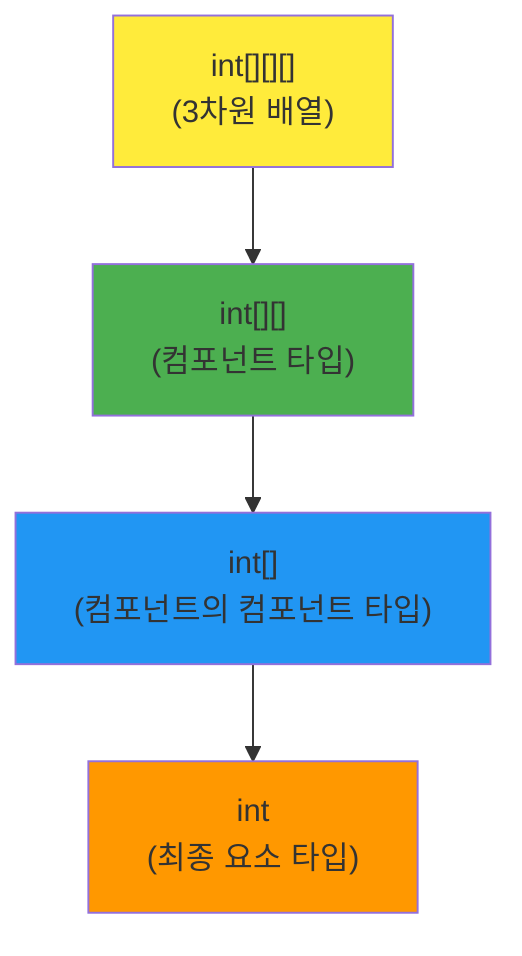
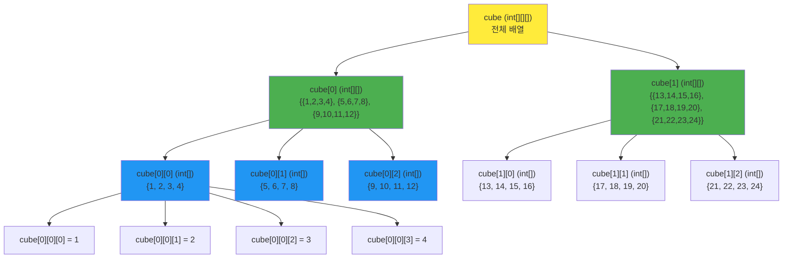

## 실제 값으로 이해하는 컴포넌트 타입

### 🎯 구체적인 3차원 배열 예시

```java
// 2x3x4 크기의 3차원 배열 생성
int[][][] cube = {
    {  // cube[0] - 첫 번째 컴포넌트 (int[][] 타입)
        {1, 2, 3, 4},      // cube[0][0]
        {5, 6, 7, 8},      // cube[0][1]
        {9, 10, 11, 12}    // cube[0][2]
    },
    {  // cube[1] - 두 번째 컴포넌트 (int[][] 타입)
        {13, 14, 15, 16},  // cube[1][0]
        {17, 18, 19, 20},  // cube[1][1]
        {21, 22, 23, 24}   // cube[1][2]
    }
};
```

### 📊 컴포넌트별 실제 값 확인

```java
public class ComponentTypeExample {
    public static void main(String[] args) {
        int[][][] cube = {
            {{1, 2, 3, 4}, {5, 6, 7, 8}, {9, 10, 11, 12}},
            {{13, 14, 15, 16}, {17, 18, 19, 20}, {21, 22, 23, 24}}
        };
        
        // 1. 전체 배열
        System.out.println("전체 배열 타입: " + cube.getClass().getSimpleName());
        // 출력: int[][][]
        
        // 2. 컴포넌트 타입 확인
        int[][] component0 = cube[0];  // 첫 번째 컴포넌트
        int[][] component1 = cube[1];  // 두 번째 컴포넌트
        
        System.out.println("\n=== 컴포넌트 타입 (int[][]) ===");
        System.out.println("cube[0] 타입: " + component0.getClass().getSimpleName());
        System.out.println("cube[1] 타입: " + component1.getClass().getSimpleName());
        
        // 3. 컴포넌트의 실제 값들
        System.out.println("\n=== cube[0]의 실제 값 ===");
        for (int i = 0; i < component0.length; i++) {
            System.out.println("cube[0][" + i + "] = " + Arrays.toString(component0[i]));
        }
        
        System.out.println("\n=== cube[1]의 실제 값 ===");
        for (int i = 0; i < component1.length; i++) {
            System.out.println("cube[1][" + i + "] = " + Arrays.toString(component1[i]));
        }
    }
}
```

### 📋 출력 결과
```
전체 배열 타입: int[][][]

=== 컴포넌트 타입 (int[][]) ===
cube[0] 타입: int[][]
cube[1] 타입: int[][]

=== cube[0]의 실제 값 ===
cube[0][0] = [1, 2, 3, 4]
cube[0][1] = [5, 6, 7, 8]
cube[0][2] = [9, 10, 11, 12]

=== cube[1]의 실제 값 ===
cube[1][0] = [13, 14, 15, 16]
cube[1][1] = [17, 18, 19, 20]
cube[1][2] = [21, 22, 23, 24]
```

### 🔍 시각적 구조 이해



### 🎯 핵심 포인트

```java
// 컴포넌트란?
int[][][] cube = /* 위의 값들 */;

// cube의 컴포넌트들:
int[][] firstComponent = cube[0];   // {{1,2,3,4}, {5,6,7,8}, {9,10,11,12}}
int[][] secondComponent = cube[1];  // {{13,14,15,16}, {17,18,19,20}, {21,22,23,24}}

// 즉, cube는 2개의 int[][] 타입 컴포넌트로 구성되어 있음
```

### 🔄 단계별 접근

```java
// 1단계: 3차원 배열
int[][][] cube = /* 값들 */;
System.out.println("cube.length = " + cube.length);  // 2

// 2단계: 2차원 배열 (컴포넌트)
int[][] component = cube[0];
System.out.println("component.length = " + component.length);  // 3
System.out.println("component는 다음 값을 가짐:");
// {{1,2,3,4}, {5,6,7,8}, {9,10,11,12}}

// 3단계: 1차원 배열 (컴포넌트의 컴포넌트)
int[] subComponent = component[0];
System.out.println("subComponent.length = " + subComponent.length);  // 4
System.out.println("subComponent = " + Arrays.toString(subComponent));
// [1, 2, 3, 4]

// 4단계: 개별 요소
int element = subComponent[0];
System.out.println("element = " + element);  // 1
```

### 📦 박스 비유로 이해

```
📦 cube (3차원 상자)
├── 📦 cube[0] (2차원 상자) ← 첫 번째 컴포넌트
│   ├── 📦 {1, 2, 3, 4}
│   ├── 📦 {5, 6, 7, 8}
│   └── 📦 {9, 10, 11, 12}
└── 📦 cube[1] (2차원 상자) ← 두 번째 컴포넌트
    ├── 📦 {13, 14, 15, 16}
    ├── 📦 {17, 18, 19, 20}
    └── 📦 {21, 22, 23, 24}
```

이제 **컴포넌트 타입**이 `int[][]`인 이유가 명확해졌나요? `cube[0]`과 `cube[1]`이 바로 `int[][]` 타입의 실제 값들이기


```mermaid
graph TD
    A["배열 타입<br/>int[][]"] --> B["컴포넌트 타입<br/>int[]"]
    B --> C{배열 타입인가?}
    C -->|Yes| D["다시 컴포넌트 찾기<br/>int"]
    C -->|No| E["요소 타입 도달"]
    D --> F{배열 타입인가?}
    F -->|No| E["요소 타입: int<br/>(기본 타입)"]
    
    style A fill:#ffeb3b
    style B fill:#4caf50
    style D fill:#2196f3
    style E fill:#ff9800
    ```
