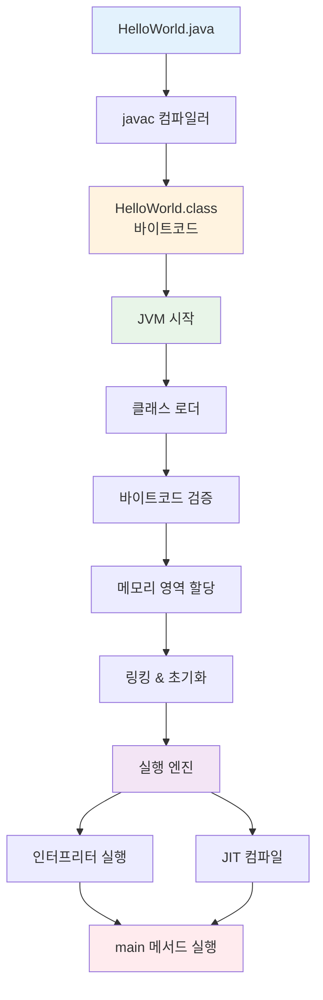
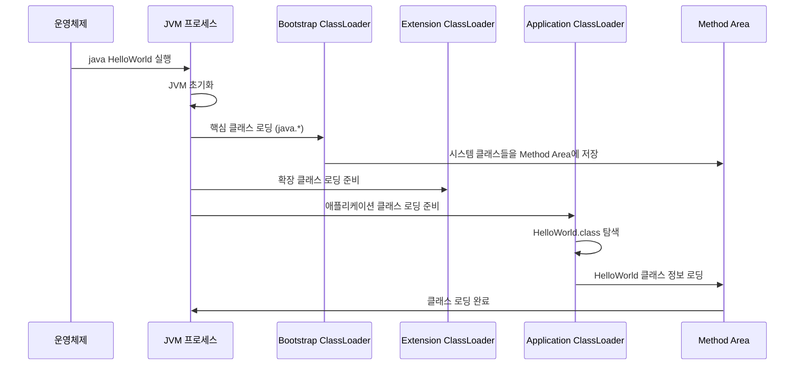
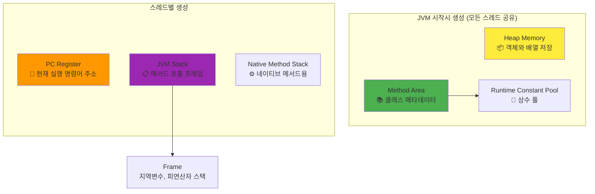
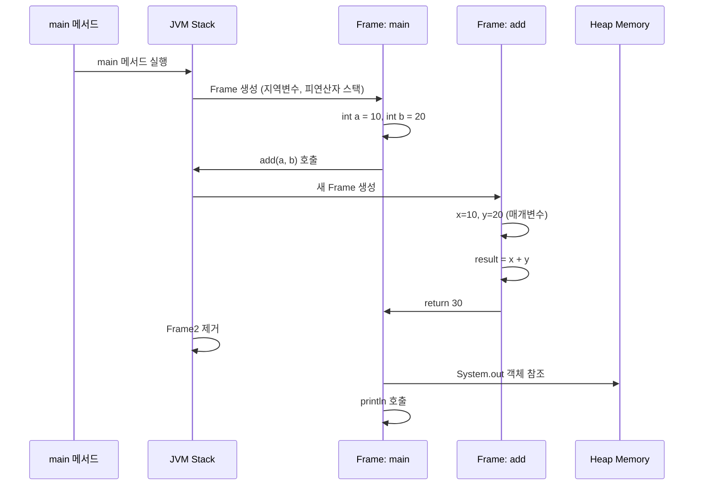

# Java 파일 실행의 완전한 여정: 소스코드에서 실행까지

> **대상 독자**: JVM 기본 개념을 이해하고 있으며, 더 깊이 있는 내부 동작을 학습하고 싶은 개발자

## 목차

- [개요: Java 실행의 3단계](#개요-java-실행의-3단계)
- [1단계: 컴파일 과정 (javac)](#1단계-컴파일-과정-javac)
- [2단계: 클래스 로딩과 링킹](#2단계-클래스-로딩과-링킹)
- [3단계: 실행 엔진과 런타임](#3단계-실행-엔진과-런타임)
- [심화: JVM 메모리 관리](#심화-jvm-메모리-관리)
- [실무 최적화 가이드](#실무-최적화-가이드)
- [트러블슈팅 시나리오](#트러블슈팅-시나리오)

---

## 개요: Java 실행의 3단계

Java 파일이 실행되는 과정을 Oracle JVM Specification을 기반으로 정확하게 이해해봅시다.



### 🎯 핵심 포인트

1. **컴파일 시점**: `.java` → `.class` (바이트코드)
2. **로딩 시점**: 클래스를 JVM 메모리로 로드
3. **실행 시점**: 바이트코드를 기계어로 변환하여 실행

---

## 1단계: 컴파일 과정 (javac)

### 소스코드 분석과 바이트코드 생성

```java
// HelloWorld.java
public class HelloWorld {
    private static final String MESSAGE = "Hello, World!";
    private int instanceVar = 42;
    
    public static void main(String[] args) {
        HelloWorld hw = new HelloWorld();
        hw.printMessage();
    }
    
    public void printMessage() {
        System.out.println(MESSAGE + " Value: " + instanceVar);
    }
}
```

### 컴파일러의 내부 작업

```bash
javac -verbose HelloWorld.java
```

#### 🔍 컴파일러가 수행하는 작업

1. **어휘 분석 (Lexical Analysis)**
   - 소스코드를 토큰으로 분해
   - 키워드, 식별자, 리터럴, 연산자 구분

2. **구문 분석 (Syntax Analysis)**
   - Abstract Syntax Tree (AST) 생성
   - 문법 규칙 검증

3. **의미 분석 (Semantic Analysis)**
   - 타입 검사
   - 변수 선언 확인
   - 메서드 시그니처 검증

4. **바이트코드 생성**
   - JVM 명령어로 변환
   - Constant Pool 구성

### 생성된 바이트코드 분석

```bash
javap -c -v HelloWorld.class
```

**주요 섹션들:**

```
Constant pool:
   #1 = Methodref          #6.#20         // java/lang/Object."<init>":()V
   #2 = Fieldref           #5.#21         // HelloWorld.instanceVar:I
   #3 = Class              #22            // HelloWorld
   #4 = String             #23            // Hello, World!
   #5 = Class              #24            // HelloWorld
   ...

public static void main(java.lang.String[]);
  Code:
     0: new           #3    // class HelloWorld
     3: dup
     4: invokespecial #1    // Method "<init>":()V
     7: astore_1
     8: aload_1
     9: invokevirtual #2    // Method printMessage:()V
    12: return
```

#### 📊 바이트코드 명령어 분석

| 명령어 | 설명 | 스택 변화 |
|--------|------|-----------|
| `new #3` | HelloWorld 인스턴스 생성 | → objectref |
| `dup` | 스택 최상위 값 복제 | objectref → objectref, objectref |
| `invokespecial #1` | 생성자 호출 | objectref → |
| `astore_1` | 지역변수 1에 참조 저장 | objectref → |
| `invokevirtual #2` | 인스턴스 메서드 호출 | objectref → |

---

## 2단계: 클래스 로딩과 링킹

### JVM 시작과 부트스트랩



### 클래스 로딩의 세부 과정

#### 🔄 Loading (로딩)

```java
// ClassLoader 내부 동작 시뮬레이션
public class ClassLoadingProcess {
    public static void demonstrateLoading() {
        ClassLoader appLoader = ClassLoader.getSystemClassLoader();
        
        try {
            // 1. 클래스 탐색
            System.out.println("클래스 파일 탐색: HelloWorld.class");
            
            // 2. 바이트코드 읽기
            Class<?> clazz = appLoader.loadClass("HelloWorld");
            
            // 3. Method Area에 저장
            System.out.println("클래스 로더: " + clazz.getClassLoader());
            System.out.println("슈퍼클래스: " + clazz.getSuperclass().getName());
            
        } catch (ClassNotFoundException e) {
            System.err.println("클래스를 찾을 수 없습니다: " + e.getMessage());
        }
    }
}
```

#### 🔗 Linking (링킹)

**1. Verification (검증)**

```java
// 바이트코드 검증 과정
public class BytecodeVerification {
    /*
     * JVM이 확인하는 항목들:
     * 1. 클래스 파일 형식의 유효성
     * 2. final 클래스 상속 시도 확인
     * 3. 스택 오버플로우 가능성 확인
     * 4. 타입 안전성 확인
     */
    
    public void demonstrateVerification() {
        // 올바른 바이트코드
        int a = 10;
        int b = 20;
        int sum = a + b;  // iadd 명령어 - 검증 통과
        
        // JVM이 방지하는 위험한 코드 (컴파일 단계에서 차단)
        // Object obj = "string";
        // int invalid = (int) obj;  // 타입 안전성 위반
    }
}
```

**2. Preparation (준비)**

```java
public class PreparationPhase {
    private static int staticVar = 100;           // 0으로 초기화됨 (준비 단계)
    private static final String CONSTANT = "Hello"; // "Hello"로 초기화됨 (준비 단계)
    private static Object obj;                    // null로 초기화됨 (준비 단계)
    
    static {
        // 실제 값 할당은 초기화 단계에서 발생
        staticVar = 100;  // 이 시점에서 실제 100이 할당됨
    }
}
```

**3. Resolution (해결)**

```java
public class ResolutionPhase {
    public void demonstrateResolution() {
        // 심볼릭 참조 → 직접 참조 변환 과정
        
        // 1. 클래스 참조 해결
        String str = new String("example");  // java.lang.String 클래스 참조 해결
        
        // 2. 필드 참조 해결
        int length = str.length();  // String.length() 메서드 참조 해결
        
        // 3. 메서드 참조 해결
        System.out.println(str);  // System.out 필드 참조 해결
    }
}
```

#### ⚡ Initialization (초기화)

```java
public class InitializationDemo {
    private static int counter = 0;
    
    static {
        System.out.println("정적 초기화 블록 실행: counter = " + ++counter);
    }
    
    private int instanceCounter = 0;
    
    {
        System.out.println("인스턴스 초기화 블록 실행: instanceCounter = " + ++instanceCounter);
    }
    
    public InitializationDemo() {
        System.out.println("생성자 실행");
    }
    
    public static void main(String[] args) {
        System.out.println("main 메서드 시작");
        
        // 클래스 첫 사용 시점에 초기화 발생
        InitializationDemo obj1 = new InitializationDemo();
        InitializationDemo obj2 = new InitializationDemo();
    }
}

/*
실행 결과:
정적 초기화 블록 실행: counter = 1
main 메서드 시작
인스턴스 초기화 블록 실행: instanceCounter = 1
생성자 실행
인스턴스 초기화 블록 실행: instanceCounter = 1
생성자 실행
*/
```

---

## 3단계: 실행 엔진과 런타임

### JVM 런타임 데이터 영역

Oracle JVM Specification에 따른 정확한 메모리 구조:



### 실행 엔진의 동작

#### 🎯 인터프리터와 JIT 컴파일러

```java
public class ExecutionEngineDemo {
    private static int fibonacci(int n) {
        if (n <= 1) return n;
        return fibonacci(n-1) + fibonacci(n-2);
    }
    
    public static void main(String[] args) {
        long startTime = System.currentTimeMillis();
        
        // 처음 몇 번 호출 - 인터프리터로 실행
        for (int i = 0; i < 1000; i++) {
            fibonacci(20);  // 호출 횟수 임계값 도달 시 JIT 컴파일 발생
        }
        
        long endTime = System.currentTimeMillis();
        System.out.println("실행 시간: " + (endTime - startTime) + "ms");
        
        // JIT 컴파일된 네이티브 코드로 실행
        startTime = System.currentTimeMillis();
        for (int i = 0; i < 1000; i++) {
            fibonacci(20);
        }
        endTime = System.currentTimeMillis();
        System.out.println("JIT 컴파일 후 실행 시간: " + (endTime - startTime) + "ms");
    }
}
```

#### 📊 바이트코드 실행 과정

```java
public class StackFrameDemo {
    public static void demonstrateStackFrame() {
        int a = 10;    // istore_1: 지역변수 1에 10 저장
        int b = 20;    // istore_2: 지역변수 2에 20 저장
        int sum = add(a, b);  // add 메서드 호출
        System.out.println("Result: " + sum);
    }
    
    private static int add(int x, int y) {
        // 새로운 Stack Frame 생성
        // 지역변수 0: x (매개변수)
        // 지역변수 1: y (매개변수)
        
        int result = x + y;  // iload_0, iload_1, iadd, istore_2
        return result;       // iload_2, ireturn
        
        // Stack Frame 제거
    }
}
```

**실행 과정의 상세 분석:**

```
demonstrateStackFrame 메서드 실행:
├── Stack Frame 생성
│   ├── 지역변수 배열: [-, 10, 20, -]
│   ├── 피연산자 스택: []
│   └── 상수 풀 참조
├── add 메서드 호출
│   ├── 새 Stack Frame 생성
│   ├── 매개변수 전달: x=10, y=20
│   ├── 연산 수행: 10 + 20 = 30
│   ├── 결과 반환: 30
│   └── Stack Frame 제거
└── 결과 출력
```

### 메서드 호출과 프레임 관리



---

## 심화: JVM 메모리 관리

### 가비지 컬렉션과 메모리 할당

#### 🗑️ 객체 생성과 GC 과정

```java
public class MemoryManagementDemo {
    
    public static void demonstrateObjectCreation() {
        // Young Generation (Eden Space)에 할당
        String str1 = new String("Hello");
        String str2 = new String("World");
        
        // 대량 객체 생성으로 Minor GC 유발
        for (int i = 0; i < 100000; i++) {
            String temp = new String("temp" + i);
            // temp 객체들은 곧 가비지가 됨
        }
        
        // str1, str2는 여전히 참조되어 Survivor Space로 이동
        System.out.println(str1 + " " + str2);
        
        // Old Generation으로 이동 가능한 장수명 객체
        List<String> longLivedList = new ArrayList<>();
        for (int i = 0; i < 1000; i++) {
            longLivedList.add("Long lived " + i);
        }
    }
    
    public static void demonstrateMemoryMonitoring() {
        Runtime runtime = Runtime.getRuntime();
        
        System.out.println("=== 메모리 정보 ===");
        System.out.printf("최대 메모리: %d MB%n", runtime.maxMemory() / 1024 / 1024);
        System.out.printf("할당된 메모리: %d MB%n", runtime.totalMemory() / 1024 / 1024);
        System.out.printf("사용 가능 메모리: %d MB%n", runtime.freeMemory() / 1024 / 1024);
        System.out.printf("사용 중인 메모리: %d MB%n", 
            (runtime.totalMemory() - runtime.freeMemory()) / 1024 / 1024);
    }
}
```

#### 📈 메모리 풀별 상세 모니터링

```java
import java.lang.management.*;
import java.util.List;

public class AdvancedMemoryMonitoring {
    
    public static void printDetailedMemoryInfo() {
        MemoryMXBean memoryBean = ManagementFactory.getMemoryMXBean();
        List<MemoryPoolMXBean> memoryPools = ManagementFactory.getMemoryPoolMXBeans();
        
        System.out.println("=== 힙 메모리 사용량 ===");
        MemoryUsage heapUsage = memoryBean.getHeapMemoryUsage();
        printMemoryUsage("Heap", heapUsage);
        
        System.out.println("\n=== 비힙 메모리 사용량 ===");
        MemoryUsage nonHeapUsage = memoryBean.getNonHeapMemoryUsage();
        printMemoryUsage("Non-Heap", nonHeapUsage);
        
        System.out.println("\n=== 메모리 풀별 상세 정보 ===");
        for (MemoryPoolMXBean pool : memoryPools) {
            System.out.printf("풀 이름: %s (타입: %s)%n", 
                pool.getName(), pool.getType());
            
            MemoryUsage usage = pool.getUsage();
            if (usage != null) {
                printMemoryUsage("  ", usage);
            }
        }
    }
    
    private static void printMemoryUsage(String prefix, MemoryUsage usage) {
        System.out.printf("%s 사용량: %d MB%n", prefix, usage.getUsed() / 1024 / 1024);
        System.out.printf("%s 커밋됨: %d MB%n", prefix, usage.getCommitted() / 1024 / 1024);
        System.out.printf("%s 최대: %d MB%n", prefix, 
            usage.getMax() == -1 ? -1 : usage.getMax() / 1024 / 1024);
    }
    
    public static void main(String[] args) {
        // 메모리 사용 전 상태
        System.out.println("=== 초기 메모리 상태 ===");
        printDetailedMemoryInfo();
        
        // 메모리 사용량 증가
        List<byte[]> memoryConsumer = new ArrayList<>();
        for (int i = 0; i < 100; i++) {
            memoryConsumer.add(new byte[1024 * 1024]); // 1MB씩 할당
        }
        
        System.out.println("\n=== 메모리 할당 후 상태 ===");
        printDetailedMemoryInfo();
    }
}
```

### Method Area와 Runtime Constant Pool

```java
public class MethodAreaDemo {
    
    // 클래스 변수들은 Method Area에 저장
    private static final String CONSTANT_STRING = "This is constant";
    private static int classVariable = 100;
    
    // 인스턴스 변수들의 메타데이터만 Method Area에, 실제 값은 Heap에
    private int instanceVariable;
    private String instanceString;
    
    static {
        // 클래스 초기화 코드도 Method Area에 저장
        System.out.println("클래스 초기화: classVariable = " + classVariable);
    }
    
    public void demonstrateConstantPool() {
        // 문자열 리터럴은 Runtime Constant Pool에 저장
        String literal1 = "Hello World";
        String literal2 = "Hello World";  // 같은 참조를 가짐
        
        // new 연산자로 생성된 문자열은 Heap에 저장
        String object1 = new String("Hello World");
        String object2 = new String("Hello World");  // 다른 참조를 가짐
        
        System.out.println("literal1 == literal2: " + (literal1 == literal2));  // true
        System.out.println("object1 == object2: " + (object1 == object2));      // false
        System.out.println("literal1 == object1: " + (literal1 == object1));    // false
        
        // intern() 메서드로 Constant Pool 참조 획득
        String interned = object1.intern();
        System.out.println("literal1 == interned: " + (literal1 == interned));  // true
    }
    
    public static void main(String[] args) {
        MethodAreaDemo demo = new MethodAreaDemo();
        demo.demonstrateConstantPool();
    }
}
```

---

## 실무 최적화 가이드

### JVM 튜닝 파라미터

#### 🚀 힙 메모리 최적화

```bash
# 기본 힙 크기 설정
-Xms2g          # 초기 힙 크기
-Xmx4g          # 최대 힙 크기

# 세대별 메모리 비율 조정
-XX:NewRatio=2  # Old:Young = 2:1 비율
-Xmn1g          # Young Generation 크기 직접 설정

# Survivor Space 비율 조정
-XX:SurvivorRatio=8  # Eden:Survivor = 8:1:1

# 대용량 힙 환경에서 백분율 기반 설정 (Java 8u191+)
-XX:InitialRAMPercentage=25  # 초기 힙 비율
-XX:MaxRAMPercentage=75      # 최대 힙 비율
```

#### ⚡ GC 알고리즘 선택

```bash
# G1GC (Java 9+ 기본값, 대용량 힙에 적합)
-XX:+UseG1GC
-XX:MaxGCPauseMillis=200     # 목표 일시정지 시간
-XX:G1HeapRegionSize=16m     # 영역 크기

# ZGC (Java 15+, 초저지연 필요시)
-XX:+UseZGC
-XX:+UnlockExperimentalVMOptions

# Parallel GC (처리량 중심)
-XX:+UseParallelGC
-XX:ParallelGCThreads=8      # 병렬 처리 스레드 수

# ConcMarkSweepGC (Java 14에서 제거, 레거시)
-XX:+UseConcMarkSweepGC      # 사용하지 않음
```

#### 🔧 JIT 컴파일러 튜닝

```bash
# 컴파일 임계값 조정
-XX:CompileThreshold=10000   # C2 컴파일러 임계값 (기본값)
-XX:Tier3CompileThreshold=2000  # C1 컴파일러 임계값

# 컴파일 스레드 수 조정
-XX:CICompilerCount=4        # 컴파일러 스레드 수

# 인라이닝 최적화
-XX:MaxInlineSize=35         # 인라인할 메서드 최대 크기
-XX:FreqInlineSize=325       # 빈번히 호출되는 메서드 인라인 크기
```

### 성능 모니터링 설정

```bash
# JFR (Java Flight Recorder) 활성화
-XX:+FlightRecorder
-XX:StartFlightRecording=duration=60s,filename=app-profile.jfr

# GC 로깅 (Java 9+)
-Xlog:gc*:gc.log:time,level,tags

# 힙 덤프 자동 생성
-XX:+HeapDumpOnOutOfMemoryError
-XX:HeapDumpPath=/var/logs/heapdumps/

# JIT 컴파일 정보
-XX:+PrintCompilation
-XX:+UnlockDiagnosticVMOptions
-XX:+PrintInlining
```

### 실시간 성능 모니터링 코드

```java
import com.sun.management.ThreadMXBean;
import java.lang.management.ManagementFactory;

public class RealTimePerformanceMonitor {
    
    private static final ThreadMXBean threadBean = 
        (ThreadMXBean) ManagementFactory.getThreadMXBean();
    
    public static void monitorApplicationPerformance() {
        // CPU 사용률 모니터링
        long startCpuTime = threadBean.getCurrentThreadCpuTime();
        long startUserTime = threadBean.getCurrentThreadUserTime();
        
        // 메모리 할당 모니터링 (Java 14+)
        long startAllocatedBytes = 0;
        if (threadBean.isThreadAllocatedMemorySupported()) {
            startAllocatedBytes = threadBean.getThreadAllocatedBytes();
        }
        
        // 업무 로직 실행
        performBusinessLogic();
        
        // 성능 측정 결과
        long endCpuTime = threadBean.getCurrentThreadCpuTime();
        long endUserTime = threadBean.getCurrentThreadUserTime();
        long endAllocatedBytes = threadBean.isThreadAllocatedMemorySupported() 
            ? threadBean.getThreadAllocatedBytes() : 0;
        
        System.out.printf("CPU Time: %d ns%n", endCpuTime - startCpuTime);
        System.out.printf("User Time: %d ns%n", endUserTime - startUserTime);
        System.out.printf("System Time: %d ns%n", 
            (endCpuTime - startCpuTime) - (endUserTime - startUserTime));
        
        if (threadBean.isThreadAllocatedMemorySupported()) {
            System.out.printf("Memory Allocated: %d bytes%n", 
                endAllocatedBytes - startAllocatedBytes);
        }
    }
    
    private static void performBusinessLogic() {
        // 시뮬레이션된 업무 로직
        List<String> data = new ArrayList<>();
        for (int i = 0; i < 10000; i++) {
            data.add("Business data " + i);
        }
        
        // CPU 집약적 작업
        data.stream()
            .filter(s -> s.contains("Business"))
            .map(String::toUpperCase)
            .collect(Collectors.toList());
    }
    
    public static void main(String[] args) {
        // 워밍업 (JIT 컴파일 유발)
        for (int i = 0; i < 1000; i++) {
            performBusinessLogic();
        }
        
        // 실제 성능 측정
        System.out.println("=== 성능 측정 결과 ===");
        monitorApplicationPerformance();
    }
}
```

---

## 트러블슈팅 시나리오

### 일반적인 메모리 문제와 해결법

#### 🚨 OutOfMemoryError 유형별 대응

```java
public class OutOfMemoryTroubleshooting {
    
    // 1. Java Heap Space
    public static void simulateHeapSpaceError() {
        List<byte[]> memoryLeak = new ArrayList<>();
        try {
            while (true) {
                memoryLeak.add(new byte[1024 * 1024]); // 1MB씩 계속 할당
            }
        } catch (OutOfMemoryError e) {
            System.err.println("Heap Space 부족: " + e.getMessage());
            System.err.println("해결책: -Xmx 값 증가 또는 메모리 리크 확인");
        }
    }
    
    // 2. Metaspace (Java 8+)
    public static void simulateMetaspaceError() {
        System.err.println("Metaspace 부족 시나리오");
        System.err.println("원인: 과도한 클래스 로딩 (동적 프록시, 리플렉션 등)");
        System.err.println("해결책: -XX:MetaspaceSize=256m -XX:MaxMetaspaceSize=512m");
    }
    
    // 3. Direct Memory
    public static void simulateDirectMemoryError() {
        System.err.println("Direct Memory 부족 시나리오");
        System.err.println("원인: NIO, Netty 등에서 off-heap 메모리 과사용");
        System.err.println("해결책: -XX:MaxDirectMemorySize=1g");
    }
    
    // 메모리 리크 감지 코드
    public static void detectMemoryLeak() {
        Runtime runtime = Runtime.getRuntime();
        long initialMemory = runtime.totalMemory() - runtime.freeMemory();
        
        // 의심되는 코드 실행
        List<String> potentialLeak = new ArrayList<>();
        for (int i = 0; i < 100000; i++) {
            potentialLeak.add("Potential leak " + i);
        }
        
        // 메모리 정리 시도
        potentialLeak.clear();
        System.gc();
        
        try {
            Thread.sleep(1000); // GC 완료 대기
        } catch (InterruptedException e) {
            Thread.currentThread().interrupt();
        }
        
        long finalMemory = runtime.totalMemory() - runtime.freeMemory();
        long memoryDiff = finalMemory - initialMemory;
        
        if (memoryDiff > 1024 * 1024) { // 1MB 이상 차이
            System.err.printf("잠재적 메모리 리크 감지: %d bytes%n", memoryDiff);
        }
    }
}
```

#### 🐛 클래스 로딩 문제 디버깅

```java
public class ClassLoadingDebugging {
    
    public static void debugClassLoading() {
        // 클래스 로딩 정보 출력
        ClassLoader currentLoader = ClassLoadingDebugging.class.getClassLoader();
        
        System.out.println("=== 클래스 로더 계층 구조 ===");
        ClassLoader loader = currentLoader;
        while (loader != null) {
            System.out.println("Loader: " + loader.getClass().getName());
            loader = loader.getParent();
        }
        System.out.println("Bootstrap ClassLoader (null)");
        
        // 특정 클래스의 로딩 위치 확인
        try {
            Class<?> stringClass = Class.forName("java.lang.String");
            System.out.println("String 클래스 로더: " + stringClass.getClassLoader());
            
            Class<?> thisClass = Class.forName("ClassLoadingDebugging");
            System.out.println("현재 클래스 로더: " + thisClass.getClassLoader());
            
        } catch (ClassNotFoundException e) {
            System.err.println("클래스를 찾을 수 없음: " + e.getMessage());
        }
    }
    
    // ClassNotFoundException 대응
    public static void handleClassNotFound() {
        try {
            // 존재하지 않는 클래스 로딩 시도
            Class.forName("com.nonexistent.NonExistentClass");
        } catch (ClassNotFoundException e) {
            System.err.println("클래스를 찾을 수 없습니다: " + e.getMessage());
            System.err.println("확인 사항:");
            System.err.println("1. 클래스패스에 해당 클래스가 포함되어 있는가?");
            System.err.println("2. 패키지명과 클래스명이 정확한가?");
            System.err.println("3. 필요한 의존성 JAR이 클래스패스에 있는가?");
        }
    }
    
    public static void main(String[] args) {
        debugClassLoading();
        handleClassNotFound();
    }
}
```

### 성능 문제 진단

```java
public class PerformanceDiagnostics {
    
    public static void diagnoseGCIssues() {
        MemoryMXBean memoryBean = ManagementFactory.getMemoryMXBean();
        List<GarbageCollectorMXBean> gcBeans = ManagementFactory.getGarbageCollectorMXBeans();
        
        System.out.println("=== GC 성능 분석 ===");
        
        for (GarbageCollectorMXBean gcBean : gcBeans) {
            System.out.printf("GC 이름: %s%n", gcBean.getName());
            System.out.printf("수집 횟수: %d%n", gcBean.getCollectionCount());
            System.out.printf("수집 시간: %d ms%n", gcBean.getCollectionTime());
            
            // GC 효율성 계산
            if (gcBean.getCollectionCount() > 0) {
                double avgGCTime = (double) gcBean.getCollectionTime() / gcBean.getCollectionCount();
                System.out.printf("평균 GC 시간: %.2f ms%n", avgGCTime);
                
                if (avgGCTime > 100) {
                    System.err.println("⚠️ GC 시간이 깁니다. 힙 크기나 GC 알고리즘 검토 필요");
                }
            }
            System.out.println();
        }
    }
    
    // JIT 컴파일 상태 확인
    public static void diagnoseJITCompilation() {
        CompilationMXBean compilationBean = ManagementFactory.getCompilationMXBean();
        
        if (compilationBean.isCompilationTimeMonitoringSupported()) {
            System.out.println("=== JIT 컴파일 정보 ===");
            System.out.printf("컴파일러: %s%n", compilationBean.getName());
            System.out.printf("총 컴파일 시간: %d ms%n", compilationBean.getTotalCompilationTime());
        }
    }
    
    public static void main(String[] args) {
        // GC 유발을 위한 메모리 할당
        List<byte[]> memoryAllocator = new ArrayList<>();
        for (int i = 0; i < 1000; i++) {
            memoryAllocator.add(new byte[1024 * 100]); // 100KB씩 할당
        }
        
        diagnoseGCIssues();
        diagnoseJITCompilation();
    }
}
```

---

## 마무리: 핵심 포인트 정리

### 🎯 Java 실행 과정의 핵심

1. **컴파일 단계**: 소스코드 → 바이트코드 변환, 타입 안전성 확보
2. **로딩 단계**: 클래스 로더를 통한 동적 로딩, 검증, 링킹, 초기화
3. **실행 단계**: 인터프리터와 JIT 컴파일러의 협업으로 최적화된 실행

### 🚀 성능 최적화 체크리스트

- [ ] **메모리 크기**: 적절한 힙 크기 설정 (-Xms, -Xmx)
- [ ] **GC 튜닝**: 애플리케이션 특성에 맞는 GC 알고리즘 선택
- [ ] **JIT 최적화**: 워밍업 시간 고려, 핫스팟 코드 최적화
- [ ] **모니터링**: JFR, GC 로그, 메모리 덤프 활용
- [ ] **프로파일링**: 정기적인 성능 측정 및 분석

### 🔧 문제 해결 접근법

1. **증상 파악**: 에러 메시지, 로그 분석
2. **원인 분석**: 메모리 사용량, GC 패턴, 클래스 로딩 상태 확인
3. **해결책 적용**: JVM 옵션 조정, 코드 최적화
4. **효과 검증**: 성능 측정을 통한 개선 효과 확인

이 문서를 통해 Java 파일이 실행되는 전체 과정을 깊이 있게 이해하셨기를 바랍니다. 실무에서 마주치는 다양한 상황에 이 지식을 활용하여 더 효율적인 Java 애플리케이션을 개발하시기 바랍니다.

---

## 다음 학습 주제 제안

1. **고급 GC 튜닝**: G1GC, ZGC의 내부 동작 원리
2. **JIT 컴파일러 심화**: C1, C2 컴파일러의 최적화 기법
3. **네이티브 메모리 관리**: Direct Memory, Off-heap 데이터 구조
4. **모듈 시스템**: Java 9+ 모듈의 클래스 로딩 영향
5. **비동기 프로그래밍**: Virtual Thread와 JVM 스케줄링

> 💡 **협업 제안**: 이 문서를 바탕으로 특정 주제에 대한 더 깊은 탐구나 실습 예제 개발을 함께 진행할 수 있습니다!
