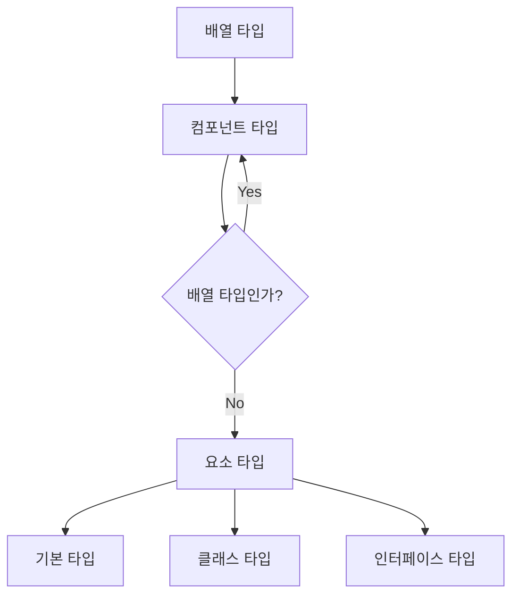
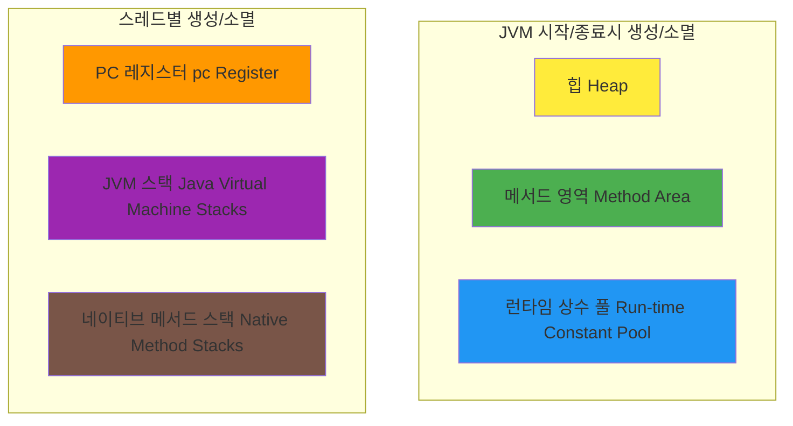
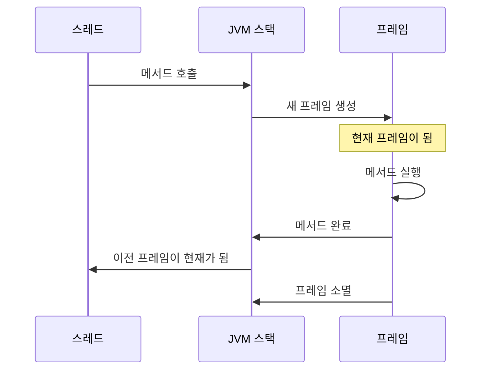
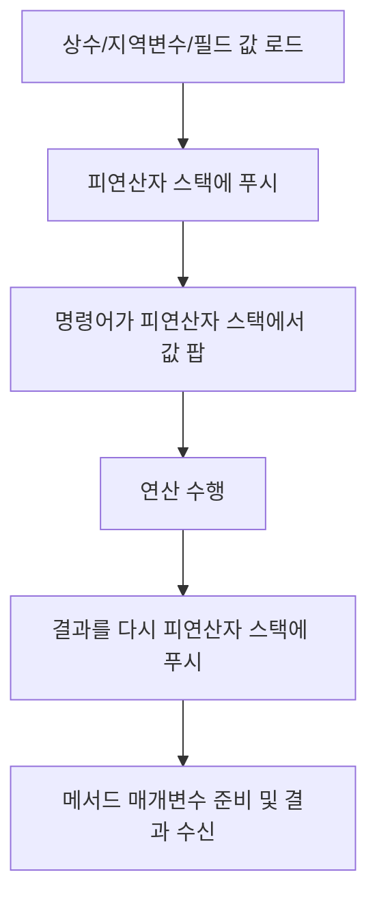
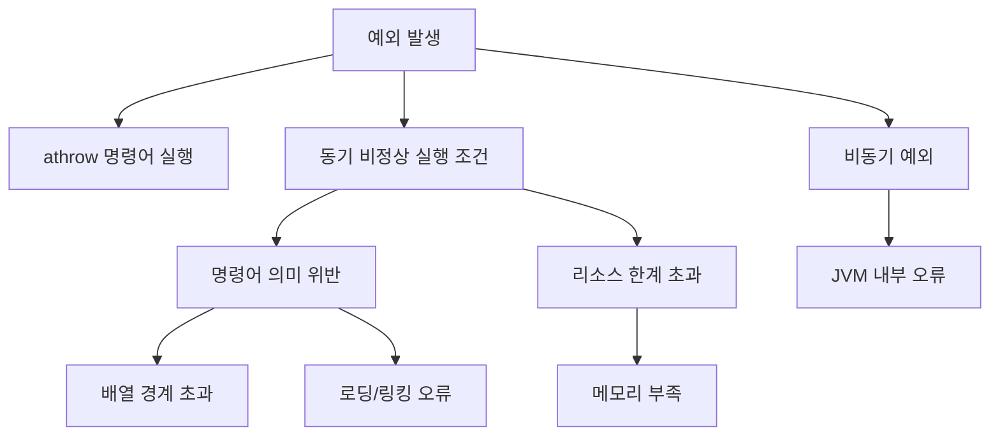
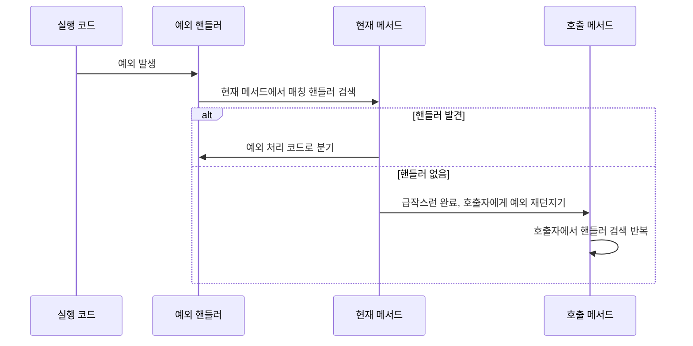
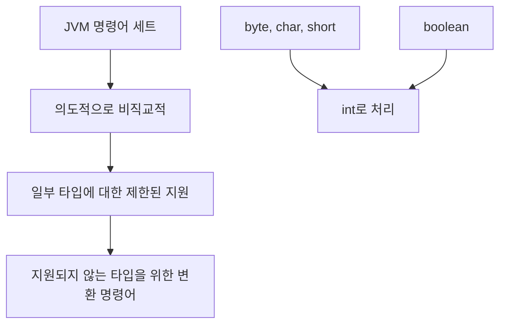
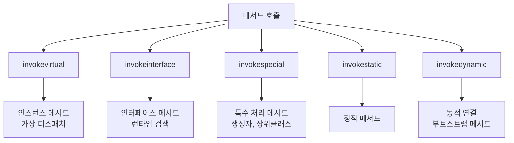
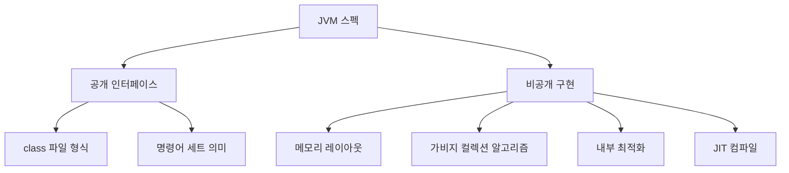

# Java Virtual Machine 구조 스펙 (Oracle SE 21) - 한국어 번역

> 원문: [Oracle Java SE 21 JVM Specification Chapter 2](https://docs.oracle.com/javase/specs/jvms/se21/html/jvms-2.html)

## 목차

- [2.1. 클래스 파일 형식](#21-클래스-파일-형식)
- [2.2. 데이터 타입](#22-데이터-타입)
- [2.3. 기본 타입과 값](#23-기본-타입과-값)
- [2.4. 참조 타입과 값](#24-참조-타입과-값)
- [2.5. 런타임 데이터 영역](#25-런타임-데이터-영역)
- [2.6. 프레임(Frames)](#26-프레임frames)
- [2.7. 객체의 표현](#27-객체의-표현)
- [2.8. 부동소수점 연산](#28-부동소수점-연산)
- [2.9. 특수 메서드](#29-특수-메서드)
- [2.10. 예외](#210-예외)
- [2.11. 명령어 세트 요약](#211-명령어-세트-요약)
- [2.12. 클래스 라이브러리](#212-클래스-라이브러리)
- [2.13. 공개 설계, 비공개 구현](#213-공개-설계-비공개-구현)

---

## 서론

이 문서는 추상 머신을 명세한다. Java Virtual Machine의 특정 구현을 설명하지 않는다.

Java Virtual Machine을 올바르게 구현하려면 `class` 파일 형식을 읽고 그 안에 명시된 연산을 올바르게 수행할 수 있기만 하면 된다. JVM 스펙의 일부가 아닌 구현 세부사항은 구현자의 창의성을 불필요하게 제약할 것이다.

---

## 2.1. 클래스 파일 형식

Java Virtual Machine에 의해 실행될 컴파일된 코드는 하드웨어 및 운영체제에 독립적인 바이너리 형식으로 표현되며, 일반적으로(반드시는 아니지만) 파일에 저장되며, 이를 `class` 파일 형식이라고 한다.

`class` 파일 형식은 클래스나 인터페이스의 표현을 정확히 정의한다. 여기에는 플랫폼별 객체 파일 형식에서 당연하게 여겨질 수 있는 바이트 순서와 같은 세부사항이 포함된다.

> 📚 **참고**: 4장 "클래스 파일 형식"에서 `class` 파일 형식을 자세히 다룬다.

---

## 2.2. 데이터 타입

Java 프로그래밍 언어와 마찬가지로, Java Virtual Machine은 두 종류의 타입으로 동작한다:

- **기본 타입 (Primitive Types)**
- **참조 타입 (Reference Types)**

이에 따라 변수에 저장되고, 인수로 전달되고, 메서드에서 반환되고, 연산될 수 있는 두 종류의 값이 있다:

- **기본 값 (Primitive Values)**
- **참조 값 (Reference Values)**

### 🔍 주요 특징

Java Virtual Machine은 거의 모든 타입 검사가 런타임 이전에(일반적으로 컴파일러에 의해) 수행되기를 기대하며, JVM 자체가 수행할 필요가 없다.

- **기본 타입 값**: 런타임에 타입을 결정하기 위해 태그가 필요하지 않음
- **명령어 세트**: 특정 타입의 값에 대해 동작하도록 의도된 명령어로 피연산자 타입을 구별
  - 예: `iadd`, `ladd`, `fadd`, `dadd`는 모두 두 숫자 값을 더하지만 각각 `int`, `long`, `float`, `double` 타입에 특화됨

### 객체 지원

JVM은 객체에 대한 명시적 지원을 포함한다:

- **객체**: 동적으로 할당된 클래스 인스턴스 또는 배열
- **참조**: 객체에 대한 포인터로 간주할 수 있는 `reference` 타입의 값
- **다중 참조**: 하나의 객체에 대해 여러 참조가 존재할 수 있음

---

## 2.3. 기본 타입과 값

### 2.3.1. 정수 타입과 값

Java Virtual Machine 정수 타입의 값 범위:

| 타입 | 범위 | 비트 |
|------|------|------|
| `byte` | -128 ~ 127 (-2⁷ ~ 2⁷-1) | 8비트 |
| `short` | -32,768 ~ 32,767 (-2¹⁵ ~ 2¹⁵-1) | 16비트 |
| `int` | -2,147,483,648 ~ 2,147,483,647 (-2³¹ ~ 2³¹-1) | 32비트 |
| `long` | -9,223,372,036,854,775,808 ~ 9,223,372,036,854,775,807 (-2⁶³ ~ 2⁶³-1) | 64비트 |
| `char` | 0 ~ 65,535 | 16비트 (무부호) |

### 2.3.2. 부동소수점 타입과 값

부동소수점 타입은 `float`와 `double`이며, IEEE 754 표준과 개념적으로 연관된다:

- **`float`**: 32비트 binary32 형식
- **`double`**: 64비트 binary64 형식

#### 🔄 IEEE 754 버전 변화
- **Java SE 15 이후**: 2019 버전의 IEEE 754 표준 사용
- **Java SE 15 이전**: 1985 버전의 IEEE 754 표준 사용

#### 특수 값들
- **양수/음수 0**
- **양수/음수 무한대**
- **NaN (Not-a-Number)**: 유효하지 않은 연산 결과 (예: 0÷0)

### 2.3.3. returnAddress 타입과 값

`returnAddress` 타입은 JVM의 `jsr`, `ret`, `jsr_w` 명령어에 의해 사용된다. 

- **값**: JVM 명령어의 opcode에 대한 포인터
- **특징**: Java 프로그래밍 언어 타입에 대응하지 않으며 실행 중인 프로그램에 의해 수정될 수 없음

### 2.3.4. boolean 타입

JVM은 `boolean` 타입을 정의하지만 매우 제한적인 지원만 제공한다:

- **명령어**: `boolean` 값만을 위한 전용 JVM 명령어는 없음
- **구현**: Java 언어의 `boolean` 표현식은 JVM `int` 데이터 타입을 사용하도록 컴파일됨
- **배열 지원**: `boolean` 배열은 직접 지원하며 `newarray` 명령어로 생성
- **인코딩**: 
  - `true` → `1`
  - `false` → `0`
  - Oracle 구현에서는 `boolean` 배열을 `byte` 배열로 인코딩 (요소당 8비트)

---

## 2.4. 참조 타입과 값

세 가지 종류의 `reference` 타입이 있다:

1. **클래스 타입** (Class Types)
2. **배열 타입** (Array Types)  
3. **인터페이스 타입** (Interface Types)

### 배열 타입 구조

### null 참조

- **특수 참조**: 어떤 객체도 가리키지 않는 특수한 참조
- **런타임 타입**: 초기에는 런타임 타입이 없지만 어떤 타입으로든 캐스팅 가능
- **기본값**: 모든 `reference` 타입의 기본값은 `null`
- **구체적 값**: JVM 스펙은 `null`을 인코딩하는 구체적인 값을 규정하지 않음

---

## 2.5. 런타임 데이터 영역

JVM은 프로그램 실행 중에 사용되는 다양한 런타임 데이터 영역을 정의한다.

### 2.5.1. PC 레지스터

- **용도**: 각 JVM 스레드가 현재 실행 중인 명령어의 주소를 저장
- **스레드별**: 각 JVM 스레드는 자신만의 `pc` 레지스터를 가짐
- **내용**:
  - **네이티브가 아닌 메서드**: 현재 실행 중인 JVM 명령어의 주소
  - **네이티브 메서드**: 정의되지 않음 (undefined)

### 2.5.2. Java Virtual Machine 스택

- **스레드별 생성**: 각 JVM 스레드는 전용 JVM 스택을 가짐
- **저장 내용**: 프레임(frames)들을 저장
- **기능**: 지역 변수와 부분 결과를 보관하고, 메서드 호출 및 반환에서 역할 수행
- **메모리**: 연속적일 필요 없음, 힙에 할당 가능

#### 🔧 설정 옵션
- **고정 크기** 또는 **동적 확장/축소** 가능
- 구현체는 초기 크기, 최대/최소 크기 제어 옵션을 제공할 수 있음

#### ⚠️ 예외 상황
- **StackOverflowError**: 필요한 스택이 허용된 크기보다 클 때
- **OutOfMemoryError**: 스택 확장 시 충분한 메모리가 없을 때

### 2.5.3. 힙

- **공유**: 모든 JVM 스레드 간 공유
- **용도**: 모든 클래스 인스턴스와 배열의 메모리가 할당되는 영역
- **생성 시점**: JVM 시작 시 생성
- **메모리 회수**: 자동 저장 관리 시스템(가비지 컬렉터)에 의해 수행
- **크기**: 고정 또는 동적 확장/축소 가능
- **메모리**: 연속적일 필요 없음

#### ⚠️ 예외 상황
- **OutOfMemoryError**: 자동 저장 관리 시스템이 제공할 수 있는 것보다 많은 힙이 필요할 때

### 2.5.4. 메서드 영역

- **공유**: 모든 JVM 스레드 간 공유
- **용도**: 컴파일된 코드의 저장 영역 (운영체제 프로세스의 "텍스트" 세그먼트와 유사)
- **저장 내용**:
  - 클래스별 구조체
  - 런타임 상수 풀
  - 필드 및 메서드 데이터
  - 메서드와 생성자의 코드
  - 특수 메서드 코드 (클래스/인터페이스 초기화, 인스턴스 초기화용)

#### 📍 특징
- **논리적 위치**: 힙의 일부이지만, 간단한 구현에서는 가비지 컬렉션이나 압축을 선택하지 않을 수 있음
- **크기**: 고정 또는 동적 확장/축소 가능
- **메모리**: 연속적일 필요 없음

#### ⚠️ 예외 상황
- **OutOfMemoryError**: 할당 요청을 만족시킬 메서드 영역의 메모리가 없을 때

### 2.5.5. 런타임 상수 풀

- **소속**: 각 클래스/인터페이스별로 메서드 영역에서 할당
- **용도**: `class` 파일의 `constant_pool` 테이블의 런타임 표현
- **내용**:
  - 컴파일 타임에 알려진 숫자 리터럴
  - 런타임에 해결되어야 하는 메서드 및 필드 참조
- **기능**: 기존 프로그래밍 언어의 심볼 테이블과 유사하지만 더 넓은 범위의 데이터 포함

#### ⚠️ 예외 상황
- **OutOfMemoryError**: 런타임 상수 풀 구성에 메서드 영역에서 사용 가능한 것보다 많은 메모리가 필요할 때

### 2.5.6. 네이티브 메서드 스택

- **용도**: 네이티브 메서드(Java 이외 언어로 작성된 메서드) 지원
- **구현**: "C 스택"이라고 불리는 기존 스택 사용 가능
- **조건부**: 네이티브 메서드를 로드할 수 없는 JVM 구현은 제공하지 않아도 됨
- **할당**: 일반적으로 각 스레드 생성 시 스레드별로 할당

#### ⚠️ 예외 상황
- **StackOverflowError**: 필요한 스택이 허용된 크기보다 클 때
- **OutOfMemoryError**: 스택 확장 시 충분한 메모리가 없을 때

---

## 2.6. 프레임(Frames)

프레임은 데이터와 부분 결과를 저장하고, 동적 링킹을 수행하며, 메서드의 값을 반환하고, 예외를 디스패치하는 데 사용된다.

### 📋 프레임의 생명 주기

### 구성 요소

각 프레임은 다음을 포함한다:

1. **지역 변수 배열** (Local Variables Array)
2. **피연산자 스택** (Operand Stack)  
3. **현재 메서드 클래스의 런타임 상수 풀 참조**

#### 🔧 크기 결정
- 지역 변수 배열과 피연산자 스택의 크기는 컴파일 타임에 결정
- 메서드와 연관된 코드와 함께 제공됨

### 2.6.1. 지역 변수

- **구조**: 각 프레임은 지역 변수 배열을 포함
- **길이**: 컴파일 타임에 결정되어 클래스/인터페이스의 바이너리 표현에 제공
- **저장 가능 타입**:
  - 단일 지역 변수: `boolean`, `byte`, `char`, `short`, `int`, `float`, `reference`, `returnAddress`
  - 쌍 지역 변수: `long`, `double` (연속된 두 지역 변수 사용)

#### 📍 인덱싱
- **시작 인덱스**: 0
- **`long`/`double`**: 더 작은 인덱스로만 접근 가능
  - 예: 인덱스 n에 저장된 `double`은 n과 n+1을 차지하지만 n+1로는 로드 불가

#### 🔄 매개변수 전달
- **클래스 메서드**: 지역 변수 0부터 연속적으로 매개변수 전달
- **인스턴스 메서드**: 
  - 지역 변수 0: 객체 참조 (`this`)
  - 지역 변수 1부터: 매개변수들

### 2.6.2. 피연산자 스택

- **구조**: 각 프레임은 LIFO(후입선출) 스택인 피연산자 스택을 포함
- **최대 깊이**: 컴파일 타임에 결정되어 메서드 코드와 함께 제공
- **초기 상태**: 프레임 생성 시 비어있음

#### 🔄 동작 과정

#### 📊 예시: iadd 명령어
1. 두 `int` 값이 피연산자 스택의 최상단에 있어야 함
2. 두 값을 스택에서 팝
3. 더한 후 합계를 스택에 푸시

#### 🔍 타입 안전성
- 각 엔트리는 모든 JVM 타입의 값을 보관 가능
- 적절한 타입으로만 연산되어야 함 (class 파일 검증을 통해 강제)

### 2.6.3. 동적 링킹

각 프레임은 동적 링킹을 지원하기 위해 현재 메서드 타입의 런타임 상수 풀에 대한 참조를 포함한다.

- **목적**: 심볼릭 메서드 참조를 구체적인 메서드 참조로 변환
- **지연 바인딩**: 메서드와 변수의 지연 바인딩으로 코드 변경에 대한 견고성 제공
- **클래스 로딩**: 필요에 따라 미정의 심볼을 해결하기 위해 클래스 로딩

### 2.6.4. 정상 메서드 호출 완료

메서드 호출이 예외를 발생시키지 않고 완료되는 경우:

1. **반환값**: return 명령어 실행 시 적절한 타입으로 값 반환
2. **상태 복원**: 호출자의 상태(지역 변수, 피연산자 스택) 복원
3. **PC 증가**: 호출자의 프로그램 카운터를 메서드 호출 명령어 이후로 설정
4. **실행 계속**: 호출자 프레임에서 실행 계속

### 2.6.5. 급작스런 메서드 호출 완료

메서드 내에서 예외가 발생하고 처리되지 않은 경우:

- **예외 전파**: athrow 명령어 실행 또는 JVM 명령어에 의한 예외 발생
- **값 반환 없음**: 급작스런 완료는 호출자에게 값을 반환하지 않음
- **프레임 정리**: 현재 프레임을 정리하고 예외를 상위로 전파

---

## 2.7. 객체의 표현

Java Virtual Machine은 객체의 특정 내부 구조를 규정하지 않는다.

### Oracle 구현 예시

Oracle의 일부 JVM 구현에서 클래스 인스턴스에 대한 참조는 핸들에 대한 포인터이며, 핸들 자체는 다음 두 포인터의 쌍이다:

1. **메서드 테이블 포인터**: 객체의 메서드와 `Class` 객체에 대한 포인터가 있는 테이블
2. **객체 데이터 포인터**: 힙에서 객체 데이터를 위해 할당된 메모리

> 📝 **참고**: 이는 하나의 구현 예시일 뿐이며, JVM 스펙은 특정 구현을 강제하지 않는다.

---

## 2.8. 부동소수점 연산

Java Virtual Machine은 IEEE 754 표준에 지정된 부동소수점 연산의 부분집합을 포함한다.

### 🔄 IEEE 754 표준 버전
- **Java SE 15 이후**: 2019 버전 IEEE 754 표준
- **Java SE 15 이전**: 1985 버전 IEEE 754 표준

### 📊 IEEE 754 연산 대응표

| JVM 명령어 | IEEE 754 연산 |
|------------|---------------|
| dcmp<op>, fcmp<op> | compareQuietLess, compareQuietEqual 등 |
| dadd, fadd | addition |
| dsub, fsub | subtraction |
| dmul, fmul | multiplication |
| ddiv, fdiv | division |
| dneg, fneg | negate |
| i2d, i2f, l2d, l2f | convertFromInt |
| d2i, d2l, f2i, f2l | convertToIntegerTowardZero |
| d2f, f2d | convertFormat |

### ⚠️ IEEE 754와의 주요 차이점

1. **나머지 연산**: `drem`, `frem`은 IEEE 754 나머지 연산과 다름
2. **부호 변경**: `dneg`, `fneg`는 NaN 피연산자의 부호 비트 반전을 요구하지 않음
3. **예외 처리**: IEEE 754 예외 조건을 throw, trap, signal하지 않음
4. **시그널링 비교**: IEEE 754 시그널링 부동소수점 비교를 지원하지 않음
5. **반올림 방향**: IEEE 754 반올림 방향 속성에 대응하지 않음

### 🔄 반올림 정책

#### 1. 가장 가까운 값으로 반올림 (Round to Nearest)
- **적용**: 정수 변환과 나머지를 제외한 모든 부동소수점 명령어
- **규칙**: 무한히 정확한 결과에 가장 가까운 표현 가능한 값으로 반올림
- **동일 거리**: 최하위 비트가 0인 값 선택

#### 2. 0 방향으로 반올림 (Round Toward Zero)
- **적용**: 부동소수점에서 정수 변환 및 나머지 연산
- **규칙**: 무한히 정확한 결과보다 크지 않은 가장 가까운 표현 가능한 값

### 📈 성능과 정확성의 역사

#### Java 1.0/1.1
- **엄격한 평가**: 각 `float`/`double` 피연산자가 IEEE 754 형식에 정확히 대응

#### Java 1.2 ~ Java SE 16
- **확장 지수 값 집합**: 성능 문제 해결을 위해 확장된 지수 범위 허용
- **ACC_STRICT 플래그**: 엄격한 평가 강제 가능

#### Java SE 17 이후
- **엄격한 평가 복귀**: 항상 엄격한 부동소수점 표현식 평가 요구
- **ACC_STRICT 플래그**: 더 이상 부동소수점 연산에 영향을 주지 않음

---

## 2.9. 특수 메서드

### 2.9.1. 인스턴스 초기화 메서드

인스턴스 초기화 메서드의 조건:

1. **정의 위치**: 클래스에서 정의됨 (인터페이스 아님)
2. **특수 이름**: `<init>`
3. **반환 타입**: `void`

#### 🔧 제약 사항
- **클래스**: 비-`void` `<init>` 메서드는 인스턴스 초기화 메서드가 아님
- **인터페이스**: 모든 `<init>` 메서드는 인스턴스 초기화 메서드가 아님
- **호출**: `invokespecial` 명령어로만 미초기화 클래스 인스턴스에서 호출 가능

> 📝 **참고**: `<init>`은 Java 언어에서 유효한 식별자가 아니므로 직접 사용할 수 없다.

### 2.9.2. 클래스 초기화 메서드

클래스 또는 인터페이스 초기화 메서드의 조건:

1. **특수 이름**: `<clinit>`
2. **반환 타입**: `void`
3. **버전 51.0 이상**: `ACC_STATIC` 플래그 설정, 인수 없음

#### 📅 버전별 차이
- **Java SE 7**: `ACC_STATIC` 요구사항 도입
- **Java SE 9**: 인수 없음 요구사항 도입
- **버전 50.0 이하**: `void` `<clinit>` 메서드는 플래그나 인수와 관계없이 클래스 초기화 메서드

> 📝 **참고**: `<clinit>`도 Java 언어에서 유효한 식별자가 아니므로 직접 사용할 수 없다.

### 2.9.3. 시그니처 다형성 메서드

시그니처 다형성 메서드의 조건:

1. **선언 위치**: `java.lang.invoke.MethodHandle` 또는 `java.lang.invoke.VarHandle` 클래스
2. **매개변수**: `Object[]` 타입 단일 형식 매개변수
3. **플래그**: `ACC_VARARGS`와 `ACC_NATIVE` 플래그 설정

#### 🔄 특수 처리
- **invokevirtual 명령어**: 메서드 핸들 호출 또는 VarHandle 인스턴스의 변수 접근을 위한 특수 처리
- **메서드 핸들**: 동적으로 강하게 타입화되고 직접 실행 가능한 참조
- **VarHandle**: 변수나 변수 패밀리에 대한 동적으로 강하게 타입화된 참조

---

## 2.10. 예외

Java Virtual Machine에서 예외는 `Throwable` 클래스 또는 그 서브클래스의 인스턴스로 표현된다.

### 🔄 예외 발생 원인

### 🎯 예외의 정밀성

JVM에 의해 던져진 예외는 정밀하다:

- **제어 이전**: 예외가 던져진 지점 이전의 모든 명령어 효과가 나타나야 함
- **제어 이후**: 예외가 던져진 지점 이후의 명령어는 평가된 것으로 나타나지 않아야 함
- **투기적 실행**: 최적화된 코드의 투기적 실행은 사용자에게 보이는 상태에서 숨겨져야 함

### 🔍 예외 핸들러 검색

### 🔧 예외 핸들러 테이블

- **저장**: 각 메서드의 예외 핸들러들이 테이블에 저장
- **검색 순서**: 테이블의 처음부터 순서대로 검색
- **매칭 조건**:
  - 예외가 발생한 명령어의 오프셋이 핸들러의 범위 내
  - 예외 타입이 핸들러가 처리하는 예외 클래스와 같거나 서브클래스

### 📤 처리되지 않은 예외

메서드 호출 체인의 최상단까지 적절한 핸들러가 없으면:

1. **스레드 종료**: 예외가 던져진 스레드의 실행 종료
2. **핸들러 규칙**:
   - 스레드에 미처리 예외 핸들러가 설정되어 있으면 실행
   - 그렇지 않으면 `ThreadGroup`의 `uncaughtException` 메서드 호출

---

## 2.11. 명령어 세트 요약

### 2.11.1. 타입과 Java Virtual Machine

대부분의 JVM 명령어는 수행하는 연산에 대한 타입 정보를 인코딩한다.

#### 📝 타입 표기법
- `i`: `int` 연산
- `l`: `long`
- `s`: `short`
- `b`: `byte`
- `c`: `char`
- `f`: `float`
- `d`: `double`
- `a`: `reference`

#### 🔄 타입 지원 제약

#### 📊 실제 타입과 계산 타입 매핑

| 실제 타입 | 계산 타입 | 카테고리 |
|-----------|-----------|----------|
| boolean | int | 1 |
| byte | int | 1 |
| char | int | 1 |
| short | int | 1 |
| int | int | 1 |
| float | float | 1 |
| reference | reference | 1 |
| returnAddress | returnAddress | 1 |
| long | long | 2 |
| double | double | 2 |

### 2.11.2. 로드 및 저장 명령어

지역 변수와 피연산자 스택 간의 값 전송:

#### 📥 로드 명령어
- **지역 변수 → 피연산자 스택**: `iload`, `lload`, `fload`, `dload`, `aload`
- **상수 → 피연산자 스택**: `bipush`, `sipush`, `ldc`, `iconst_<i>`, `lconst_<l>`, `fconst_<f>`, `dconst_<d>`, `aconst_null`

#### 📤 저장 명령어
- **피연산자 스택 → 지역 변수**: `istore`, `lstore`, `fstore`, `dstore`, `astore`

#### 🔧 확장 명령어
- **더 넓은 인덱스**: `wide` 명령어로 더 많은 지역 변수 접근

### 2.11.3. 산술 명령어

피연산자 스택의 두 값에 대한 계산 수행:

#### ➕ 기본 산술
- **덧셈**: `iadd`, `ladd`, `fadd`, `dadd`
- **뺄셈**: `isub`, `lsub`, `fsub`, `dsub`
- **곱셈**: `imul`, `lmul`, `fmul`, `dmul`
- **나눗셈**: `idiv`, `ldiv`, `fdiv`, `ddiv`
- **나머지**: `irem`, `lrem`, `frem`, `drem`
- **부호 변경**: `ineg`, `lneg`, `fneg`, `dneg`

#### 🔀 비트 연산
- **시프트**: `ishl`, `ishr`, `iushr`, `lshl`, `lshr`, `lushr`
- **논리합**: `ior`, `lor`
- **논리곱**: `iand`, `land`
- **배타적 논리합**: `ixor`, `lxor`
- **지역 변수 증가**: `iinc`

#### 📊 비교
- **비교**: `dcmpg`, `dcmpl`, `fcmpg`, `fcmpl`, `lcmp`

### 2.11.4. 타입 변환 명령어

#### ➡️ 확장 변환 (정보 손실 없음)
- `int` → `long`, `float`, `double`
- `long` → `float`, `double`
- `float` → `double`

**명령어**: `i2l`, `i2f`, `i2d`, `l2f`, `l2d`, `f2d`

#### ⬅️ 축소 변환 (정보 손실 가능)
- `int` → `byte`, `short`, `char`
- `long` → `int`
- `float` → `int`, `long`
- `double` → `int`, `long`, `float`

**명령어**: `i2b`, `i2c`, `i2s`, `l2i`, `f2i`, `f2l`, `d2i`, `d2l`, `d2f`

### 2.11.5. 객체 생성 및 조작

#### 🆕 생성
- **클래스 인스턴스**: `new`
- **배열**: `newarray`, `anewarray`, `multianewarray`

#### 🔧 필드 접근
- **정적 필드**: `getstatic`, `putstatic`
- **인스턴스 필드**: `getfield`, `putfield`

#### 📋 배열 연산
- **로드**: `baload`, `caload`, `saload`, `iaload`, `laload`, `faload`, `daload`, `aaload`
- **저장**: `bastore`, `castore`, `sastore`, `iastore`, `lastore`, `fastore`, `dastore`, `aastore`
- **길이**: `arraylength`

#### ✅ 타입 검사
- **인스턴스 확인**: `instanceof`
- **타입 캐스팅**: `checkcast`

### 2.11.6. 피연산자 스택 관리 명령어

피연산자 스택의 직접 조작:

- **제거**: `pop`, `pop2`
- **복제**: `dup`, `dup2`, `dup_x1`, `dup2_x1`, `dup_x2`, `dup2_x2`
- **교환**: `swap`

### 2.11.7. 제어 전송 명령어

#### 🔀 조건부 분기
- **단일 값**: `ifeq`, `ifne`, `iflt`, `ifle`, `ifgt`, `ifge`, `ifnull`, `ifnonnull`
- **두 값 비교**: `if_icmpeq`, `if_icmpne`, `if_icmplt`, `if_icmple`, `if_icmpgt`, `if_icmpge`, `if_acmpeq`, `if_acmpne`

#### 🔄 복합 조건부 분기
- **테이블 스위치**: `tableswitch`
- **룩업 스위치**: `lookupswitch`

#### ➡️ 무조건부 분기
- **이동**: `goto`, `goto_w`
- **서브루틴**: `jsr`, `jsr_w`, `ret`

### 2.11.8. 메서드 호출 및 반환 명령어

#### 📞 호출 명령어

#### 🔙 반환 명령어
- **타입별 반환**: `ireturn`, `lreturn`, `freturn`, `dreturn`, `areturn`
- **void 반환**: `return`

### 2.11.9. 예외 던지기

- **프로그래밍 방식**: `athrow` 명령어
- **자동 발생**: JVM 명령어가 비정상 조건 감지 시

### 2.11.10. 동기화

#### 🔒 메서드 레벨 동기화
- **암시적 수행**: 메서드 호출 및 반환의 일부로
- **플래그**: `ACC_SYNCHRONIZED` 플래그로 구분
- **모니터**: 실행 스레드가 모니터 진입, 메서드 호출, 모니터 탈출

#### 🔗 명령어 시퀀스 동기화
- **명시적 명령어**: `monitorenter`, `monitorexit`
- **synchronized 블록**: Java 언어의 synchronized 블록 구현
- **컴파일러 협력**: JVM을 대상으로 하는 컴파일러와의 협력 필요

#### 📏 구조화된 잠금 규칙
1. **진입-탈출 균형**: 메서드 호출 동안 모니터 진입과 탈출 횟수가 같아야 함
2. **탈출 한계**: 메서드 호출 동안 어느 시점에서도 탈출이 진입을 초과하지 않아야 함

---

## 2.12. 클래스 라이브러리

Java Virtual Machine은 Java SE 플랫폼의 클래스 라이브러리 구현을 위한 충분한 지원을 제공해야 한다.

### 🛠️ 특별한 지원이 필요한 클래스들

#### 🔍 리플렉션
- **패키지**: `java.lang.reflect`
- **클래스**: `Class`

#### 📦 클래스 로딩 및 생성
- **대표 클래스**: `ClassLoader`

#### 🔗 링킹 및 초기화
- 위에서 인용된 클래스들도 이 범주에 해당

#### 🔐 보안
- **패키지**: `java.security`
- **클래스**: `SecurityManager` 등

#### 🧵 멀티스레딩
- **클래스**: `Thread`

#### 🔗 약한 참조
- **패키지**: `java.lang.ref`

> 📝 **참고**: 이 목록은 포괄적이지 않고 예시적이다. Java SE 플랫폼 클래스 라이브러리의 자세한 스펙은 별도 문서에서 확인하라.

---

## 2.13. 공개 설계, 비공개 구현

### 🎯 공개 설계와 비공개 구현의 경계

지금까지 이 스펙은 JVM의 공개적 관점을 스케치했다:

- **`class` 파일 형식**
- **명령어 세트**

이러한 구성요소들은 JVM의 하드웨어, 운영체제, 구현 독립성에 필수적이다.

### 🔧 구현의 자유도

#### ✅ 준수해야 할 것
- `class` 파일 형식을 읽을 수 있어야 함
- JVM 코드의 의미를 정확히 구현해야 함
- 올바른 외부 인터페이스를 신중히 유지해야 함

#### 🆓 자유로운 것
- 메모리 레이아웃
- 가비지 컬렉션 알고리즘  
- JVM 명령어의 내부 최적화
- 기계어 번역

### 🔬 예외 상황

일부 도구들은 일반적으로 "내부"로 간주되는 JVM 요소에 접근이 필요하다:

- **디버거** (Debuggers)
- **프로파일러** (Profilers)  
- **JIT 코드 생성기** (Just-in-time Code Generators)

> 🤝 **협력**: Oracle은 다른 JVM 구현체 및 도구 벤더와 협력하여 공통 인터페이스를 개발하고 업계 전반에 걸쳐 이를 촉진한다.

### 🎨 구현 선택의 유연성

구현자는 다양한 목표에 맞게 JVM 구현을 조정할 수 있다:

- **고성능** (High Performance)
- **낮은 메모리 사용** (Low Memory Use)  
- **이식성** (Portability)

#### 🔄 구현 옵션 범위

1. **로드 타임 변환**: JVM 코드를 다른 가상 머신의 명령어 세트로 변환
2. **런타임 변환**: 실행 중 다른 가상 머신의 명령어 세트로 변환
3. **네이티브 코드 생성**: 호스트 CPU의 네이티브 명령어 세트로 변환 (JIT)

### 🌟 설계 철학

정밀하게 정의된 가상 머신과 객체 파일 형식의 존재가 구현자의 창의성을 크게 제한할 필요는 없다.

**Java Virtual Machine은 다음을 지원하도록 설계되었다:**
- **다양한 구현**: 새롭고 흥미로운 솔루션 제공
- **호환성 유지**: 구현체 간 호환성 보장
- **혁신 촉진**: 창의적인 구현 방법 허용

> 🚀 **결론**: JVM의 공개 인터페이스를 정확히 유지하는 한, "내부" 구현은 구현자의 몫이다.

---

## 📖 참고 자료

- **원문**: [Oracle Java SE 21 JVM Specification Chapter 2](https://docs.oracle.com/javase/specs/jvms/se21/html/jvms-2.html)
- **관련 챕터**:
  - [Chapter 1: Introduction](https://docs.oracle.com/javase/specs/jvms/se21/html/jvms-1.html)
  - [Chapter 3: Compiling for the Java Virtual Machine](https://docs.oracle.com/javase/specs/jvms/se21/html/jvms-3.html)
  - [Chapter 4: The class File Format](https://docs.oracle.com/javase/specs/jvms/se21/html/jvms-4.html)
  - [Chapter 5: Loading, Linking, and Initializing](https://docs.oracle.com/javase/specs/jvms/se21/html/jvms-5.html)
  - [Chapter 6: The Java Virtual Machine Instruction Set](https://docs.oracle.com/javase/specs/jvms/se21/html/jvms-6.html)

---

## 🏷️ 태그

`#JVM` `#Java` `#VirtualMachine` `#Specification` `#Oracle` `#번역` `#메모리관리` `#바이트코드` `#런타임` `#가상머신구조`

---

*이 문서는 Oracle Java SE 21 JVM Specification의 Chapter 2를 한국어로 번역하여 정리한 것입니다. 원문의 정확한 의미 전달을 위해 기술적 용어는 가능한 한 원문을 병기하였습니다.*
