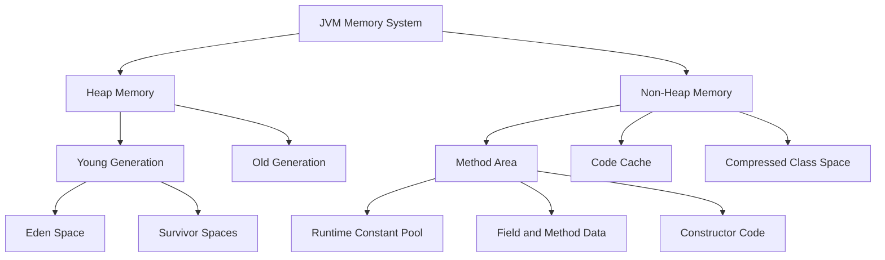
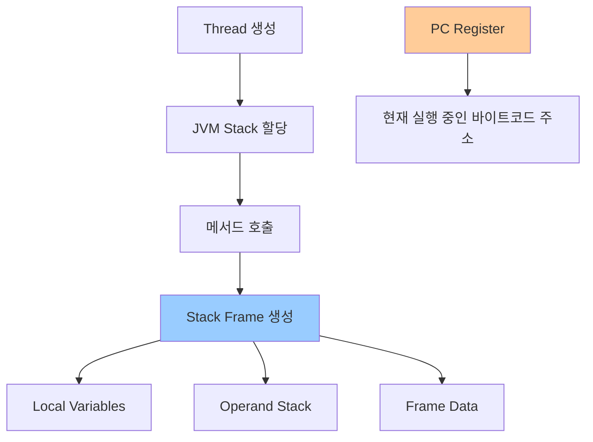
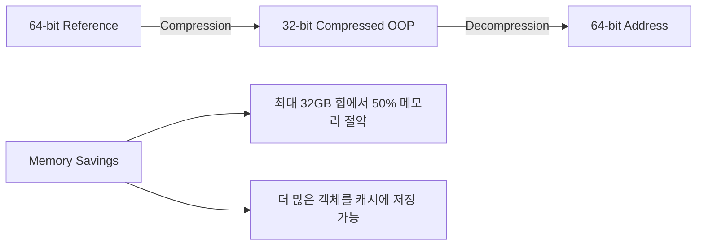
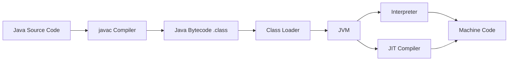

# Java Virtual Machine (JVM) 공식 문서 기반 정리

## 목차
- [Java Virtual Machine (JVM) 공식 문서 기반 정리](#java-virtual-machine-jvm-공식-문서-기반-정리)
  - [목차](#목차)
  - [JVM 런타임 데이터 영역](#jvm-런타임-데이터-영역)
    - [Heap Memory와 Non-Heap Memory](#heap-memory와-non-heap-memory)
    - [Method Area와 Runtime Constant Pool](#method-area와-runtime-constant-pool)
    - [JVM Stack과 PC Register](#jvm-stack과-pc-register)
    - [메모리 관리와 GC](#메모리-관리와-gc)
  - [JVM 메모리 모니터링](#jvm-메모리-모니터링)
    - [Runtime 클래스 메모리 API](#runtime-클래스-메모리-api)
    - [Memory Management API](#memory-management-api)
    - [Thread Memory Allocation](#thread-memory-allocation)
  - [JVM 옵션과 메모리 튜닝](#jvm-옵션과-메모리-튜닝)
    - [Heap 크기 설정](#heap-크기-설정)
    - [Memory Pool 관리](#memory-pool-관리)
    - [Compressed OOPs](#compressed-oops)
  - [클래스 로딩과 바이트코드](#클래스-로딩과-바이트코드)
    - [클래스 로더와 Method Area](#클래스-로더와-method-area)
    - [바이트코드 실행](#바이트코드-실행)
  - [메모리 세그먼트와 Foreign Memory Access](#메모리-세그먼트와-foreign-memory-access)
    - [Heap Segments](#heap-segments)
    - [Native Memory Access](#native-memory-access)
  - [실무 활용 가이드](#실무-활용-가이드)
    - [메모리 문제 진단](#메모리-문제-진단)
    - [성능 최적화](#성능-최적화)
  - [요약](#요약)
    - [JVM 메모리 아키텍처 핵심](#jvm-메모리-아키텍처-핵심)
    - [성능 최적화 체크리스트](#성능-최적화-체크리스트)

---

## JVM 런타임 데이터 영역

Java Virtual Machine Specification에 따르면, JVM은 프로그램 실행을 위해 다양한 런타임 데이터 영역을 관리합니다.

### Heap Memory와 Non-Heap Memory



**Java Memory System 구조 (공식 정의):**

| 메모리 영역 | 공식 정의 | 특징 |
|------------|----------|------|
| **Heap Memory** | Runtime data area for class instances and arrays | 가비지 컬렉션 대상, JVM 시작 시 생성 |
| **Non-Heap Memory** | Method Area + internal processing memory | 클래스별 구조 저장, JIT 컴파일러 코드 포함 |

### Method Area와 Runtime Constant Pool

```java
// Method Area에 저장되는 정보들
public class Example {
    static int staticVar = 100;        // Method Area
    final String CONSTANT = "Hello";   // Runtime Constant Pool
    
    public void method() {             // Method bytecode in Method Area
        int localVar = 10;             // JVM Stack
        String str = "World";          // Reference in Stack, Object in Heap
    }
}
```

**Method Area 저장 내용:**
- 클래스 메타데이터 (필드, 메서드 정보)
- Runtime Constant Pool
- Static 변수들
- 메서드 바이트코드

### JVM Stack과 PC Register



**Stack Frame 구성요소:**
1. **Local Variables**: 메서드 매개변수와 지역변수
2. **Operand Stack**: 바이트코드 연산을 위한 작업 스택
3. **Frame Data**: Constant Pool 참조, 예외 처리 정보

### 메모리 관리와 GC

```java
// Runtime 클래스를 통한 메모리 정보 확인
Runtime runtime = Runtime.getRuntime();

// 현재 메모리 사용량
long totalMemory = runtime.totalMemory();     // 현재 JVM이 사용 중인 총 메모리
long freeMemory = runtime.freeMemory();       // 사용 가능한 메모리
long maxMemory = runtime.maxMemory();         // JVM이 사용할 수 있는 최대 메모리

// GC 실행 (권장사항)
runtime.gc();  // System.gc()와 동일
```

---

## JVM 메모리 모니터링

### Runtime 클래스 메모리 API

Java에서 제공하는 공식 메모리 모니터링 API입니다.

```java
public class MemoryMonitor {
    public static void printMemoryInfo() {
        Runtime runtime = Runtime.getRuntime();
        
        // 바이트 단위로 반환
        long maxMemory = runtime.maxMemory();     // -Xmx 설정값
        long totalMemory = runtime.totalMemory(); // 현재 할당된 힙 크기
        long freeMemory = runtime.freeMemory();   // 사용 가능한 메모리
        long usedMemory = totalMemory - freeMemory;
        
        System.out.printf("Max Memory: %d MB%n", maxMemory / 1024 / 1024);
        System.out.printf("Total Memory: %d MB%n", totalMemory / 1024 / 1024);
        System.out.printf("Used Memory: %d MB%n", usedMemory / 1024 / 1024);
        System.out.printf("Free Memory: %d MB%n", freeMemory / 1024 / 1024);
    }
}
```

### Memory Management API

```java
import java.lang.management.*;

public class AdvancedMemoryMonitor {
    public static void printDetailedMemoryInfo() {
        MemoryMXBean memoryBean = ManagementFactory.getMemoryMXBean();
        
        // Heap Memory 사용량
        MemoryUsage heapUsage = memoryBean.getHeapMemoryUsage();
        System.out.println("Heap Memory Usage:");
        printMemoryUsage(heapUsage);
        
        // Non-Heap Memory 사용량  
        MemoryUsage nonHeapUsage = memoryBean.getNonHeapMemoryUsage();
        System.out.println("Non-Heap Memory Usage:");
        printMemoryUsage(nonHeapUsage);
        
        // 각 Memory Pool 정보
        List<MemoryPoolMXBean> memoryPools = ManagementFactory.getMemoryPoolMXBeans();
        for (MemoryPoolMXBean pool : memoryPools) {
            System.out.printf("Pool: %s, Type: %s%n", 
                pool.getName(), pool.getType());
            printMemoryUsage(pool.getUsage());
        }
    }
    
    private static void printMemoryUsage(MemoryUsage usage) {
        if (usage != null) {
            System.out.printf("  Used: %d MB%n", usage.getUsed() / 1024 / 1024);
            System.out.printf("  Committed: %d MB%n", usage.getCommitted() / 1024 / 1024);
            System.out.printf("  Max: %d MB%n", usage.getMax() / 1024 / 1024);
        }
    }
}
```

### Thread Memory Allocation

Java 21에서 도입된 Thread별 메모리 할당 추적:

```java
import com.sun.management.ThreadMXBean;
import java.lang.management.ManagementFactory;

public class ThreadMemoryMonitor {
    public static void monitorThreadMemory() {
        ThreadMXBean threadBean = (ThreadMXBean) 
            ManagementFactory.getThreadMXBean();
        
        if (threadBean.isThreadAllocatedMemorySupported()) {
            // 현재 스레드의 메모리 할당량
            long currentThreadAllocation = threadBean.getThreadAllocatedBytes();
            System.out.printf("Current Thread Allocated: %d bytes%n", 
                currentThreadAllocation);
            
            // 전체 스레드 메모리 할당량
            long totalAllocation = threadBean.getTotalThreadAllocatedBytes();
            System.out.printf("Total Thread Allocated: %d bytes%n", 
                totalAllocation);
        }
    }
}
```

---

## JVM 옵션과 메모리 튜닝

### Heap 크기 설정

**기본 Heap 크기 설정:**
```bash
# 초기 힙 크기와 최대 힙 크기
-Xms2g -Xmx4g

# 또는 백분율로 설정 (Java 8u191+)
-XX:InitialRAMPercentage=25
-XX:MaxRAMPercentage=75
-XX:MinRAMPercentage=50  # 작은 힙용 (약 125MB 이하)
```

**Young Generation 튜닝:**
```bash
# Young:Old 비율 설정 (기본값: 2, 즉 1:2)
-XX:NewRatio=1          # Young Generation을 전체 힙의 1/2로 설정

# Young Generation 절대 크기 설정
-XX:NewSize=512m        # 초기 크기
-XX:MaxNewSize=1g       # 최대 크기
-Xmn1g                  # NewSize와 MaxNewSize를 동시에 설정

# Eden:Survivor 비율 (기본값: 8, 즉 8:1:1)
-XX:SurvivorRatio=6     # Eden:Survivor = 6:1:1
```

### Memory Pool 관리

```bash
# 힙 확장/축소 정책
-XX:MinHeapFreeRatio=10    # GC 후 최소 여유 공간 (기본: 40%)
-XX:MaxHeapFreeRatio=20    # GC 후 최대 여유 공간 (기본: 70%)
-XX:-ShrinkHeapInSteps     # 힙 크기 점진적 축소 비활성화

# Thread Local Allocation Buffer (TLAB) 튜닝
-XX:TLABSize=512k          # 초기 TLAB 크기
-XX:+UseTLAB               # TLAB 사용 (기본값: enabled)
```

### Compressed OOPs

64비트 JVM에서 메모리 효율성을 위한 압축 포인터:

```bash
# Compressed OOPs 설정 (기본값: enabled, 32GB 힙까지)
-XX:+UseCompressedOops     # 압축 포인터 사용 (기본값)
-XX:-UseCompressedOops     # 압축 포인터 비사용

# 객체 정렬 설정
-XX:ObjectAlignmentInBytes=16  # 객체 정렬 크기 (기본: 8바이트)
```

**Compressed OOPs 동작 원리:**


---

## 클래스 로딩과 바이트코드

### 클래스 로더와 Method Area

```java
// 클래스 로딩 과정 확인
public class ClassLoadingExample {
    static {
        System.out.println("ClassLoadingExample 클래스 로딩됨");
    }
    
    public static void main(String[] args) {
        System.out.println("main 메서드 시작");
        
        // 이 시점에 AnotherClass가 로딩됨
        AnotherClass obj = new AnotherClass();
        
        // Reflection을 통한 클래스 정보 확인
        Class<?> clazz = obj.getClass();
        System.out.println("Class Name: " + clazz.getName());
        System.out.println("ClassLoader: " + clazz.getClassLoader());
    }
}

class AnotherClass {
    static {
        System.out.println("AnotherClass 클래스 로딩됨");
    }
}
```

### 바이트코드 실행

**Java 컴파일과 실행 과정:**


**바이트코드 예시:**
```java
public class BytecodeExample {
    public int add(int a, int b) {
        return a + b;
    }
}

// javap -c BytecodeExample로 확인한 바이트코드:
/*
public int add(int, int);
  Code:
     0: iload_1      // 첫 번째 매개변수를 스택에 로드
     1: iload_2      // 두 번째 매개변수를 스택에 로드
     2: iadd         // 두 값을 더하기
     3: ireturn      // 결과 반환
*/
```

---

## 메모리 세그먼트와 Foreign Memory Access

Java 21의 Foreign Memory Access API (Preview)를 통한 고급 메모리 관리:

### Heap Segments

```java
import java.lang.foreign.*;

public class MemorySegmentExample {
    public static void heapSegmentExample() {
        // 배열을 기반으로 한 힙 세그먼트 생성
        int[] array = {1, 2, 3, 4, 5};
        MemorySegment heapSegment = MemorySegment.ofArray(array);
        
        // 세그먼트 정보 확인
        System.out.println("Segment size: " + heapSegment.byteSize());
        System.out.println("Is heap segment: " + heapSegment.isNative());
        
        // 힙 베이스 객체 확인
        var heapBase = heapSegment.heapBase();
        if (heapBase.isPresent()) {
            System.out.println("Heap base: " + heapBase.get());
        }
    }
}
```

### Native Memory Access

```java
public class NativeMemoryExample {
    public static void nativeMemoryExample() {
        try (Arena arena = Arena.ofConfined()) {
            // 네이티브 메모리 할당
            MemorySegment nativeSegment = arena.allocate(1024);
            
            // 메모리에 데이터 쓰기
            nativeSegment.set(ValueLayout.JAVA_INT, 0, 42);
            
            // 메모리에서 데이터 읽기
            int value = nativeSegment.get(ValueLayout.JAVA_INT, 0);
            System.out.println("Read value: " + value);
            
            // Arena가 닫히면 자동으로 메모리 해제
        }
    }
}
```

---

## 실무 활용 가이드

### 메모리 문제 진단

**OutOfMemoryError 유형별 대응:**

```java
public class MemoryDiagnostics {
    // 1. Heap Space 부족
    public static void diagnoseHeapSpace() {
        try {
            List<byte[]> list = new ArrayList<>();
            while (true) {
                list.add(new byte[1024 * 1024]); // 1MB씩 할당
            }
        } catch (OutOfMemoryError e) {
            System.err.println("Java heap space exceeded");
            // 해결: -Xmx 증가 또는 메모리 리크 확인
        }
    }
    
    // 2. Metaspace 부족 (Java 8+)
    public static void diagnoseMetaspace() {
        // 동적 클래스 생성으로 Metaspace 고갈 시뮬레이션
        System.err.println("Metaspace exceeded");
        // 해결: -XX:MetaspaceSize, -XX:MaxMetaspaceSize 조정
    }
    
    // 3. Memory Pool 모니터링
    public static void setupMemoryPoolMonitoring() {
        List<MemoryPoolMXBean> pools = ManagementFactory.getMemoryPoolMXBeans();
        
        for (MemoryPoolMXBean pool : pools) {
            if (pool.isUsageThresholdSupported()) {
                // 80% 사용률에서 알림
                long threshold = (long) (pool.getUsage().getMax() * 0.8);
                pool.setUsageThreshold(threshold);
                
                // 임계값 초과 시 알림
                if (pool.isUsageThresholdExceeded()) {
                    System.err.printf("Memory pool %s exceeded threshold%n", 
                        pool.getName());
                }
            }
        }
    }
}
```

### 성능 최적화

**GC 튜닝 전략:**

```bash
# G1GC 사용 (Java 9+ 기본값)
-XX:+UseG1GC
-XX:MaxGCPauseMillis=200        # 목표 GC 일시정지 시간
-XX:G1HeapRegionSize=16m        # G1 영역 크기

# ZGC 사용 (Java 15+, 매우 낮은 지연시간)
-XX:+UseZGC
-XX:+UnlockExperimentalVMOptions

# Parallel GC 튜닝
-XX:+UseParallelGC
-XX:ParallelGCThreads=8         # 병렬 GC 스레드 수

# GC 로깅 (Java 9+)
-Xlog:gc:gc.log:time,level,tags
```

**메모리 효율성 최적화:**

```java
public class MemoryOptimization {
    // 1. 객체 풀링으로 GC 압박 감소
    private static final ThreadLocal<StringBuilder> STRING_BUILDER_POOL = 
        ThreadLocal.withInitial(() -> new StringBuilder(256));
    
    public static String efficientStringConcatenation(String... parts) {
        StringBuilder sb = STRING_BUILDER_POOL.get();
        sb.setLength(0); // 재사용을 위해 초기화
        
        for (String part : parts) {
            sb.append(part);
        }
        return sb.toString();
    }
    
    // 2. Primitive Collections 사용으로 메모리 절약
    // Eclipse Collections나 Trove 라이브러리 활용
    
    // 3. Off-heap 캐싱 고려
    // Chronicle Map, Hazelcast 등의 솔루션
}
```

**JVM 성능 모니터링:**

```bash
# JVM 성능 지표 수집
-XX:+FlightRecorder
-XX:StartFlightRecording=duration=60s,filename=profile.jfr

# 힙 덤프 자동 생성
-XX:+HeapDumpOnOutOfMemoryError
-XX:HeapDumpPath=/path/to/dumps/

# JIT 컴파일 정보
-XX:+PrintCompilation
-XX:+UnlockDiagnosticVMOptions
-XX:+PrintInlining
```

---

## 요약

### JVM 메모리 아키텍처 핵심

1. **Heap Memory**: 객체와 배열 저장, GC 대상
2. **Non-Heap Memory**: 클래스 메타데이터, JIT 코드 캐시
3. **Runtime Constant Pool**: 문자열 리터럴, 클래스 상수
4. **JVM Stack**: 메서드별 로컬 변수와 중간 연산 결과

### 성능 최적화 체크리스트

- [ ] 적절한 힙 크기 설정 (`-Xms`, `-Xmx`)
- [ ] Young Generation 비율 조정 (`-XX:NewRatio`)
- [ ] GC 알고리즘 선택 및 튜닝
- [ ] 메모리 누수 모니터링 설정
- [ ] Compressed OOPs 활용 (32GB 이하 힙)
- [ ] 메모리 풀 임계값 모니터링

Java의 메모리 관리는 **자동적이면서도 세밀한 튜닝이 가능**합니다. 공식 API를 활용한 모니터링과 적절한 JVM 옵션 설정을 통해 애플리케이션의 메모리 효율성과 성능을 크게 향상시킬 수 있습니다.