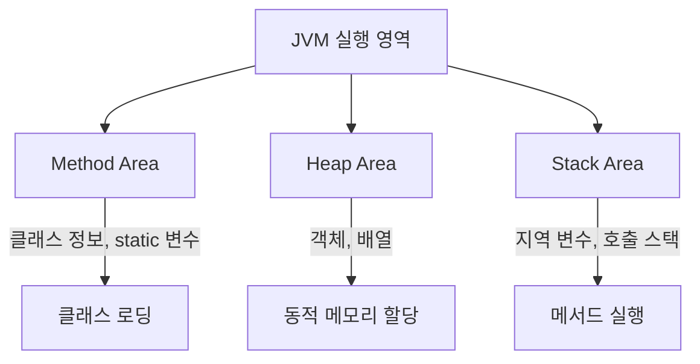
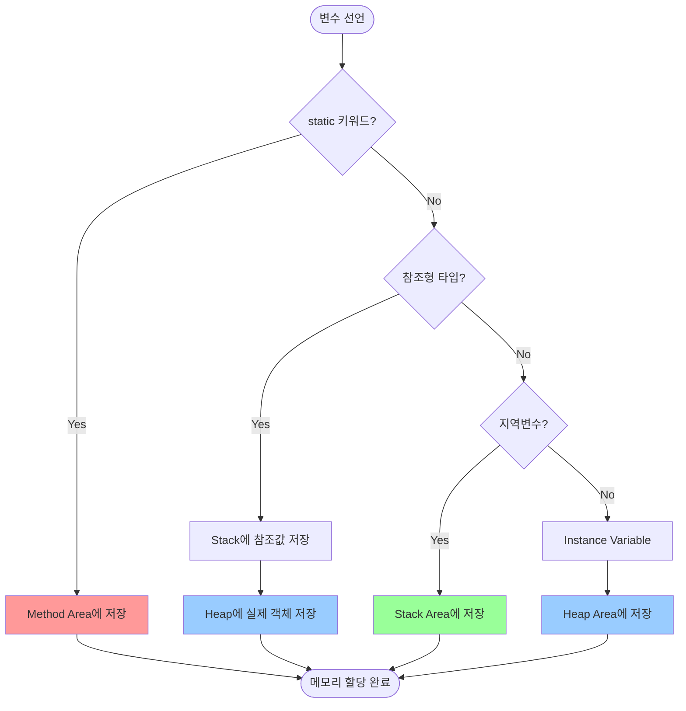
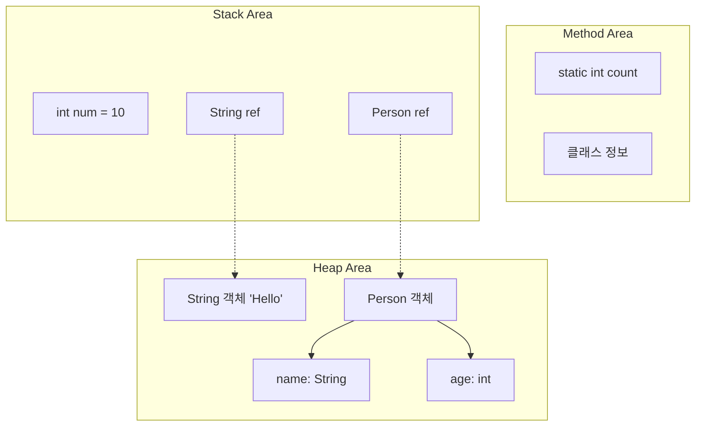

# JAVA 

## 목차
1. [식별자란?](#식별자란)
2. [JVM 메모리 구조](#jvm-메모리-구조)
   - [메모리 영역별 특징](#메모리-영역별-특징)
   - [변수 저장 위치 Workflow](#변수-저장-위치-workflow)
   - [변수 타입별 저장 규칙](#변수-타입별-저장-규칙)
   - [예시별 메모리 할당](#예시별-메모리-할당)
   - [메모리 할당 예시 설명](#메모리-할당-예시-설명)
3. [Unicode에 궁금한 점](#unicode에-궁금한-점)
   - [16진수 변환 예시](#16진수-변환-예시)
4. [JAVA 형변환에서 값손실을 허용하는 이유](#java-형변환에서-값손실을-허용하는-이유)

---

## 식별자란?
- 자바에서 식별자는 **클래스, 변수, 메서드, 인터페이스 등과 같이 프로그래밍 요소들을 구별하고 식별하기 위해 사용되는 이름**입니다.

## JVM 메모리 구조


### 메모리 영역별 특징
- **Method Area**: 클래스 정보, static 변수, 상수 풀 저장
- **Heap Area**: 객체와 배열의 실제 데이터 저장 (참조형 데이터)
- **Stack Area**: 지역 변수, 매개변수, 메서드 호출 정보 저장

### 변수 저장 위치 Workflow


### 변수 타입별 저장 규칙
1. **static 변수**: Method Area에 저장 (클래스 로딩 시)
2. **참조형 변수**: Stack에 참조값, Heap에 실제 객체
3. **기본형 지역변수**: Stack Area에 직접 저장
4. **인스턴스 변수**: 객체와 함께 Heap Area에 저장

### 예시별 메모리 할당


### 메모리 할당 예시 설명
- `static int count`: Method Area에 저장 (모든 인스턴스가 공유)
- `int num = 10`: Stack에 직접 저장 (기본형 지역변수)
- `String str = "Hello"`: Stack에 참조값, Heap에 String 객체
- `Person p = new Person()`: Stack에 참조값, Heap에 Person

## Unicode에 궁금한 점

Unicode는 **U+0000부터 시작**됩니다. 

- **U+0000 ~ U+001F**: 제어 문자 (NULL, TAB, LF, CR 등) - **총 32개** (0~31)
- **U+0020**: 공백 문자 (Space) - 10진수 32
- **U+0030 ~ U+0039**: 숫자 '0' ~ '9' (48~57)
- **U+0041 ~ U+005A**: 대문자 'A' ~ 'Z' (65~90)
- **U+0061 ~ U+007A**: 소문자 'a' ~ 'z' (97~122)

따라서 **U+0001부터 유효한 문자**가 있습니다. U+0001은 제어문자 SOH(Start of Heading)입니다.

**정확히는 0부터 시작하지만, 일반적으로 보이는 문자는 32(공백)부터 시작한다고 생각하면 됩니다.**

### 주요 제어 문자들
- **U+0000**: NULL (널 문자)
- **U+0008**: BS (백스페이스)
- **U+0009**: TAB (탭) - **ASCII 9번**
- **U+000A**: LF (줄바꿈)
- **U+000D**: CR (캐리지 리턴)
- **U+001B**: ESC (이스케이프)
- **U+001F**: US (Unit Separator) - 마지막 제어문자
- **U+0020**: Space (공백) - **ASCII 32번**

### TAB vs 공백 구분 방법
```java
// 컴퓨터가 구분하는 방식
char tab = '\t';        // ASCII 9 (U+0009)
char space = ' ';       // ASCII 32 (U+0020)

System.out.println((int)tab);    // 출력: 9
System.out.println((int)space);  // 출력: 32

// 문자열에서 구분
String text = "Hello\tWorld";     // TAB 포함
String text2 = "Hello World";    // 공백 포함
```

### 실제 구분 예시
- **TAB 문자 1개**: ASCII 값 9 (화면에는 여러 칸 공백처럼 보임)
- **공백 문자 4개**: ASCII 값 32, 32, 32, 32 (각각 개별 공백)
- **에디터 설정**: TAB을 공백 4개로 **보여주기만** 하는 것 (실제로는 TAB 문자 1개)


### 16진수 변환 예시
- U+001F = 1×16¹ + 15×16⁰ = 16 + 15 = **31** (10진수) - Unit Separator (제어문자)
- U+0020 = 2×16¹ + 0×16⁰ = 32 (10진수) - **공백문자 (첫 번째 출력 가능한 문자)**
- U+0041 = 4×16¹ + 1×16⁰ = 64 + 1 = **65** (10진수) = 'A'

## JAVA 형변환에서 값손실을 허용하는 이유

### 1. 현실적인 필요성
```java
// 예시 1: 소수점 없애기
double price = 1999.99;
int displayPrice = (int) price;  // 1999 (원 단위만 표시하고 싶을 때)

// 예시 2: 나이 계산
double ageDouble = 25.8;
int age = (int) ageDouble;  // 25 (나이는 정수로만 표시)
```

### 2. "내가 책임질게!" 라는 의미
- **자동으로 안됨**: `int x = 3.14;` ❌ (컴파일 에러)
- **내가 강제로**: `int x = (int) 3.14;` ✅ (3이 됨)
- 괄호 `(int)`를 써서 "나는 소수점이 사라져도 괜찮다"고 선언

### 3. 간단한 비유
- **큰 컵에서 작은 컵으로 물 옮기기**
- 물이 넘칠 수 있지만, 내가 "괜찮다"고 하면 옮길 수 있게 해줌
- 자바가 "정말 괜찮아?" 하고 물어보는 게 `(int)` 같은 명시적 캐스팅

### 4. 실제 쓰이는 상황들
```java
// 평균 점수를 정수로 표시
double average = 87.6;
int scoreDisplay = (int) average;  // 87점으로 표시

// 퍼센트 계산
double percent = 95.7;
int roundedPercent = (int) percent;  // 95%로 표시

// 픽셀 좌표 (소수점 있을 수 없음)
double mouseX = 123.456;
int pixelX = (int) mouseX;  // 123픽셀 위치
```

**핵심**: 자바는 안전하게 하려고 막지만, 개발자가 "내가 책임질게"라고 명시적으로 표현하면 그에 맞춰줌.