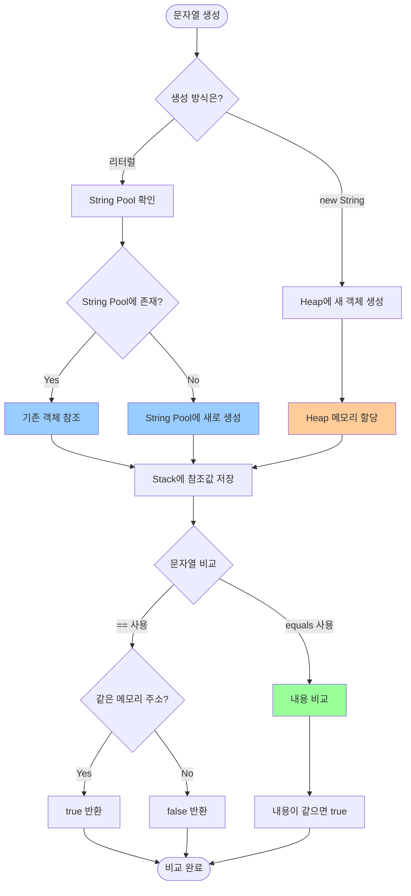
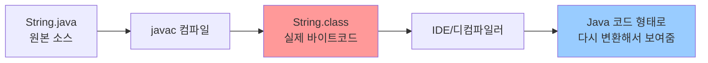
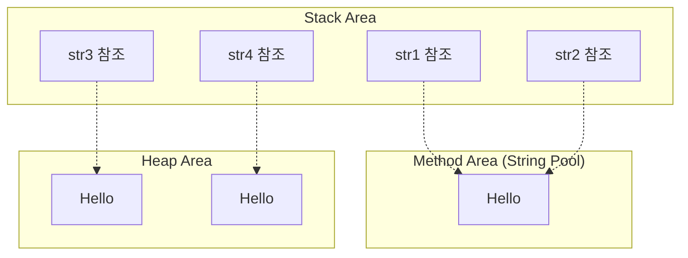
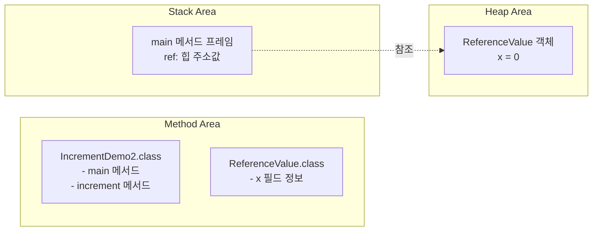
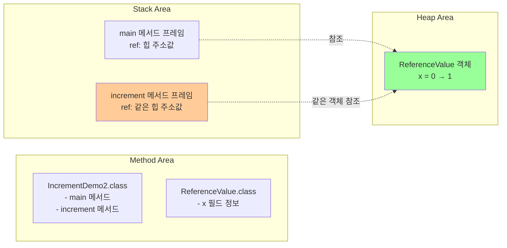
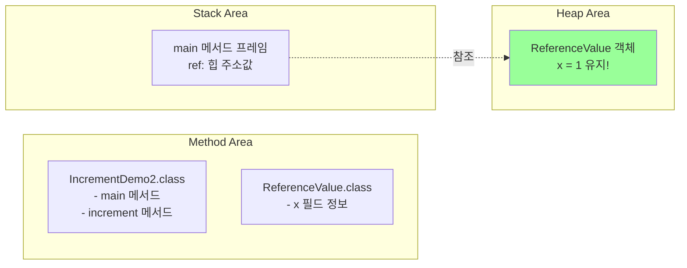
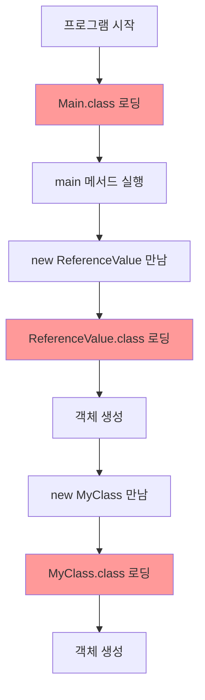
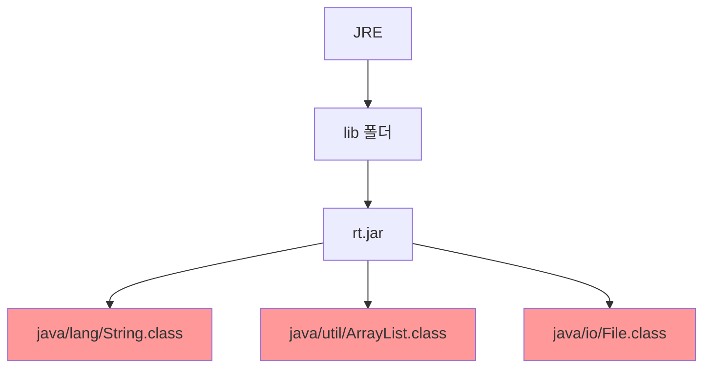

# JAVA

## 목차
1. [문자열과 String Pool](#문자열과-string-pool)
2. [메모리 구조와 메서드 호출](#메모리-구조와-메서드-호출)
3. [클래스 로딩과 바이트코드](#클래스-로딩과-바이트코드)
4. [논리 연산](#논리-연산)

---

## 문자열과 String Pool

### 문자열 비교
문자열을 비교할때는 동일 연산자(==, !=) 대신 동등 연산(equals, !equals)을 사용해야 함

### 동일성 vs 동등성
- **동일성**: 두 객체가 완전히 같음 (메모리 주소가 같음)
- **동등성**: 두 객체에 저장된 값이 같음 (내용이 같음)

### String Pool의 존재와 혼란
```java
// 리터럴로 생성된 문자열 - String Pool 사용
String str1 = "Hello";
String str2 = "Hello";
System.out.println(str1 == str2);  // true (같은 메모리 주소 참조)

// new 키워드로 생성된 문자열 - Heap에 새로 생성
String str3 = new String("Hello");
String str4 = new String("Hello");
System.out.println(str3 == str4);  // false (다른 메모리 주소)
System.out.println(str1 == str3);  // false (다른 메모리 주소)

// 올바른 비교 방법
System.out.println(str1.equals(str3));  // true (내용 비교)
```

### 문자열 생성 및 비교 Workflow


### String Pool이란?
- **메모리 효율성**을 위해 Java가 제공하는 특별한 메모리 영역
- 같은 문자열 리터럴은 **한 번만 저장**하고 재사용
- Method Area의 일부분에 위치

### 왜 String만 Pool이 있을까?
1. **문자열 사용 빈도가 매우 높음**
   - 프로그램에서 문자열은 가장 자주 사용되는 데이터 타입
   - 같은 문자열이 반복적으로 생성될 가능성이 높음

2. **문자열은 불변(Immutable) 객체**
   - String은 한 번 생성되면 변경 불가능
   - 안전하게 공유할 수 있어서 Pool 방식이 적합

3. **메모리 절약 효과가 큼**
   ```java
   // Pool 없다면: 1000개의 "Hello" 객체 생성
   for(int i = 0; i < 1000; i++) {
       String str = "Hello";  // 매번 새로 생성해야 함
   }
   
   // Pool 있으면: 1개의 "Hello" 객체만 생성하고 재사용
   ```

4. **다른 타입은 Pool이 필요 없는 이유**
   - **기본형(int, double 등)**: 이미 값 자체를 Stack에 저장하므로 효율적
   - **다른 객체들**: 대부분 가변(Mutable)이라서 공유하면 위험
   - **숫자 객체**: Integer.valueOf() 같은 캐싱은 있지만 제한적

### 불변 객체란? (초보자용 설명)
**착각하기 쉬운 부분**: 코드에서 문자열을 바꾸는 것처럼 보이지만, 실제로는 새로운 문자열을 만드는 것!

```java
String str = "Hello";
System.out.println(str);  // "Hello" 출력

str = str + " World";     // 기존 "Hello"를 바꾸는 게 아님!
System.out.println(str);  // "Hello World" 출력
```

### 실제로 메모리에서 일어나는 일
```java
String str = "Hello";        // 메모리에 "Hello" 생성
str = str + " World";        // 새로운 "Hello World" 생성
                            // 기존 "Hello"는 그대로 남아있음
```

### 비유로 이해하기
- **String**: **돌에 새긴 글자** 
  - 한 번 새기면 바꿀 수 없음
  - 다른 내용을 원하면 새로운 돌을 가져와야 함
  
- **StringBuilder**: **연필로 쓴 글자** ### .class 파일 vs 디컴파일된 Java 코드

**실제 상황 설명:**

### 1. 실제 .class 파일 (바이트코드)
```bash
# 실제 String.class 파일을 바이너리로 보면
hexdump -C String.class | head -5

# 결과: 바이너리 데이터
cafe babe 0000 0034 0123 0700 0100 1a6a
6176 612f 6c61 6e67 2f53 7472 696e 6707
...
```

### 2. 우리가 보는 "Java 코드 같은 것"
```java
// IDE나 디컴파일러로 보는 String.class
public final class String implements Serializable, Comparable<String>, CharSequence {
    private final char[] value;
    
    public int length() {
        return value.length;
    }
}
```

### 혼동이 생기는 이유

**IDE나 도구들이 자동으로 디컴파일해서 보여주기 때문입니다!**



### 실제 확인 방법

**1. 바이트코드 명령어 보기**
```bash
javap -c java.lang.String

# 결과: 실제 바이트코드 명령어
public int length();
  Code:
     0: aload_0
     1: getfield      #85  // Field value:[C
     4: arraylength
     5: ireturn
```

**2. 바이너리 형태 확인**
```bash
# jar 파일에서 실제 클래스 파일 추출
jar -xf rt.jar java/lang/String.class

# 바이너리 에디터로 열면 실제 바이트코드 확인 가능
```

### 도구별 차이점

**IntelliJ IDEA에서 String.class 보기:**
- 자동으로 디컴파일해서 Java 코드처럼 보여줌
- 실제로는 .class 파일(바이트코드)을 읽어서 변환한 것

**Eclipse에서 String.class 보기:**
- 마찬가지로 디컴파일된 형태로 표시

**실제 .class 파일:**
- 바이너리 데이터 (사람이 읽을 수 없음)
- JVM이 직접 실행하는 바이트코드

### 실험해보기
```java
// 1. 간단한 클래스 작성
public class Test {
    public void hello() {
        System.out.println("Hello");
    }
}

// 2. 컴파일
javac Test.java

// 3. 바이트코드 확인
javap -c Test

// 4. 바이너리 확인
hexdump -C Test.class
```

### 핵심 정리
- **java.lang의 .class 파일들**: 실제로는 바이트코드 (바이너리)
- **IDE에서 보이는 Java 코드**: 디컴파일러가 변환해서 보여주는 것
- **실제 JVM이 읽는 것**: 바이트코드 명령어들

**결론**: java.lang에 있는 것들도 100% 바이트코드입니다. 단지 도구들이 우리가 읽기 쉽게 Java 코드 형태로
  - 지우고 다시 쓸 수 있음
  - 같은 종이에서 계속 수정 가능

### 실제 증명 코드
```java
String original = "Hello";
String modified = original + " World";

System.out.println(original);  // 여전히 "Hello" (변하지 않음!)
System.out.println(modified);  // "Hello World" (새로 만들어진 것)

// 메모리 주소로 확인
System.out.println(original == modified);  // false (다른 객체)
```

**핵심**: `str = str + " World"`는 str 변수가 가리키는 대상만 바뀌는 것이지, 원본 "Hello" 문자열은 절대 변하지 않음!

### 왜 equals()를 사용해야 할까?
1. **예측 가능한 결과**: String Pool 사용 여부와 관계없이 항상 내용 비교
2. **안전한 코드**: 문자열 생성 방식에 영향받지 않음
3. **일관성**: 모든 문자열 비교에서 동일한 방식 사용

### 메모리 관점에서 보기


**핵심**: String Pool 때문에 가끔 `==`이 true가 나와도, 안전을 위해 항상 `equals()`를 사용하자!

---

## 메모리 구조와 메서드 호출

### 메서드 호출과 참조형 매개변수 Workflow

```java
public class IncrementDemo2 {
    public static void main(String[] args) {

        ReferenceValue ref = new ReferenceValue();
        System.out.println("main에서 increment() 메서드를 호출하기 전 " + ref.x);
        increment(ref);
        System.out.println("main에서 increment() 메서드를 호출한 후 " + ref.x);

    }

    public static void increment(ReferenceValue ref) {

        System.out.println("increment() 메서드를 시작 " + ref.x);
        ref.x++;
        System.out.println("increment() 메서드가 종료 " + ref.x);

    }
}

class ReferenceValue {
    int x;
}
```

### 메모리 변화 과정 시각화

**1단계: ReferenceValue ref = new ReferenceValue(); 실행 후**


**2단계: increment(ref); 메서드 호출 시**


**3단계: increment() 메서드 종료 후**


### 핵심 포인트
1. **같은 객체 참조**: main의 ref와 increment의 ref 매개변수는 **같은 힙 객체**를 가리킴
2. **값 변경**: ref.x++는 힙에 있는 **실제 객체의 x 값**을 0에서 1로 변경
3. **메서드 종료**: increment() 메서드가 끝나면 Stack에서 해당 프레임만 사라짐
4. **객체 유지**: Heap의 객체는 변경된 상태(x=1)로 계속 남아있음

**결과**: main에서 increment() 호출 후에도 ref.x는 1이 됨!

---

## 클래스 로딩과 바이트코드

### Method Area에 저장되는 것들

1. **클래스 바이트코드 정보**
   - 클래스의 메서드 코드 (바이트코드)
   - 클래스 구조 정보 (필드, 메서드 시그니처 등)
   - 상수 풀 (Constant Pool)

2. **Static 관련 데이터**
   - static 변수들
   - static 메서드들

### JVM 클래스 로딩 방식: Lazy Loading (지연 로딩)

**한 번에 전부 올라가지 않고, 필요할 때마다 순차적으로 로딩됩니다.**

### 클래스 로딩 시점
```java
public class Main {
    public static void main(String[] args) {
        // 1. Main.class는 프로그램 시작 시 로딩됨
        
        System.out.println("프로그램 시작");
        
        // 2. 이 시점에 ReferenceValue.class 로딩
        ReferenceValue ref = new ReferenceValue();
        
        // 3. 이 시점에 MyClass.class 로딩
        MyClass obj = new MyClass();
        
        // 4. 이 시점에 AnotherClass.class 로딩
        AnotherClass another = new AnotherClass();
    }
}
```

### 실제 로딩 순서 시각화


### 왜 Lazy Loading을 사용할까?
1. **메모리 효율성**: 사용하지 않는 클래스는 로딩하지 않음
2. **빠른 시작 속도**: 프로그램 시작 시 모든 클래스를 로딩하면 느려짐
3. **조건부 로딩**: if문 안에 있는 클래스는 조건이 맞을 때만 로딩

### 예시: 조건부 로딩
```java
public class ConditionalLoading {
    public static void main(String[] args) {
        boolean condition = false;
        
        if (condition) {
            // condition이 false이므로 NeverLoaded.class는 로딩되지 않음!
            NeverLoaded obj = new NeverLoaded();
        }
        
        // 이 클래스만 로딩됨
        AlwaysLoaded obj2 = new AlwaysLoaded();
    }
}
```

### .class 파일 = 바이트코드

**정확한 설명:**
- **.java 파일**: 사람이 읽을 수 있는 소스코드 (Java 언어)
- **.class 파일**: JVM이 읽을 수 있는 바이트코드 (중간 언어)

### 컴파일 과정


### 바이트코드란?
- **플랫폼 독립적인 중간 코드**
- Java 소스코드와 기계어 사이의 중간 단계
- JVM이 이해할 수 있는 명령어 집합

### 실제 예시
**HelloWorld.java (소스코드)**
```java
public class HelloWorld {
    public static void main(String[] args) {
        System.out.println("Hello World");
    }
}
```

**HelloWorld.class (바이트코드) - 일부 내용**
```
0: getstatic     #2  // Field java/lang/System.out
3: ldc           #3  // String Hello World  
5: invokevirtual #4  // Method println
8: return
```

### 왜 바이트코드를 사용할까?
1. **플랫폼 독립성**: 한 번 컴파일하면 어떤 OS에서든 실행 가능
2. **최적화**: JVM이 바이트코드를 읽어서 각 플랫폼에 최적화된 기계어로 변환
3. **보안**: 소스코드를 노출하지 않고 배포 가능

### JRE의 .class 파일들도 바이트코드

**JRE에서 볼 수 있는 .class 파일들:**
- `String.class`, `System.class`, `Object.class` 등
- 모두 **바이트코드로 컴파일된 파일**들입니다!

### JRE 구조와 .class 파일 위치


### 확인 방법
```bash
cd $JAVA_HOME/lib
jar -tf rt.jar | Select-Object -First 10 # PowerShell for Windows

# 결과 예시:
# java/lang/Object.class
# java/lang/String.class
# java/lang/Class.class
# java/util/ArrayList.class
# ...

cd $JAVA_HOME/bin
javap -c java.lang.String
javap -c java.lang.String | Select-Object -First 20

#결과 예시:
# Compiled from "String.java"                                                                                          
# public final class java.lang.String implements java.io.Serializable, java.lang.Comparable<java.lang.String>, java.lang.CharSequence, java.lang.constant.Constable, java.lang.constant.ConstantDesc {                                        
# static final boolean COMPACT_STRINGS; 
# ...

```

### 같은 바이트코드, 다른 출처
**우리가 만든 .class 파일**
```java
// MyClass.java 작성
public class MyClass {
    // 코드...
}

// javac MyClass.java 컴파일
// → MyClass.class 생성 (바이트코드)
```

**Oracle/OpenJDK에서 제공하는 .class 파일**
```java
// String.java 작성 (Oracle에서)
public final class String {
    // String 클래스 구현...
}

// javac String.java 컴파일 (Oracle에서)
// → String.class 생성 (바이트코드)
// → JRE에 포함되어 배포
```

**결론**: JRE의 .class 파일들도 우리가 만든 .class 파일들과 **동일한 방식**으로 바이트코드로 컴파일되어 있습니다.

---

## 논리 연산
- 쇼트서킷? 불필요한 연산을 생략함으로써 성능을 개선하는 연산방식