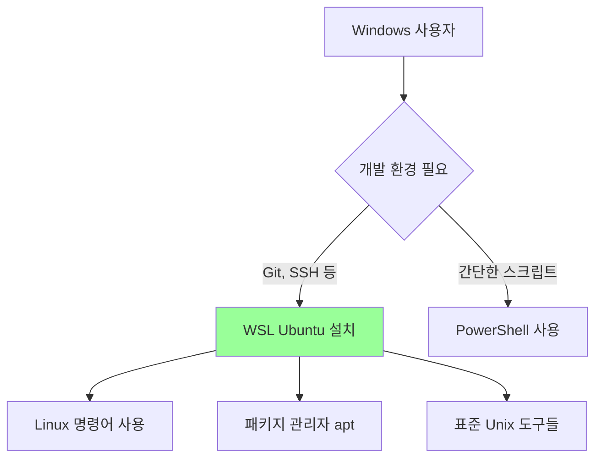
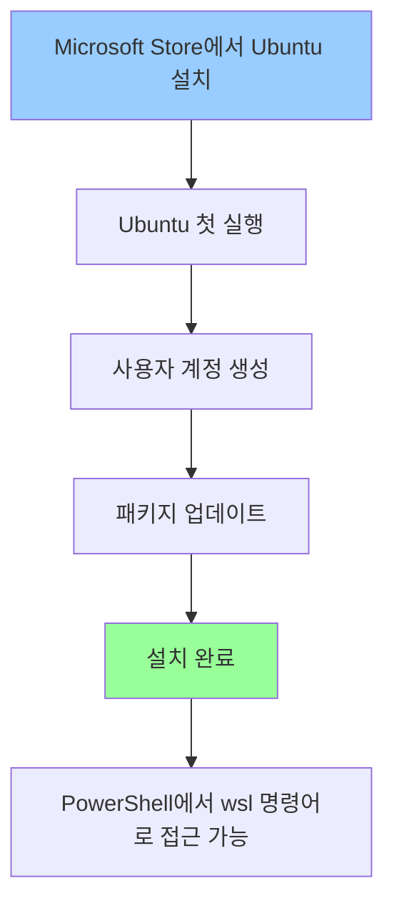
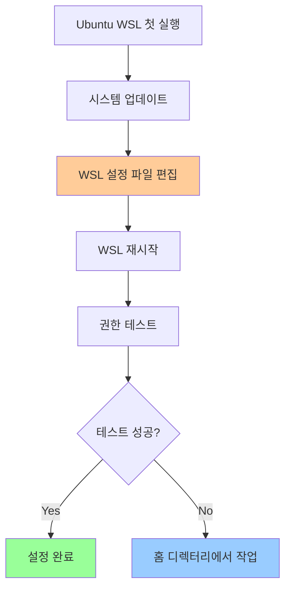

# Windows에서 Ubuntu WSL을 통한 GitHub 연동 가이드

## 목차
1. [Windows 환경에서의 명령어 차이점](#windows-환경에서의-명령어-차이점)
2. [WSL(Windows Subsystem for Linux) 개념](#wslwindows-subsystem-for-linux-개념)
3. [Ubuntu WSL 설치](#ubuntu-wsl-설치)
4. [Ubuntu WSL 초기 설정](#ubuntu-wsl-초기-설정)
5. [Git 설치 및 설정](#git-설치-및-설정)
6. [SSH 키 생성 및 GitHub 연동](#ssh-키-생성-및-github-연동)
7. [Git 저장소 설정](#git-저장소-설정)
8. [GitHub Push 과정](#github-push-과정)
9. [Windows와 WSL 파일 시스템 연동](#windows와-wsl-파일-시스템-연동)
10. [자주 사용하는 명령어 비교](#자주-사용하는-명령어-비교)

---

## Windows 환경에서의 명령어 차이점

### 파일 목록 보기
| Windows (CMD/PowerShell) | Unix/Linux (Ubuntu WSL) |
|--------------------------|--------------------------|
| `dir` 또는 `ls` (PowerShell) | `ls` |
| `Get-ChildItem` (PowerShell) | `ls -la` |

```powershell
# Windows PowerShell
PS C:\> dir
PS C:\> Get-ChildItem
```

```bash
# Ubuntu WSL
$ ls
$ ls -la
```

### 디렉터리 이동
| Windows (CMD/PowerShell) | Unix/Linux (Ubuntu WSL) |
|--------------------------|--------------------------|
| `cd directory_name` | `cd directory_name` |
| `Set-Location` (PowerShell) | `cd ~` (홈 디렉터리) |

```powershell
# Windows PowerShell
PS C:\> cd Documents
PS C:\> Set-Location Documents
```

```bash
# Ubuntu WSL
$ cd Documents
$ cd ~
$ cd /home/username
```

**주요 차이점:**
- PowerShell은 Unix 명령어도 일부 지원하지만 완전하지 않음
- Git 관련 명령어에서 경로 처리 방식이 다름
- **WSL을 사용하면 표준 Unix 명령어를 그대로 사용 가능**

## WSL(Windows Subsystem for Linux) 개념

### WSL이란?
**Windows Subsystem for Linux**의 줄임말로, Windows 10/11에서 **Linux 환경을 네이티브로 실행**할 수 있게 해주는 기능입니다.

### WSL의 핵심 특징
- **가상머신 없이** Linux 바이너리를 Windows에서 직접 실행
- **파일 시스템 공유**: Windows와 Linux 파일에 서로 접근 가능
- **성능**: 가상머신보다 빠르고 리소스 효율적
- **통합**: Windows와 Linux 명령어를 함께 사용 가능

### WSL 버전 비교
| 구분 | WSL 1 | WSL 2 |
|------|-------|-------|
| 아키텍처 | 번역 레이어 | 실제 Linux 커널 |
| 파일 시스템 성능 | 느림 | 빠름 |
| 네트워크 | Windows와 동일 | 별도 가상 네트워크 |
| 권장 사용 | 간단한 명령어 | 본격적인 개발 |

### WSL 활용 시나리오


### 실제 사용 예시
```bash
# Windows에서 WSL Ubuntu 실행
PS C:\> wsl

# 이제 Linux 환경
username@DESKTOP:~$ ls -la
username@DESKTOP:~$ git --version
username@DESKTOP:~$ apt update
```

**왜 WSL을 선택했나?**
- PowerShell의 명령어 차이 때문에 혼란
- Git과 SSH 설정이 Unix 환경에서 더 직관적
- 개발 도구들이 대부분 Linux 기반으로 설계됨

## Ubuntu WSL 설치

### 사전 요구사항
- **Windows 10 버전 2004** 이상 또는 **Windows 11**
- **관리자 권한**으로 PowerShell 또는 CMD 실행

### 설치 방법

**1단계: Microsoft Store에서 Ubuntu 설치**
1. **Microsoft Store** 실행
2. 검색창에 **"Ubuntu"** 입력
3. **"Ubuntu 22.04 LTS"** 또는 최신 버전 선택
4. **"받기"** 또는 **"설치"** 클릭

**2단계: Ubuntu 첫 실행 및 초기 설정**
1. Windows 시작 메뉴에서 **"Ubuntu"** 검색하여 실행
2. 터미널이 열리고 Ubuntu의 첫 실행 준비가 자동으로 진행됨
   - 이 과정에서 약간의 시간이 소요될 수 있음
3. 사용자 계정 생성 화면이 나타남
   ```bash
   Installing, this may take a few minutes...
   Please create a default UNIX user account...
   Enter new UNIX username: [사용자명 입력]
   New password: [비밀번호 입력]
   Retype new password: [비밀번호 재입력]
   ```
4. Ubuntu 셸 프롬프트가 나오면 설치 완료

**3단계: 기본 설정 및 업데이트**
```bash
# 패키지 목록 업데이트 (권장)
username@DESKTOP:~$ sudo apt update

# 개발 도구 설치 (선택사항)
username@DESKTOP:~$ sudo apt install gcc git
```

### WSL 실행 방법
```powershell
# PowerShell이나 Windows Terminal에서
PS C:\> wsl

# 또는 시작 메뉴에서 "Ubuntu" 검색 후 실행
```

### 설치 확인
```powershell
# 설치된 WSL 배포판 확인
PS C:\> wsl --list --verbose
  NAME      STATE           VERSION
* Ubuntu    Running         1
```

### 설치 과정 시각화


**주의사항:**
- 첫 설치 시 **인터넷 연결** 필요
- 사용자명은 **소문자**로 입력 (Linux 관례)
- 비밀번호는 **sudo 명령어** 사용 시 필요하므로 기억해둘 것
- **Windows 계정과 별개의 Linux용 계정**임
- 기본적으로 **WSL 1 버전**으로 설치됨

**요약:**
스토어에서 설치 → 시작 메뉴에서 실행 → 사용자 이름/비밀번호 등록 → 리눅스 환경 사용 가능 → PowerShell에서 `wsl` 입력

## Ubuntu WSL 초기 설정

### 기본 환경 확인
```bash
# Ubuntu 버전 확인
username@DESKTOP:~$ lsb_release -a

# 현재 디렉터리 확인
username@DESKTOP:~$ pwd
/home/username

# 홈 디렉터리 내용 확인
username@DESKTOP:~$ ls -la
```

### 시스템 업데이트
```bash
# 패키지 목록 업데이트
username@DESKTOP:~$ sudo apt update

# 설치된 패키지 업그레이드
username@DESKTOP:~$ sudo apt upgrade -y

# 기본 개발 도구 설치
username@DESKTOP:~$ sudo apt install build-essential curl wget vim -y
```

### WSL 파일 시스템 권한 설정 (중요)

**문제점:** WSL에서 Windows 파일 시스템(`/mnt/c`)에서 Git 명령어 사용 시 권한 에러 발생
- `error: chmod on .../.git/config.lock failed: Operation not permitted`
- `fatal: could not set 'core.filemode' to 'false'`
- `fatal: not a git repository (or any parent up to mount point /mnt)`

**원인:** WSL이 NTFS 파일 시스템에서 Linux식 파일 권한 처리 불가

### 해결 방법

**1단계: 임시 해결 (현재 세션만)**
```bash
# Windows C: 드라이브 재마운트 (metadata 옵션 추가)
username@DESKTOP:~$ sudo umount /mnt/c
username@DESKTOP:~$ sudo mount -t drvfs C: /mnt/c -o metadata
```

**2단계: 영구 해결 (권장)**
```bash
# WSL 설정 파일 생성/편집
username@DESKTOP:~$ sudo vim /etc/wsl.conf

# 아래 내용 추가
[automount]
options = "metadata"
```

**3단계: WSL 재시작**
```powershell
# PowerShell에서 WSL 종료
PS C:\> wsl --shutdown

# WSL 다시 실행
PS C:\> wsl
```

### 설정 확인
```bash
# 마운트 옵션 확인
username@DESKTOP:~$ mount | grep "/mnt/c"
C: on /mnt/c type drvfs (rw,noatime,uid=1000,gid=1000,metadata)

# 권한 테스트 (C: 드라이브에서)
username@DESKTOP:~$ cd /mnt/c/temp
username@DESKTOP:/mnt/c/temp$ touch test.txt
username@DESKTOP:/mnt/c/temp$ chmod 755 test.txt
# 에러가 나지 않으면 설정 완료
```

### 작업 디렉터리 선택 가이드

**권장 방법:**
```bash
# WSL 홈 디렉터리에서 작업 (가장 안전)
username@DESKTOP:~$ cd ~
username@DESKTOP:~$ mkdir projects
username@DESKTOP:~$ cd projects
```

**Windows 파일과 연동이 필요한 경우:**
```bash
# metadata 설정 후 Windows 디렉터리 사용
username@DESKTOP:~$ cd /mnt/c/Users/사용자명/Documents
```

### 초기 설정 시각화


### 주요 디렉터리 구조 이해
```bash
# WSL 내부 디렉터리 (권장)
/home/username/          # 홈 디렉터리 (안전한 작업공간)
/home/username/projects/ # 프로젝트 폴더

# Windows 연동 디렉터리
/mnt/c/                  # C: 드라이브
/mnt/c/Users/사용자명/   # Windows 사용자 폴더
```

**핵심 포인트:**
- WSL에서 Git 작업 시 **권한 문제 해결이 필수**
- `/etc/wsl.conf`에 metadata 옵션 설정으로 영구 해결
- 안전한 작업을 위해서는 **WSL 홈 디렉터리 사용 권장**
- Windows 파일과 연동이 필요한 경우에만 `/mnt/c` 사용
- 장점 : IDE 터미널에서도 `wsl`을 사용 가능
