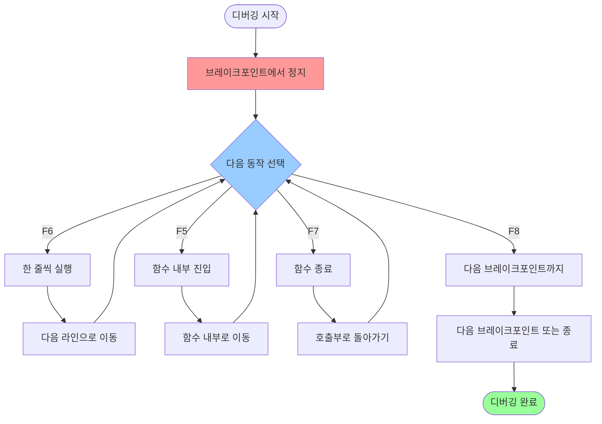
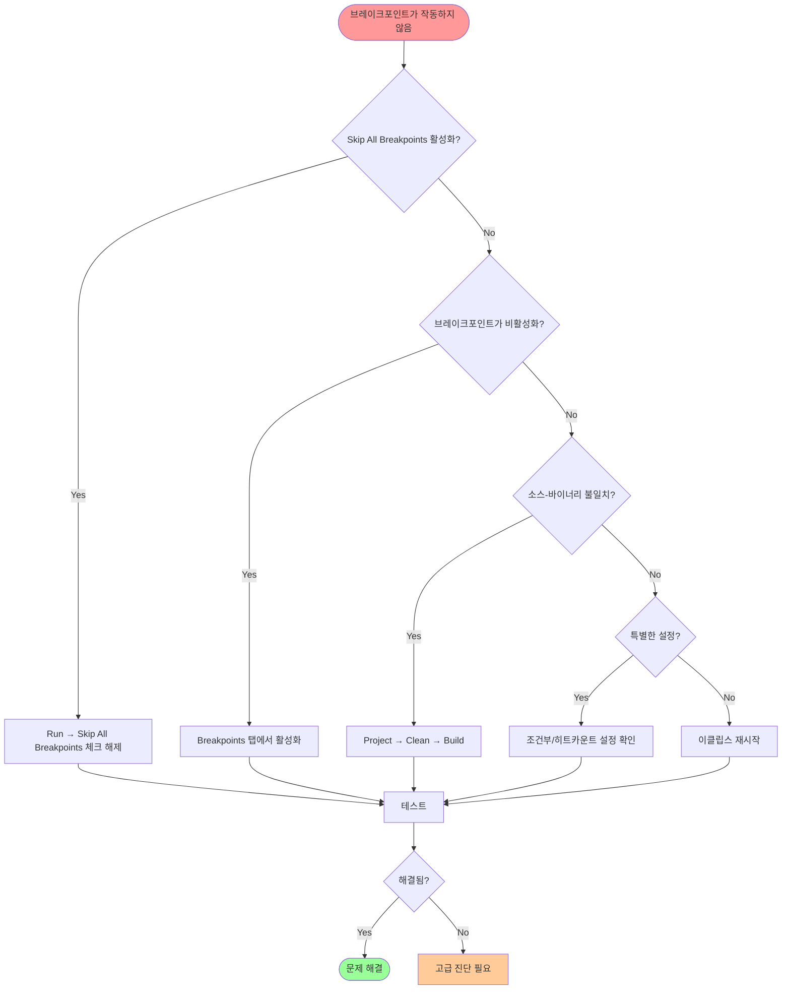
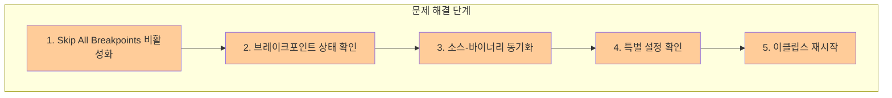

# 이클립스

## 목차
1. [디버깅 방법](#디버깅-방법)
   - [브레이크포인트 설정](#브레이크포인트-설정)
   - [디버그 모드로 실행](#디버그-모드로-실행)
   - [디버깅 진행](#디버깅-진행)
   - [변수 값 확인](#변수-값-확인)
   - [브레이크포인트 관리](#브레이크포인트-관리)
   - [디버그 모드 종료](#디버그-모드-종료)
2. [브레이크포인트 문제 해결](#브레이크포인트-문제-해결)
   - [Skip All Breakpoints 해제](#skip-all-breakpoints-해제)
   - [비활성화 상태 확인](#비활성화-상태-확인)
   - [소스-바이너리 동기화](#소스-바이너리-동기화)
   - [기타 원인들](#기타-원인들)
   - [해결 체크리스트](#해결-체크리스트)

---

## 디버깅 방법

이클립스에서 자바 디버깅하는 방법을 단계별로 정리합니다.

### 브레이크포인트 설정
- **코드에서 멈추고 싶은 줄의 왼쪽 라인 번호 영역을 더블클릭**하거나 **우클릭 후 "Toggle Breakpoint"를 선택**하면 브레이크포인트가 설정됩니다.
- 브레이크포인트를 다시 클릭하면 해제됩니다.

### 디버그 모드로 실행
- 상단 메뉴에 있는 **벌레 모양 아이콘("Debug")을 클릭**하거나, 실행 파일 또는 프로젝트에서 **오른쪽 클릭 → Debug As → Java Application**을 선택합니다.
- 단축키는 **F11**입니다.
- Debug 모드로 처음 전환할 때 "디버그 모드로 전환(Switch)" 창이 뜨면 "확인(Switch)"을 눌러 디버그 화면으로 이동하세요.

### 디버깅 진행

프로그램이 브레이크포인트에서 멈추면, 아래 동작들을 활용할 수 있습니다:

**디버깅 단축키:**

| 동작 | 설명 | 단축키 |
|------|------|--------|
| 한 줄씩 실행 | 현재 라인 실행 후 다음 라인으로 이동 | F6 |
| 함수 내부 진입 | 함수 호출 시 함수 내부로 이동 | F5 |
| 함수 종료 | 현재 함수 실행 완료 후, 호출부로 돌아가기 | F7 |
| 다음 브레이크포인트까지 실행 | 다음 브레이크포인트 또는 프로그램 종료까지 실행 | F8 |

### 변수 값 확인
- **Variables 창**: 현재 스코프의 변수 값과 타입을 실시간으로 확인할 수 있습니다.
- **Expressions 창**: "+ Add new expression"을 눌러 보고 싶은 변수명을 추가하면 해당 값이 표시됩니다. (예: a, b 등)

### 브레이크포인트 관리
- **Breakpoints 탭**에서 현재 설정된 모든 브레이크포인트를 확인, 비활성화 또는 삭제할 수 있습니다.

### 디버그 모드 종료
- 디버깅을 종료하려면 디버깅 Console에서 Terminate(종료) 버튼(빨간 네모)을 누르거나, 상단 Perspective 전환 메뉴에서 Java(또는 JavaEE)로 돌아오세요.

**팁:**
- 디버깅 중 언제든 브레이크포인트 추가/삭제가 가능합니다.
- **디버그 관련 도구나 창이 보이지 않을 때:** 메뉴에서 Window → Show View → Debug/Variables/Breakpoints/Expressions를 선택하면 됩니다.

## 브레이크포인트 문제 해결

브레이크포인트를 지정했는데 디버깅 시 멈추지 않는 현상은 이클립스에서 자주 발생하는 문제로, 여러 가지 원인이 있을 수 있습니다.

### Skip All Breakpoints 해제

이클립스에서는 **브레이크포인트에 사선(/) 표시가 뜨면서 무시**되는 현상이 발생할 수 있습니다.

**해결 방법:**
- 상단 메뉴에서 **Run → Skip All Breakpoints** 메뉴를 찾아 체크를 해제하세요.
- 또는 디버그 창(`Debug Perspective`)에서 **Breakpoints 탭**을 연 후, 도구모음에 있는 **스킵(사선 아이콘) 버튼을 클릭해서 해제**합니다.
- 단축키 **Ctrl + Alt + B**로도 토글이 가능합니다.

### 비활성화 상태 확인

- 흰색 동그라미로 비활성화된 브레이크포인트는 실행 시 작동하지 않습니다.
- **Breakpoints 탭**에서 해당 브레이크포인트가 활성화(빨간 원) 상태인지 확인하세요.

### 소스-바이너리 동기화

예를 들어, 소스를 수정했는데 프로젝트를 다시 빌드하지 않았다면 브레이크포인트가 제대로 동작하지 않을 수 있습니다.

**해결 방법:**
- 프로젝트를 **Clean** (Project → Clean...) 후 **Build** 하세요.
- 에디터 파일과 실제 실행되는 코드(특히 서버 실행 등)가 꼭 일치하는지 확인하세요.

### 기타 원인들

- 조건부 브레이크포인트나 Hit Count 등 특별한 설정을 했을 때 잘못 걸려있으면 정상적으로 동작하지 않을 수 있습니다.
- 이클립스 자체 버그나 설정 꼬임이 있을 때는 이클립스를 재시작하거나, 워크스페이스를 새로 만들어보는 것도 도움될 수 있습니다.
- JRE 버전이 맞는지도 체크해보세요.

### 해결 체크리스트

1. **"Skip All Breakpoints"** 비활성화 (체크 해제)
2. 브레이크포인트(빨간 원) 정상 표시 확인
3. 소스-바이너리 싱크 확인 및 클린 빌드
4. 조건부/히트카운트 등 특이 설정 여부 점검
5. 그래도 안 되면 이클립스 재시작/워크스페이스 교체

만약 위 방법으로도 해결이 되지 않는 경우, 구체적인 메시지(사선 또는 색상 변화, 에러 메시지 등)나 여러가지 환경(실행 JRE, 프로젝트 타입 등)을 추가로 알려주시면 더 세부적으로 진단해드릴 수 있습니다.