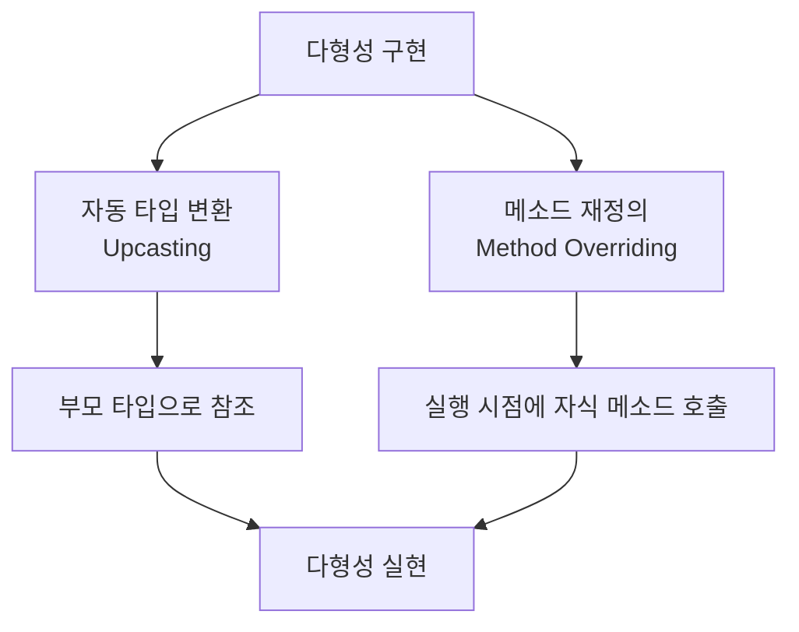
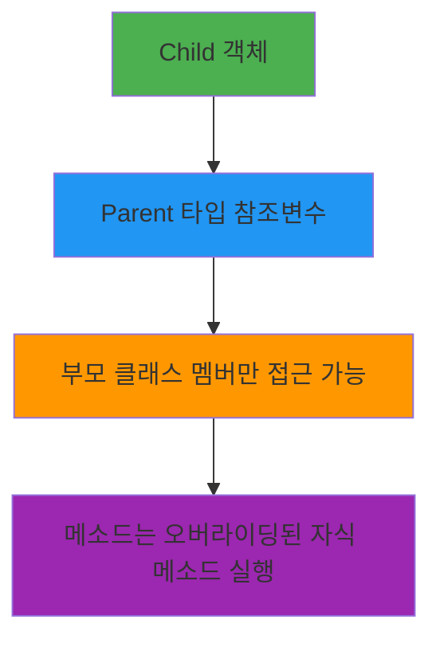
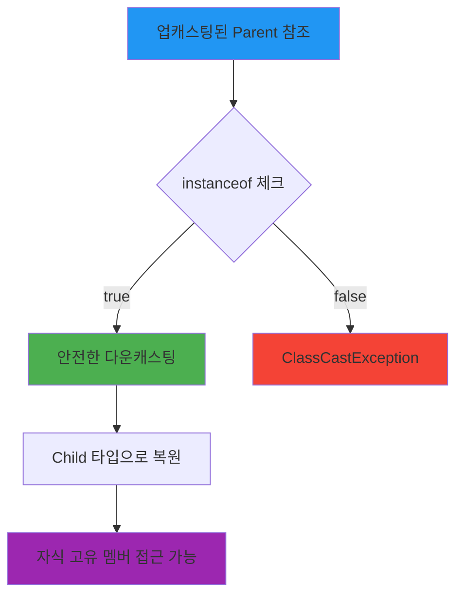

# Java 다형성과 캐스팅

## 🎯 다형성 (Polymorphism)
- **정의**: 사용방법은 동일하지만 실행 결과가 다양하게 나오는 성질
- **구현 조건**: `자동 타입 변환(Up Cast)`과 `메소드 재정의(Method Overriding)`가 필요



### 📋 다형성의 종류

#### 1. 필드 다형성
필드 타입은 동일하지만, 대입되는 객체가 달라져서 실행 결과가 다양하게 나올 수 있는 것

```java
class Vehicle {
    public void move() {
        System.out.println("차량이 이동합니다.");
    }
}

class Car extends Vehicle {
    @Override
    public void move() {
        System.out.println("자동차가 도로를 달립니다.");
    }
}

class Airplane extends Vehicle {
    @Override
    public void move() {
        System.out.println("비행기가 하늘을 납니다.");
    }
}

public class FieldPolymorphism {
    Vehicle vehicle;  // 동일한 필드 타입
    
    public void test() {
        vehicle = new Car();      // 자동차 객체 대입
        vehicle.move();           // "자동차가 도로를 달립니다."
        
        vehicle = new Airplane(); // 비행기 객체 대입
        vehicle.move();           // "비행기가 하늘을 납니다."
    }
}
```

#### 2. 매개변수 다형성
메소드가 클래스 타입의 매개변수를 가지고 있을 경우, 부모 타입으로 선언하면 자식 객체도 전달받을 수 있음

```java
public class ParameterPolymorphism {
    // 부모 타입 매개변수로 다양한 자식 객체 처리
    public void drive(Vehicle vehicle) {
        vehicle.move();  // 전달받은 객체의 실제 타입에 따라 다른 동작
    }
    
    public static void main(String[] args) {
        ParameterPolymorphism pp = new ParameterPolymorphism();
        
        pp.drive(new Car());      // "자동차가 도로를 달립니다."
        pp.drive(new Airplane()); // "비행기가 하늘을 납니다."
    }
}
```

---

## 🔄 업캐스팅 (Upcasting)

### 정의
자손 타입을 조상 타입으로 형변환하는 것 (형변환 연산자 생략 가능)

### 특징
```java
Parent p = new Child();  // 자동 형변환 (업캐스팅)
```



### 실제 예시
```java
class Animal {
    String name = "동물";
    
    public void sound() {
        System.out.println("동물 소리");
    }
    
    public void move() {
        System.out.println("동물이 움직입니다");
    }
}

class Dog extends Animal {
    String breed = "진돗개";  // 자식만의 필드
    
    @Override
    public void sound() {  // 메소드 오버라이딩
        System.out.println("멍멍!");
    }
    
    public void wagTail() {  // 자식만의 메소드
        System.out.println("꼬리를 흔듭니다");
    }
}

public class UpcastingExample {
    public static void main(String[] args) {
        // 업캐스팅 - 자동 형변환
        Animal animal = new Dog();
        
        // 접근 가능한 것들
        System.out.println(animal.name);   // "동물" (부모 필드)
        animal.sound();  // "멍멍!" (자식에서 오버라이딩된 메소드)
        animal.move();   // "동물이 움직입니다" (부모 메소드)
        
        // 접근 불가능한 것들 (컴파일 에러)
        // System.out.println(animal.breed);  // 자식 필드 접근 불가
        // animal.wagTail();  // 자식 메소드 접근 불가
    }
}
```

### 업캐스팅의 장점
1. **코드의 재사용성 증대**
2. **유지보수성 향상**
3. **확장성 제공**

```java
// 하나의 메소드로 여러 타입 처리
public void handleAnimal(Animal animal) {
    animal.sound();  // 각 동물마다 다른 소리
    animal.move();   // 기본 이동 방식
}

// 사용
handleAnimal(new Dog());    // 멍멍!
handleAnimal(new Cat());    // 야옹!
handleAnimal(new Bird());   // 짹짹!
```

---

## 🔄 다운캐스팅 (Downcasting)

### 정의
조상 타입으로 업캐스팅된 객체를 다시 자손 타입으로 형변환하는 것

### 특징
- **명시적 형변환 필요**
- **ClassCastException 위험성 존재**
- **instanceof 연산자로 안전성 확보 필요**



### 실제 예시
```java
public class DowncastingExample {
    public static void main(String[] args) {
        // 1. 업캐스팅
        Animal animal = new Dog();
        
        // 2. 안전하지 않은 다운캐스팅 (위험!)
        // Dog dog = (Dog) animal;  // ClassCastException 가능성
        
        // 3. 안전한 다운캐스팅
        if (animal instanceof Dog) {
            Dog dog = (Dog) animal;  // 명시적 형변환
            
            // 이제 자식 고유 멤버 접근 가능
            System.out.println(dog.breed);  // "진돗개"
            dog.wagTail();  // "꼬리를 흔듭니다"
            dog.sound();    // "멍멍!"
        }
        
        // 4. 잘못된 다운캐스팅 예시
        Animal animal2 = new Animal();  // 실제로는 Animal 객체
        
        if (animal2 instanceof Dog) {
            Dog dog2 = (Dog) animal2;  // 실행되지 않음
        } else {
            System.out.println("Dog 타입이 아닙니다.");
        }
    }
}
```

### instanceof 연산자 활용
```java
public void processAnimal(Animal animal) {
    // 기본 동작
    animal.sound();
    
    // 타입별 특수 동작
    if (animal instanceof Dog) {
        Dog dog = (Dog) animal;
        dog.wagTail();
    } else if (animal instanceof Cat) {
        Cat cat = (Cat) animal;
        cat.purr();
    } else if (animal instanceof Bird) {
        Bird bird = (Bird) animal;
        bird.fly();
    }
}
```

---

## 📊 캐스팅 비교표

| 구분 | 업캐스팅 | 다운캐스팅 |
|------|----------|------------|
| **방향** | Child → Parent | Parent → Child |
| **형변환** | 자동 (생략 가능) | 명시적 (필수) |
| **안전성** | 항상 안전 | ClassCastException 위험 |
| **접근 범위** | 부모 멤버만 | 자식 멤버까지 |
| **사용 시점** | 다형성 구현 시 | 자식 고유 기능 사용 시 |
| **검증 방법** | 불필요 | instanceof 권장 |

---

## 🎯 실무 활용 예시

### 1. GUI 컴포넌트 처리
```java
public void handleComponent(Component comp) {
    // 공통 처리
    comp.setVisible(true);
    
    // 타입별 특수 처리
    if (comp instanceof JButton) {
        JButton btn = (JButton) comp;
        btn.addActionListener(e -> System.out.println("버튼 클릭"));
    } else if (comp instanceof JTextField) {
        JTextField field = (JTextField) comp;
        field.setEditable(true);
    }
}
```

### 2. 컬렉션과 다형성
```java
List<Animal> animals = Arrays.asList(
    new Dog(),
    new Cat(),
    new Bird()
);

// 업캐스팅을 통한 일괄 처리
for (Animal animal : animals) {
    animal.sound();  // 각 동물의 고유 소리
    
    // 필요시 다운캐스팅
    if (animal instanceof Dog) {
        ((Dog) animal).wagTail();
    }
}
```

---

## ⚠️ 주의사항

### 1. ClassCastException 방지
```java
// 잘못된 예
Animal animal = new Dog();
Cat cat = (Cat) animal;  // RuntimeException!

// 올바른 예
if (animal instanceof Cat) {
    Cat cat = (Cat) animal;
    // 안전한 사용
}
```

### 2. 불필요한 다운캐스팅 지양
```java
// 비권장: 다운캐스팅 남용
public void badExample(Animal animal) {
    if (animal instanceof Dog) {
        ((Dog) animal).wagTail();
    }
    // Dog에만 해당하는 로직...
}

// 권장: 메소드 오버라이딩 활용
public void goodExample(Animal animal) {
    animal.performSpecialAction();  // 각 클래스에서 오버라이딩
}
```

### 3. Modern Java 패턴 매칭 (Java 17+)
```java
// Java 17 이후 패턴 매칭
public String getAnimalInfo(Animal animal) {
    return switch (animal) {
        case Dog dog -> "개: " + dog.getBreed();
        case Cat cat -> "고양이: " + cat.getColor();
        case Bird bird -> "새: " + bird.getWingspan();
        default -> "알 수 없는 동물";
    };
}
```


