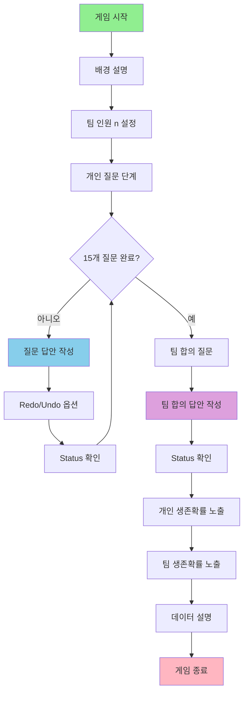

# 자바 생존 게임 프로젝트

윈도우 CMD에서 실행되는 자바 콘솔 게임입니다.

## 게임 개요
팀원들이 15개의 질문에 답하고, 마지막에 팀 합의로 1개의 질문에 답하여 개인과 팀의 생존확률을 계산하는 게임입니다.

## 게임 순서도

## 게임 세부 기능

### 1. 게임 시작
- 게임 타이틀 출력
- 메뉴 선택 (시작/종료)

### 2. 배경 설명
- 게임의 목적과 규칙 설명
- 생존 시나리오 제시

### 3. 팀 인원 설정
- 팀원 수 입력 (1~10명 권장)
- 각 팀원 이름 입력

### 4. 개인 질문 단계
- 각 팀원별로 15개 질문에 답변
- **기능:**
  - `redo`: 이전 답변 수정
  - `undo`: 답변 취소
  - `status`: 현재 진행 상황 확인

### 5. 팀 합의 질문
- 팀원들이 함께 논의하여 1개 질문에 답변
- **기능:**
  - `status`: 현재 상황 확인

### 6. 개인 생존확률 노출
- 각 팀원의 개별 생존확률 계산 및 출력
- 답변 패턴 분석 결과 제시

### 7. 팀 생존확률 노출
- 팀 전체 생존확률 계산
- 팀워크 보너스/페널티 적용

### 8. 데이터 설명
- 생존확률 계산 알고리즘 설명
- 각 질문별 가중치 공개
- 통계 데이터 제시(나중에)

### 9. 게임 종료
- 결과 요약
- 게임 재시작 옵션

## 기술 스택
- **언어**: Java
- **실행 환경**: Windows CMD
- **UI**: 콘솔 기반 텍스트 인터페이스

## 게임 명령어
- `start`: 게임 시작
- `redo`: 이전 답변 수정
- `undo`: 답변 취소  
- `status`: 현재 진행 상황 확인
- `help`: 도움말 출력
- `exit`: 게임 종료
