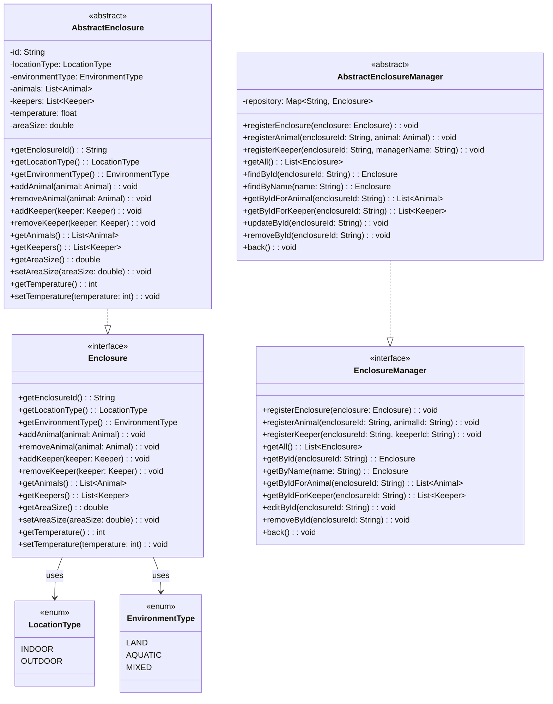

# 요구사항 정리서

| 기능 | 메서드 이름 | 입력값 | 반환값 |
|---------|-----------|--------|--------|
| 케이지 등록 | registerEnclosure(enclosure: Enclosure) | id(자동 등록), animals = null, keepers = null, temperature(float 입력), areaSize(double 입력),locationType(선택입력), environmentType(선택입력)| void |
| 동물 등록 | registerAnimal(enclosureId: String, animalId: String) | 케이지에 등록되지 않은 동물 list 중 animalId 를 입력 | void |
| 관리자 등록 | registerKeeper(enclosureId: String, keeperID: String) | 모든 keeper list 중 keeperId 를 입력 | void |
| 뒤로가기 | back() | void | void |
| 전체목록 조회 | getAll() | void | EnclosureManager.repository 의 EnclosureId : EnclosuerName  |
| ID로 검색 | getById(enclosureId: String) | enclosureId 입력 |EnclosureId로 검색된 Enclosuer 객체의 모든 정보 |
| ID로 검색한 케이지의 동물검색 | getByIdForAnimal(enclosureId: String) | enclosureId 입력 | 검색된 Enclosuer 객체에서 animals 정보 나열 |
| ID로 검색한 케이지의 사육사검색 | getByIdForKeeper(enclosureId: String) |enclosureId 입력 | 검색된 Enclosuer 객체에서 keepers 정보 나열 |
| 뒤로가기 | back() | void | void |
| ID로 검색 후 수정 | editById(enclosureId: String) | enclosureId 입력 | EnclosureId로 검색된  Enclosuer 객체의 모든 정보 수정 |
| 뒤로가기 | back() | void | void |
| ID로 검색 후 삭제 | removeById(enclosureId: String) | enclosureId 입력 |EnclosureId로 검색된  Enclosuer 객체의 모든 정보 삭제 |
| 뒤로가기 | back() | void | void |
