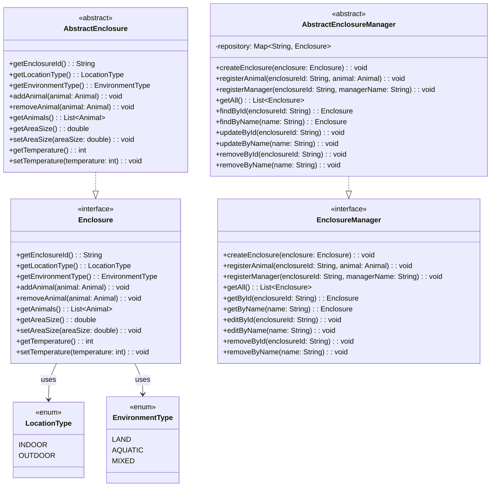

# 요구사항 정리서

## 1. 케이지 등록
- 1. 등록 → createEnclosure(enclosure: Enclosure)
- 2. 입사등록(동물 등록) → registerAnimal(enclosureId: String, animal: Animal)
- 3. 관리자 등록 → registerManager(enclosureId: String, managerName: String)
- 4. 뒤로가기 → back()

## 2. 케이지 조회 
- 1. 전체목록 조회 → getAll(): List
- 2. ID로 검색 → getById(enclosureId: String): Enclosure
- 3. 이름으로 검색 → getByName(name: String): Enclosure
- 4. 뒤로가기 → back()

## 3. 케이지 정보 수정 
- 1. ID로 검색 후 수정 → editById(enclosureId: String): void
- 2. 이름으로 검색 후 수정 → editByName(name: String): void
- 3. 뒤로가기 → back()

## 4. 케이지 정보 삭제 
- 1. ID로 검색 → removeById(enclosureId: String): void
- 2. 이름으로 검색 → removeByName(name: String): void
- 3. 뒤로가기 → back()

## 5. 뒤로가기
- 뒤로가기 → back()
