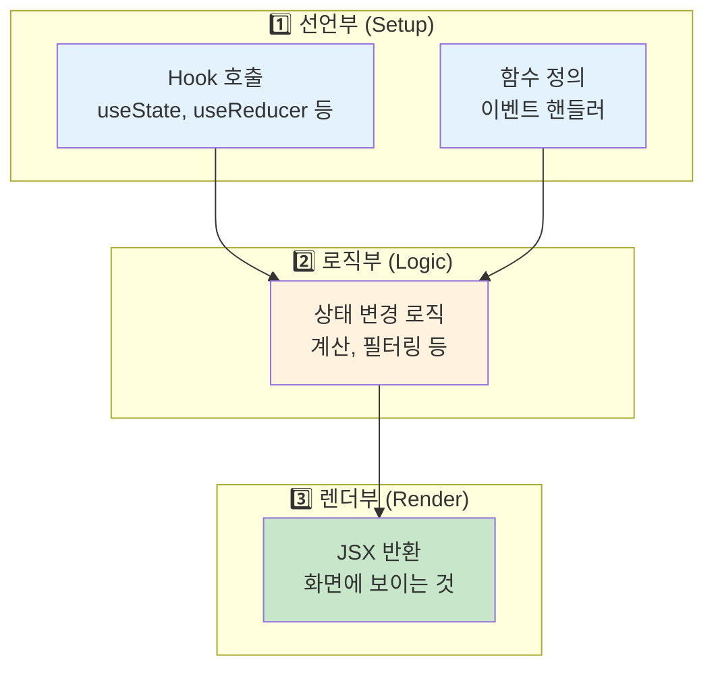
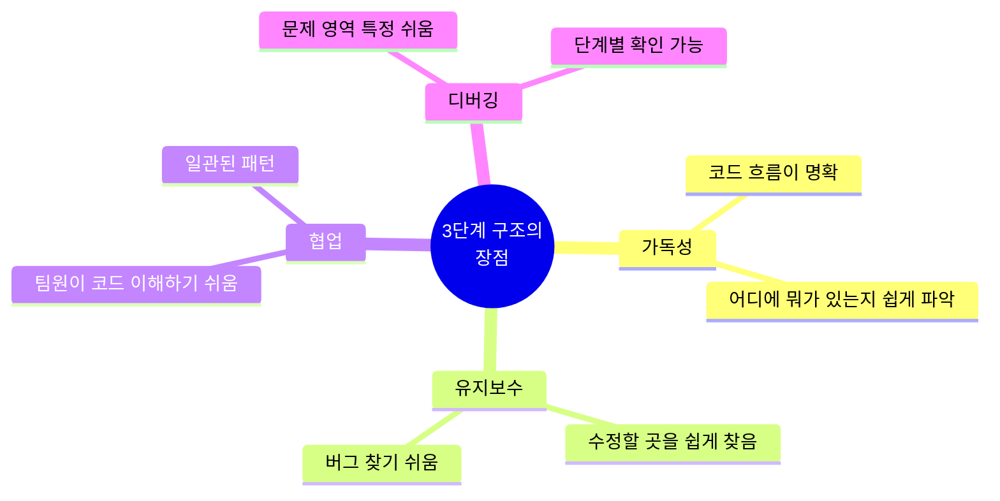
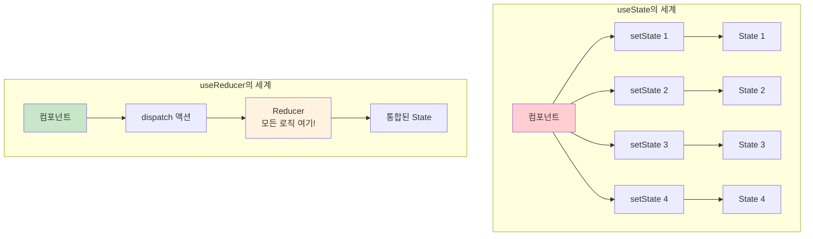
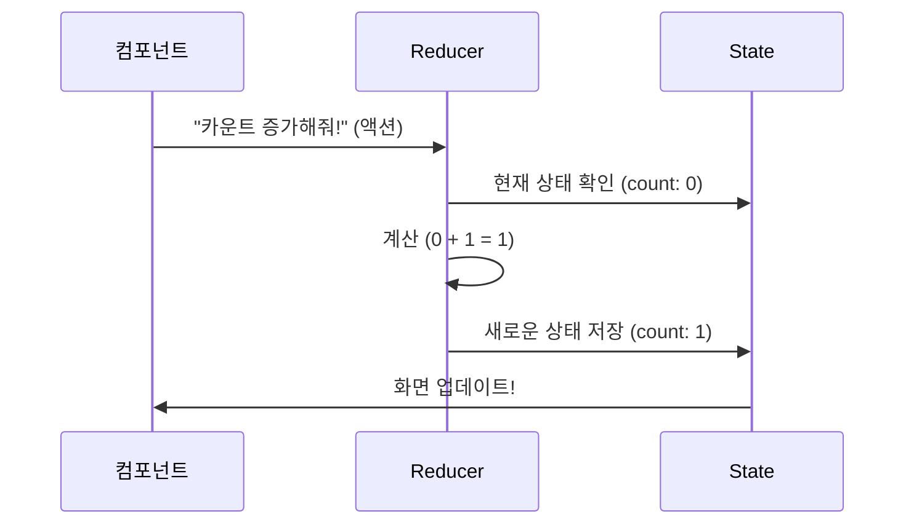
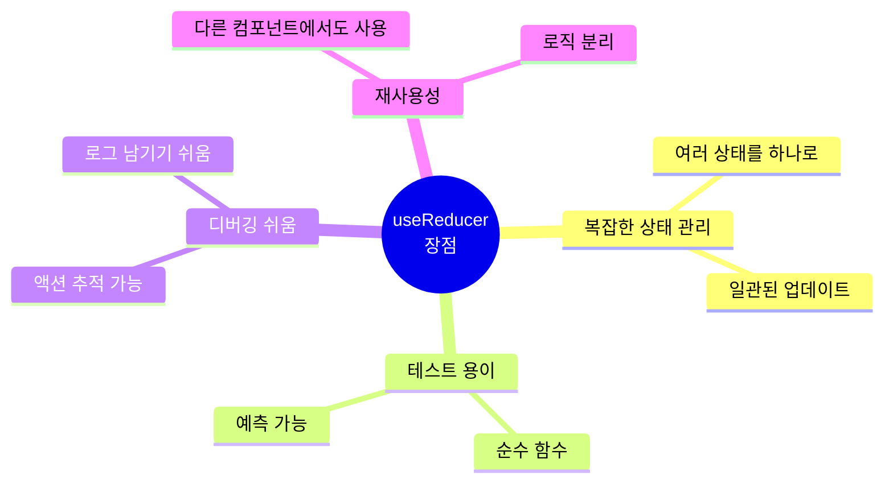
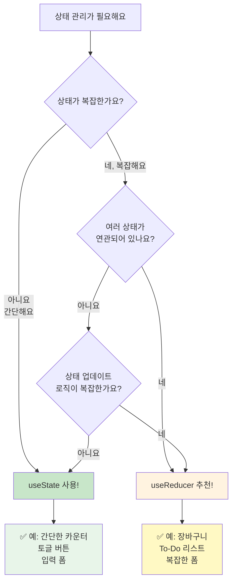
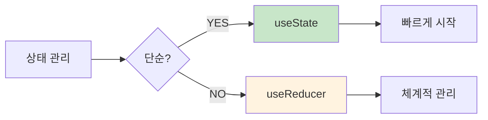

# 🎯 useState vs useReducer 완벽 가이드

> "언제 useState를 쓰고, 언제 useReducer를 써야 할까?" 

---

## 📚 목차

0. [React Hook 코드 3단계 구조](#0-react-hook-코드-3단계-구조-중요)
1. [useState: 간단한 상태 관리](#1-usestate-간단한-상태-관리)
2. [useState의 한계](#2-usestate의-한계)
3. [useReducer: 복잡한 상태 관리](#3-usereducer-복잡한-상태-관리)
4. [실전 비교 예제](#4-실전-비교-예제)
5. [어떤 걸 선택할까?](#5-어떤-걸-선택할까)

---

## 0. React Hook 코드 3단계 구조 (중요!)

### 🎯 React 컴포넌트 코드를 3단계로 생각하세요!

React 공식 문서에서는 Hook을 사용하는 컴포넌트를 **3개의 영역**으로 나누어 생각하라고 합니다.



### 📋 3단계 자세히 알아보기

#### 1️⃣ 선언부 (Setup Phase)

컴포넌트 최상단에서 **Hook을 호출**하고 **함수를 정의**하는 부분

```javascript
function MyComponent() {
  // ✅ 선언부: Hook 호출
  const [count, setCount] = useState(0);
  const [state, dispatch] = useReducer(reducer, initialState);
  
  // ✅ 선언부: 함수 정의
  const handleClick = () => {
    // 이벤트 처리
  };
  
  const calculateTotal = () => {
    // 계산 로직
  };
  
  // ... 다음 단계로
}
```

**특징:**

- Hook은 **반드시 컴포넌트 최상단**에서 호출
- 조건문, 반복문 안에서 Hook 호출 금지! ❌
- 함수는 여기서 정의

#### 2️⃣ 로직부 (Logic Phase)

상태를 기반으로 **계산하고 가공**하는 부분

```javascript
function MyComponent() {
  // 1️⃣ 선언부
  const [todos, setTodos] = useState([]);
  const [filter, setFilter] = useState('ALL');
  
  // 2️⃣ 로직부: 데이터 가공
  const activeTodos = todos.filter(todo => !todo.completed);
  const completedTodos = todos.filter(todo => todo.completed);
  
  // 2️⃣ 로직부: 필터링
  const displayedTodos = filter === 'ALL' 
    ? todos 
    : filter === 'ACTIVE' 
    ? activeTodos 
    : completedTodos;
  
  // 2️⃣ 로직부: 통계 계산
  const activeCount = activeTodos.length;
  const progress = (completedTodos.length / todos.length) * 100;
  
  // ... 다음 단계로
}
```

**특징:**

- 상태를 **읽기만** 함 (변경하지 않음)
- 필터링, 정렬, 계산 등
- 렌더링에 필요한 데이터 준비

#### 3️⃣ 렌더부 (Render Phase)

**JSX를 반환**하여 화면에 표시하는 부분

```javascript
function MyComponent() {
  // 1️⃣ 선언부
  const [count, setCount] = useState(0);
  
  // 2️⃣ 로직부
  const isEven = count % 2 === 0;
  
  // 3️⃣ 렌더부: JSX 반환
  return (
    <div>
      <h1>카운트: {count}</h1>
      <p>{isEven ? '짝수' : '홀수'}</p>
      <button onClick={() => setCount(count + 1)}>
        증가
      </button>
    </div>
  );
}
```

**특징:**

- **return 문** 안의 JSX
- 화면에 보이는 모든 것
- 로직부에서 준비한 데이터를 사용

### 🎨 실전 예제: 3단계 구조로 코드 작성하기

```javascript
function TodoApp() {
  // ========================================
  // 1️⃣ 선언부 (Setup)
  // ========================================
  const [todos, setTodos] = useState([
    { id: 1, text: '리액트 공부하기', completed: false }
  ]);
  const [filter, setFilter] = useState('ALL');
  
  const handleToggle = (id) => {
    setTodos(todos.map(todo =>
      todo.id === id ? { ...todo, completed: !todo.completed } : todo
    ));
  };
  
  // ========================================
  // 2️⃣ 로직부 (Logic)
  // ========================================
  const filteredTodos = filter === 'ALL' 
    ? todos 
    : todos.filter(t => t.completed === (filter === 'COMPLETED'));
  
  const activeCount = todos.filter(t => !t.completed).length;
  
  // ========================================
  // 3️⃣ 렌더부 (Render)
  // ========================================
  return (
    <div>
      <h1>📝 할 일 ({activeCount}개 남음)</h1>
      
      <div>
        <button onClick={() => setFilter('ALL')}>전체</button>
        <button onClick={() => setFilter('ACTIVE')}>진행중</button>
        <button onClick={() => setFilter('COMPLETED')}>완료</button>
      </div>
      
      <ul>
        {filteredTodos.map(todo => (
          <li key={todo.id}>
            <input 
              type="checkbox"
              checked={todo.completed}
              onChange={() => handleToggle(todo.id)}
            />
            <span>{todo.text}</span>
          </li>
        ))}
      </ul>
    </div>
  );
}
```

### 🎯 useReducer도 같은 3단계 구조

```javascript
// ⭐ Reducer 함수 (컴포넌트 밖에 선언)
function cartReducer(state, action) {
  switch (action.type) {
    case 'ADD_ITEM':
      return {
        items: [...state.items, action.item],
        total: state.total + action.item.price
      };
    case 'REMOVE_ITEM':
      return {
        items: state.items.filter(i => i.id !== action.id),
        total: state.total - action.item.price
      };
    default:
      return state;
  }
}

function ShoppingCart() {
  // 1️⃣ 선언부
  const [state, dispatch] = useReducer(cartReducer, {
    items: [],
    total: 0
  });
  
  const handleAddItem = (item) => {
    dispatch({ type: 'ADD_ITEM', item });
  };
  
  // 2️⃣ 로직부
  const isEmpty = state.items.length === 0;
  const itemCount = state.items.length;
  
  // 3️⃣ 렌더부
  return (
    <div>
      <h1>🛒 장바구니 ({itemCount}개)</h1>
      <p>총 금액: {state.total.toLocaleString()}원</p>
      
      {isEmpty ? (
        <p>장바구니가 비어있습니다</p>
      ) : (
        <ul>
          {state.items.map(item => (
            <li key={item.id}>{item.name}</li>
          ))}
        </ul>
      )}
      
      <button onClick={() => handleAddItem({ id: 1, name: '사과', price: 1000 })}>
        사과 추가
      </button>
    </div>
  );
}
```

**💡 Reducer 함수는 컴포넌트 밖에 선언!**
- Reducer는 순수 함수이므로 컴포넌트 외부에 정의
- 재사용 가능하고 테스트하기 쉬움

### 💡 왜 3단계로 나누나요?



### ⚠️ 주의사항

#### ❌ 나쁜 예

```javascript
function BadComponent() {
  const [count, setCount] = useState(0);
  return (
    <div>
      {count > 5 && useState(0)}  {/* ❌ 렌더부에서 Hook 호출 */}
      <button onClick={() => setCount(count * 2)}>증가</button>
    </div>
  );
}
```

#### ✅ 좋은 예

```javascript
function GoodComponent() {
  // 1️⃣ 선언부
  const [count, setCount] = useState(0);
  const handleClick = () => setCount(count * 2);
  
  // 2️⃣ 로직부
  const isLarge = count > 5;
  
  // 3️⃣ 렌더부
  return (
    <div>
      <h1>{count}</h1>
      <p>{isLarge ? '크다!' : '작다!'}</p>
      <button onClick={handleClick}>증가</button>
    </div>
  );
}
```

### 📚 핵심 정리

| 단계 | 영어 | 역할 | 예시 |
|------|------|------|------|
| 1️⃣ 선언부 | Setup | Hook 호출, 함수 정의 | `useState()`, `useReducer()`, 이벤트 핸들러 |
| 2️⃣ 로직부 | Logic | 데이터 가공, 계산 | 필터링, 정렬, 통계 |
| 3️⃣ 렌더부 | Render | 화면 표시 | `return <div>...</div>` |

**기억하세요!**

> "선언 → 로직 → 렌더" 순서로 코드를 작성하면 깔끔하고 읽기 쉬운 컴포넌트가 됩니다! 🎯

---

## 1. useState: 간단한 상태 관리

### ✅ useState가 완벽한 경우

**단순한 값 하나**를 관리할 때는 useState가 최고입니다!

```javascript
// ✅ 완벽한 useState 사용
function SimpleCounter() {
  const [count, setCount] = useState(0);
  
  return (
    <div>
      <h1>카운트: {count}</h1>
      <button onClick={() => setCount(count + 1)}>+</button>
      <button onClick={() => setCount(count - 1)}>-</button>
    </div>
  );
}
```

**useState가 좋은 경우:**
- 🟢 단일 값 관리 (숫자, 문자열, boolean)
- 🟢 간단한 토글 (on/off)
- 🟢 입력 폼 (한 개 필드)
- 🟢 상태끼리 독립적

```javascript
// 각각 독립된 상태들
function Profile() {
  const [name, setName] = useState('');
  const [email, setEmail] = useState('');
  const [isPublic, setIsPublic] = useState(true);
  
  return (
    // ... JSX
  );
}
```

---

## 2. useState의 한계

### 😫 useState의 불편함

여러 개의 관련된 상태를 관리할 때, `useState`는 복잡해집니다!

#### ❌ 문제 상황: 쇼핑몰 장바구니

```javascript
function ShoppingCart() {
  // 상태가 너무 많아요! 😵
  const [items, setItems] = useState([]);
  const [totalPrice, setTotalPrice] = useState(0);
  const [itemCount, setItemCount] = useState(0);
  const [discount, setDiscount] = useState(0);
  const [isLoading, setIsLoading] = useState(false);
  const [error, setError] = useState(null);

  // 물건을 추가할 때마다 여러 상태를 업데이트해야 해요 😭
  const addItem = (item) => {
    setItems([...items, item]);
    setTotalPrice(totalPrice + item.price);  // 깜빡하면 버그!
    setItemCount(itemCount + 1);              // 하나라도 빠뜨리면 큰일!
    // discount도 계산해야 하고...
  };

  // 삭제할 때도 마찬가지...
  const removeItem = (itemId) => {
    const item = items.find(i => i.id === itemId);
    setItems(items.filter(i => i.id !== itemId));
    setTotalPrice(totalPrice - item.price);  // 또 여러 개를 수정...
    setItemCount(itemCount - 1);
  };
}
```

**문제점:**
1. 🔴 상태가 너무 많아서 관리가 어려움
2. 🔴 하나의 액션에 여러 `setState` 호출 필요
3. 🔴 실수로 하나라도 빠뜨리면 버그 발생
4. 🔴 로직이 여기저기 흩어져 있음

### 🎯 useState vs useReducer 비교



---

## 3. useReducer: 복잡한 상태 관리

### 📖 Reducer란?

**Reducer**는 **"현재 상태"**와 **"액션"**을 받아서 **"새로운 상태"**를 반환하는 함수입니다.

```javascript
function reducer(현재상태, 액션) {
  return 새로운상태;
}
```

### 🎨 작동 원리



### ✅ useReducer가 해결하는 문제

#### 1️⃣ 상태를 하나로 묶기

```javascript
// 흩어진 상태 → 하나의 객체로!
const [state, dispatch] = useReducer(reducer, {
  items: [],
  totalPrice: 0,
  itemCount: 0,
  discount: 0
});
```

#### 2️⃣ 로직을 한 곳에 모으기

```javascript
// 모든 상태 변경 로직이 reducer 안에!
function cartReducer(state, action) {
  switch (action.type) {
    case 'ADD_ITEM':
      return {
        ...state,
        items: [...state.items, action.item],
        totalPrice: state.totalPrice + action.item.price,
        itemCount: state.itemCount + 1
      };
    case 'REMOVE_ITEM':
      const item = state.items.find(i => i.id === action.itemId);
      return {
        ...state,
        items: state.items.filter(i => i.id !== action.itemId),
        totalPrice: state.totalPrice - item.price,
        itemCount: state.itemCount - 1
      };
    default:
      return state;
  }
}
```

#### 3️⃣ 의도를 명확하게 표현

```javascript
// "무엇을" 할지만 말하면 됨!
dispatch({ type: 'ADD_ITEM', item: newItem });
dispatch({ type: 'REMOVE_ITEM', itemId: 123 });
```

### 📊 useReducer 장점



---

## 4. 실전 비교 예제

### 🎯 예제 1: 카운터 - useState vs useReducer

#### useState 버전 ✅

```javascript
function Counter() {
  const [count, setCount] = useState(0);

  return (
    <div>
      <h1>카운트: {count}</h1>
      <button onClick={() => setCount(count + 1)}>+</button>
      <button onClick={() => setCount(count - 1)}>-</button>
      <button onClick={() => setCount(0)}>리셋</button>
    </div>
  );
}
```

**👍 간단하고 직관적! 이 경우엔 useState가 완벽!**

#### useReducer 버전

```javascript
function counterReducer(state, action) {
  switch (action.type) {
    case 'INCREMENT': return { count: state.count + 1 };
    case 'DECREMENT': return { count: state.count - 1 };
    case 'RESET': return { count: 0 };
    default: return state;
  }
}

function Counter() {
  const [state, dispatch] = useReducer(counterReducer, { count: 0 });

  return (
    <div>
      <h1>카운트: {state.count}</h1>
      <button onClick={() => dispatch({ type: 'INCREMENT' })}>+</button>
      <button onClick={() => dispatch({ type: 'DECREMENT' })}>-</button>
      <button onClick={() => dispatch({ type: 'RESET' })}>리셋</button>
    </div>
  );
}
```

**🤔 이 경우엔 오히려 복잡해졌네요!**

---

### 🛒 예제 2: 쇼핑 장바구니 - useState의 한계

#### useState 버전 ❌

```javascript
function ShoppingCart() {
  // 1️⃣ 선언부
  const [items, setItems] = useState([]);
  const [total, setTotal] = useState(0);

  const addItem = (item) => {
    setItems([...items, item]);
    setTotal(total + item.price);  // 깜빡하면 버그!
  };

  const removeItem = (id) => {
    const item = items.find(i => i.id === id);
    setItems(items.filter(i => i.id !== id));
    setTotal(total - item.price);  // 또 잊으면 큰일!
  };

  // 3️⃣ 렌더부
  return (
    <div>
      <h1>🛒 장바구니</h1>
      <p>총 금액: {total}원</p>
      {items.map(item => (
        <div key={item.id}>
          <span>{item.name} - {item.price}원</span>
          <button onClick={() => removeItem(item.id)}>삭제</button>
        </div>
      ))}
    </div>
  );
}
```

**❌ 문제점:**
- 여러 상태를 동시에 업데이트 → 실수하기 쉬움
- 로직이 컴포넌트 곳곳에 흩어져 있음

#### useReducer 버전 ✅

```javascript
function cartReducer(state, action) {
  switch (action.type) {
    case 'ADD_ITEM':
      return {
        items: [...state.items, action.item],
        total: state.total + action.item.price  // 한 곳에서 모든 계산!
      };
    case 'REMOVE_ITEM':
      const item = state.items.find(i => i.id === action.id);
      return {
        items: state.items.filter(i => i.id !== action.id),
        total: state.total - item.price
      };
    case 'CLEAR':
      return { items: [], total: 0 };
    default:
      return state;
  }
}

function ShoppingCart() {
  // 1️⃣ 선언부
  const [state, dispatch] = useReducer(cartReducer, {
    items: [],
    total: 0
  });

  // 3️⃣ 렌더부
  return (
    <div>
      <h1>🛒 장바구니</h1>
      <p>총 금액: {state.total}원</p>
      
      {state.items.map(item => (
        <div key={item.id}>
          <span>{item.name} - {item.price}원</span>
          <button onClick={() => 
            dispatch({ type: 'REMOVE_ITEM', id: item.id })
          }>
            삭제
          </button>
        </div>
      ))}
      
      <button onClick={() => dispatch({ type: 'CLEAR' })}>
        전체 삭제
      </button>
    </div>
  );
}
```

**✅ 장점:**
- 모든 로직이 reducer 안에 있어 관리하기 쉬움
- 실수로 한 곳만 업데이트하는 버그 방지

---

### 📝 예제 3: To-Do 리스트 - useReducer가 빛나는 경우

**여러 상태 + 복잡한 로직 + 필터링**이 필요할 때!

```javascript
function todoReducer(state, action) {
  switch (action.type) {
    case 'ADD':
      return {
        ...state,
        todos: [...state.todos, { id: Date.now(), text: action.text, done: false }]
      };
    case 'TOGGLE':
      return {
        ...state,
        todos: state.todos.map(t => 
          t.id === action.id ? { ...t, done: !t.done } : t
        )
      };
    case 'DELETE':
      return {
        ...state,
        todos: state.todos.filter(t => t.id !== action.id)
      };
    case 'SET_FILTER':
      return { ...state, filter: action.filter };
    default:
      return state;
  }
}

function TodoApp() {
  // 1️⃣ 선언부
  const [state, dispatch] = useReducer(todoReducer, {
    todos: [],
    filter: 'ALL'
  });
  const [input, setInput] = useState('');

  const handleAdd = () => {
    dispatch({ type: 'ADD', text: input });
    setInput('');
  };

  // 2️⃣ 로직부
  const filtered = state.todos.filter(t => {
    if (state.filter === 'ACTIVE') return !t.done;
    if (state.filter === 'DONE') return t.done;
    return true;
  });

  // 3️⃣ 렌더부
  return (
    <div>
      <h1>📝 할 일 ({state.todos.length}개)</h1>
      
      <input value={input} onChange={e => setInput(e.target.value)} />
      <button onClick={handleAdd}>추가</button>
      
      <div>
        <button onClick={() => dispatch({ type: 'SET_FILTER', filter: 'ALL' })}>
          전체
        </button>
        <button onClick={() => dispatch({ type: 'SET_FILTER', filter: 'ACTIVE' })}>
          진행중
        </button>
        <button onClick={() => dispatch({ type: 'SET_FILTER', filter: 'DONE' })}>
          완료
        </button>
      </div>
      
      <ul>
        {filtered.map(todo => (
          <li key={todo.id}>
            <input 
              type="checkbox" 
              checked={todo.done}
              onChange={() => dispatch({ type: 'TOGGLE', id: todo.id })}
            />
            <span style={{ textDecoration: todo.done ? 'line-through' : 'none' }}>
              {todo.text}
            </span>
            <button onClick={() => dispatch({ type: 'DELETE', id: todo.id })}>
              삭제
            </button>
          </li>
        ))}
      </ul>
    </div>
  );
}
```

**✅ useReducer를 써야 하는 이유:**
- todos 배열 + filter 상태가 연관됨
- 4가지 복잡한 액션 (ADD, TOGGLE, DELETE, SET_FILTER)
- 모든 로직이 reducer에 깔끔하게 정리됨


---

## 5. 어떤 걸 선택할까?

### 🎯 선택 가이드



### � 비교표

| 기준 | useState | useReducer |
|------|----------|------------|
| **복잡도** | 간단한 상태 | 복잡한 상태 |
| **상태 개수** | 1~2개 | 3개 이상 연관됨 |
| **업데이트 로직** | 직관적 | 복잡하고 체계적 |
| **코드 길이** | 짧음 | 길지만 정리됨 |
| **테스트** | 컴포넌트에서 | Reducer만 따로 |
| **디버깅** | 쉬움 | 액션 추적 가능 |
| **예시** | 카운터, 토글 | 장바구니, Todo |

### �📋 체크리스트

#### ✅ useState를 사용하세요

- 단순한 값 하나만 관리 (숫자, 문자열, boolean)
- 상태끼리 관련이 없음
- 업데이트 로직이 간단함
- 코드가 직관적이어야 함

**예시:**
```javascript
const [isOpen, setIsOpen] = useState(false);
const [name, setName] = useState('');
```

#### ✅ useReducer를 사용하세요

- 여러 개의 관련된 상태를 관리할 때
- 상태 업데이트 로직이 복잡할 때
- 다음 상태가 이전 상태에 의존할 때
- 상태 업데이트 로직을 재사용하고 싶을 때
- 테스트하기 쉬운 코드를 원할 때

**예시:**
```javascript
const [state, dispatch] = useReducer(reducer, {
  items: [],
  total: 0,
  status: 'idle'
});
```

---

## 💡 마무리

### 핵심 요약



### 실전 조언

1. **처음엔 useState로 시작**하세요
   - 간단하게 시작해서 복잡해지면 useReducer로 전환

2. **3개 이상 연관된 상태**가 생기면
   - useReducer로 전환을 고려하세요

3. **같은 상태를 여러 곳에서 업데이트**한다면
   - useReducer로 로직을 한 곳에 모으세요

### 기억하세요!

> **"useState와 useReducer는 경쟁 관계가 아닙니다"**
>
> 상황에 맞게 적절히 선택하면 됩니다! 💪
>
> 간단할 땐 useState, 복잡할 땐 useReducer!

