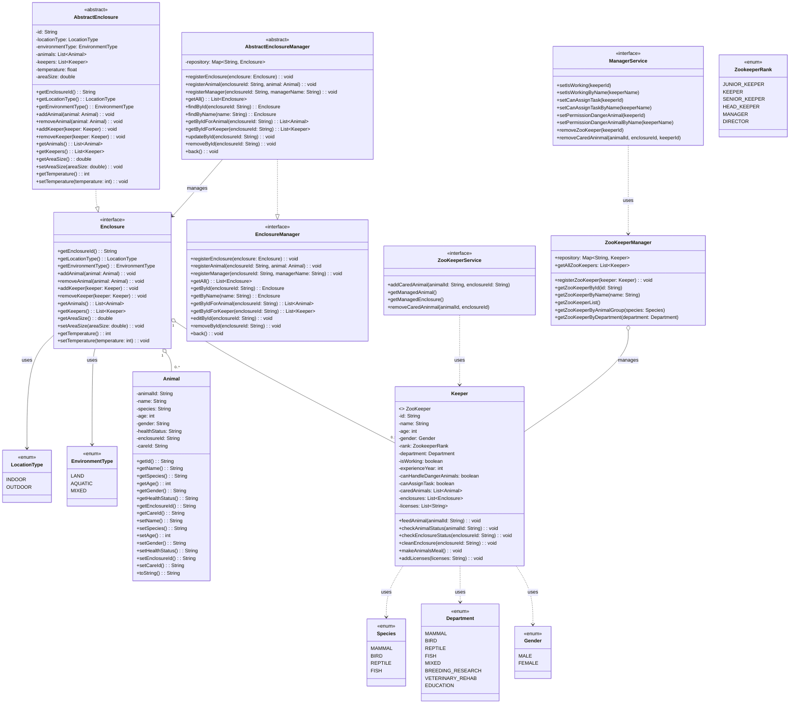

```mermaid
classDiagram
    %% =========================
    %% Core Enclosure domain
    %% =========================
    class Enclosure {
        <<interface>>
        +getEnclosureId(): String
        +getLocationType(): LocationType
        +getEnvironmentType(): EnvironmentType
        +addAnimal(animal: Animal): void
        +removeAnimal(animal: Animal): void
        +addKeeper(keeper: Keeper): void
        +removeKeeper(keeper: Keeper): void
        +getAnimals(): List~Animal~
        +getKeepers(): List~Keeper~
        +getAreaSize(): double
        +setAreaSize(areaSize: double): void
        +getTemperature(): int
        +setTemperature(temperature: int): void
    }

    class AbstractEnclosure {
        <<abstract>>
        -id: String
        -locationType: LocationType
        -environmentType: EnvironmentType
        -animals: List~Animal~
        -keepers: List~Keeper~
        -temperature: float
        -areaSize: double

        +getEnclosureId(): String
        +getLocationType(): LocationType
        +getEnvironmentType(): EnvironmentType
        +addAnimal(animal: Animal): void
        +removeAnimal(animal: Animal): void
        +addKeeper(keeper: Keeper): void
        +removeKeeper(keeper: Keeper): void
        +getAnimals(): List~Animal~
        +getKeepers(): List~Keeper~
        +getAreaSize(): double
        +setAreaSize(areaSize: double): void
        +getTemperature(): int
        +setTemperature(temperature: int): void
    }

    AbstractEnclosure ..|> Enclosure

    class LocationType {
        <<enum>>
        INDOOR
        OUTDOOR
    }

    class EnvironmentType {
        <<enum>>
        LAND
        AQUATIC
        MIXED
    }

    Enclosure --> LocationType : uses
    Enclosure --> EnvironmentType : uses

    %% Explicitly show Enclosure owns Animals and Keepers
    Enclosure "1" o-- "0..*" Animal
    Enclosure "1" o-- "0..*" Keeper

    %% =========================
    %% Enclosure Manager domain
    %% =========================
    class EnclosureManager {
        <<interface>>
        +registerEnclosure(enclosure: Enclosure): void
        +registerAnimal(enclosureId: String, animal: Animal): void
        +registerManager(enclosureId: String, managerName: String): void

        +getAll(): List~Enclosure~
        +getById(enclosureId: String): Enclosure
        +getByName(name: String): Enclosure

        +getByIdForAnimal(enclosureId: String): List~Animal~
        +getByIdForKeeper(enclosureId: String): List~Keeper~

        +editById(enclosureId: String): void

        +removeById(enclosureId: String): void
        +back(): void
    }

    class AbstractEnclosureManager {
        <<abstract>>
        -repository: Map~String, Enclosure~

        +registerEnclosure(enclosure: Enclosure): void
        +registerAnimal(enclosureId: String, animal: Animal): void
        +registerManager(enclosureId: String, managerName: String): void

        +getAll(): List~Enclosure~
        +findById(enclosureId: String): Enclosure
        +findByName(name: String): Enclosure

        +getByIdForAnimal(enclosureId: String): List~Animal~
        +getByIdForKeeper(enclosureId: String): List~Keeper~

        +updateById(enclosureId: String): void

        +removeById(enclosureId: String): void
        +back(): void
    }

    AbstractEnclosureManager ..|> EnclosureManager
    AbstractEnclosureManager --> Enclosure : manages

    %% =========================
    %% ZooKeeper (Keeper) domain
    %% =========================
    class Keeper {
        <<abstract>> ZooKeeper
        -id: String
        -name: String
        -age: int
        -gender: Gender
        -rank: ZookeeperRank
        -department: Department
        -isWorking: boolean
        -experienceYear: int
        -canHandleDangerAnimals: boolean
        -canAssignTask: boolean
        -caredAnimals: List~Animal~
        -enclosures: List~Enclosure~
        -licenses: List~String~

        +feedAnimal(animalId: String): void
        +checkAnimalStatus(animalId: String): void
        +checkEnclosureStatus(enclosureId: String): void
        +cleanEnclosure(enclosureId: String): void
        +makeAnimalsMeal(): void
        +addLicenses(licenses: String): void
    }

    class ZooKeeperManager {
        +repository: Map~String, Keeper~
        +registerZooKeeper(keeper: Keeper): void
        +getZooKeeperById(id: String)
        +getZooKeeperByName(name: String)
        +getZooKeeperList()
        +getAllZooKeepers: List~Keeper~
        +getZooKeeperByAnimalGroup(species: Species)
        +getZooKeeperByDepartment(department: Department)
    }

    class ZooKeeperService {
        <<interface>>
        +addCaredAnimal(animalId: String, enclosureId: String)
        +getManagedAnimal()
        +getManagedEnclosure()
        +removeCaredAninmal(animalId, enclosureId)
    }

    class ManagerService {
        <<interface>>
        +setIsWorking(keeperId)
        +setIsWorkingByName(keeperName)
        +setCanAssignTask(keeperId)
        +setCanAssignTaskByName(keeperName)
        +setPermissionDangerAnimal(keeperId)
        +setPermissionDangerAnimalByName(keeperName)
        +removeZooKeeper(keeperId)
        +removeCaredAninmal(animalId, enclosureId, keeperId)
    }

    %% Keeper relations (from XML edges)
    ZooKeeperService ..> Keeper : uses
    ManagerService ..> ZooKeeperManager : uses
    ZooKeeperManager o-- Keeper : manages
    Keeper ..> Species : uses
    Keeper ..> Department : uses
    Keeper ..> Gender : uses

    %% =========================
    %% Animal domain
    %% =========================
    class Animal {
        -animalId: String
        -name: String
        -species: String
        -age: int
        -gender: String
        -healthStatus: String
        -enclosureId: String
        -careId: String

        +getId(): String
        +getName(): String
        +getSpecies(): String
        +getAge(): int
        +getGender(): String
        +getHealthStatus(): String
        +getEnclosureId(): String
        +getCareId(): String

        +setName(): String
        +setSpecies(): String
        +setAge(): int
        +setGender(): String
        +setHealthStatus(): String
        +setEnclosureId(): String
        +setCareId(): String

        +toString(): String
    }

    %% =========================
    %% Enums
    %% =========================
    class Species {
        <<enum>>
        MAMMAL
        BIRD
        REPTILE
        FISH
    }

    class Gender {
        <<enum>>
        MALE
        FEMALE
    }

    class ZookeeperRank {
        <<enum>>
        JUNIOR_KEEPER
        KEEPER
        SENIOR_KEEPER
        HEAD_KEEPER
        MANAGER
        DIRECTOR
    }

    class Department {
        <<enum>>
        MAMMAL
        BIRD
        REPTILE
        FISH
        MIXED
        BREEDING_RESEARCH
        VETERINARY_REHAB
        EDUCATION
    }

```